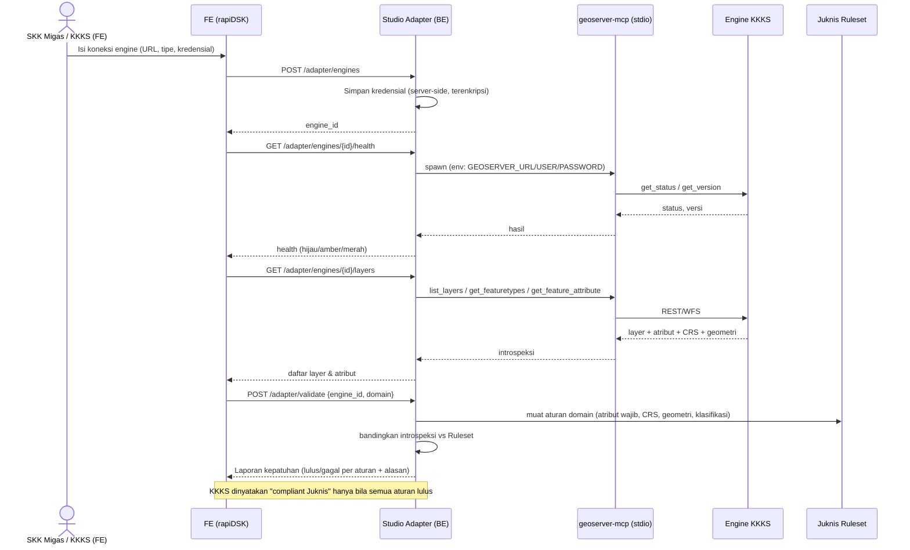
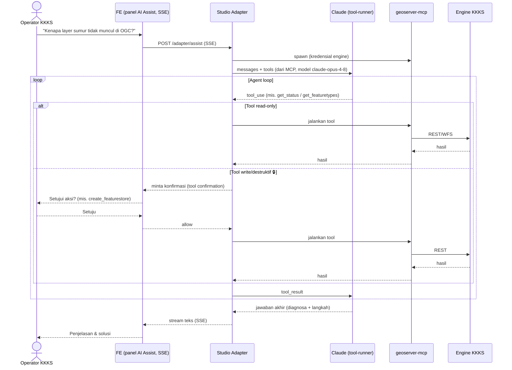
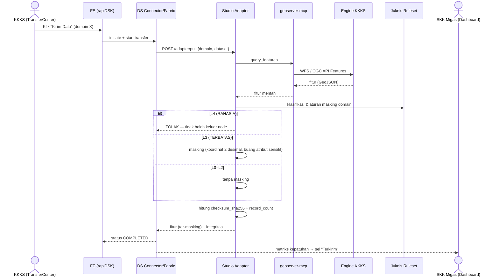
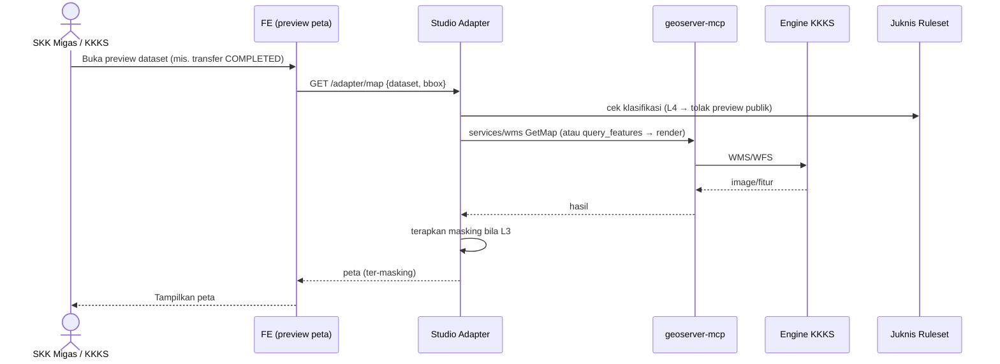

# ADR — Studio Adapter: Komunikasi Data Space ↔ KKKS Engine via `geoserver-mcp`

> **Nama produk: Studio Adapter** — adapter+studio untuk menghubungkan Data Space rapiDSK ke engine data KKKS, memvalidasi kepatuhan Juknis SKK Migas, dan membantu provisioning/diagnosa (berbantuan AI).
> Status: **Usulan (Draft)** · Tanggal: 2026-06-08 · Penulis: Tim Frontend (analis)
> Keputusan terkait: Prioritas **Mode B (AI control-plane)**; tipe engine KKKS **menunggu survei**; kepatuhan divalidasi dari `docs/juknis/juknis-ruleset.json`.

---

## 1. Konteks & Masalah

Data Space rapiDSK (pola Eclipse-Dataspace-Connector: `contract → agreement → connector initiate/start/status → transfer`) saat ini menyimpan endpoint data KKKS hanya sebagai **URL + protokol** tanpa validasi/introspeksi (`PublishDatasetDialog`, `connector.ts`). Tidak ada:
- Validasi konformансi endpoint KKKS (CRS, atribut SIGI, klasifikasi),
- Introspeksi sumber (feature type, atribut, jumlah fitur),
- Bantuan provisioning/diagnosa untuk operator KKKS.

`geoserver-mcp` (Python, MCP **stdio**, beta v0.5.0) membungkus **GeoServer REST API** sebagai tools yang bisa dikendalikan LLM: `list_workspaces`, `create_datastore`, `create_featurestore`, `get_featuretypes`, `get_feature_attribute`, `query_features`, `create_layer`, `create_style`, `get_status`, `get_version`, dll. Auth basic (`GEOSERVER_URL/USER/PASSWORD`).

**Pertanyaan:** apa yang bisa kita bangun di BE & FE untuk memakai pola ini sebagai adapter DS ↔ engine KKKS?

---

## 2. Keputusan

1. **Prioritaskan Mode B — AI control-plane**: jalankan `geoserver-mcp` di belakang **agent Claude** untuk asistensi operasional (deteksi layer, validasi, diagnosa, bantuan setup). Mode A (adapter data-plane deterministik untuk transfer) menyusul sebagai fase lanjut.
2. **Protokol-first, GeoServer-second**: adapter harus menargetkan **OGC API Features / WFS standar** sebagai kontrak utama; `geoserver-mcp` adalah **salah satu driver**. Tipe engine KKKS sebenarnya **belum diketahui** → jalankan **survei** (Lampiran A) sebelum mengunci driver.
3. **Kredensial engine KKKS hanya di server** — tidak pernah menyentuh FE (konsisten pola `client.ts`).

---

## 3. Arsitektur Mode B

```
┌────────── Frontend (rapiDSK Web) ──────────┐
│  Panel "AI Assist Engine KKKS" (gaya sama) │
│  • Validasi & Deteksi Layer (di Publish)   │
│  • Chat diagnosa setup GeoServer           │
└───────────────┬─────────────────────────────┘
                │ HTTPS (SSE streaming)
┌───────────────▼──────────── BE: kkks-engine-adapter (FastAPI, Python) ─────────┐
│  Agent loop Claude (Anthropic SDK)                                              │
│   └─ tools = SDK tool-runner + MCP tools dari geoserver-mcp (stdio subprocess)  │
│  Driver registry: GeoServer (geoserver-mcp) | OGC API Features | REST           │
│  Kredensial engine KKKS (server-side secret store)                              │
└───────────────┬─────────────────────────────────────────────────────────────────┘
                │ stdio (MCP)                         │ HTTPS (basic auth)
        ┌───────▼────────┐                    ┌───────▼─────────┐
        │  geoserver-mcp  │ ─── GeoServer REST▶│  Engine KKKS    │ (GeoServer / OGC server)
        └─────────────────┘                    └─────────────────┘
```

### 3.1 Cara Claude terhubung ke `geoserver-mcp` (penting — `geoserver-mcp` itu **stdio**, bukan remote)

Anthropic menyediakan **dua jalur** koneksi MCP; pilih sesuai transport server:

| Jalur | Untuk | Cocok untuk `geoserver-mcp`? |
|---|---|---|
| **Parameter `mcp_servers`** pada Messages API / Managed Agents | MCP server **remote** (URL, Streamable HTTP/SSE) | ❌ langsung — `geoserver-mcp` ber-transport **stdio** |
| **SDK MCP tool-runner helpers** (`anthropic.lib.tools.mcp` + `stdio_client`) | MCP server **lokal/stdio** (subprocess) | ✅ **inilah jalur yang dipakai** |

**Rekomendasi:** BE service menjalankan `geoserver-mcp` sebagai **subprocess stdio**, mengonversi tool-nya via `async_mcp_tool`, lalu menjalankan **tool-runner** Claude. (Alternatif: bungkus `geoserver-mcp` sebagai server SSE/HTTP remote agar bisa pakai `mcp_servers` — menambah infra; tidak direkomendasikan untuk awal.)

Sketsa (Python, `pip install "anthropic[mcp]"`, Python 3.10+):

```python
from anthropic import AsyncAnthropic
from anthropic.lib.tools.mcp import async_mcp_tool
from mcp import ClientSession
from mcp.client.stdio import stdio_client, StdioServerParameters

client = AsyncAnthropic()  # ANTHROPIC_API_KEY dari env

server = StdioServerParameters(
    command="geoserver-mcp",
    env={
        "GEOSERVER_URL": engine.url,        # dari registry, server-side
        "GEOSERVER_USER": engine.user,
        "GEOSERVER_PASSWORD": engine.secret,
    },
)

async with stdio_client(server) as (read, write):
    async with ClientSession(read, write) as mcp:
        await mcp.initialize()
        tools = (await mcp.list_tools()).tools
        runner = client.beta.messages.tool_runner(
            model="claude-opus-4-8",
            max_tokens=16000,
            thinking={"type": "adaptive"},
            messages=[{"role": "user", "content": prompt}],
            tools=[async_mcp_tool(t, mcp) for t in tools],
        )
        async for message in runner:
            ...  # stream ke FE
```

> Catatan keamanan: spawn satu subprocess `geoserver-mcp` **per koneksi engine** dengan kredensial di `env` (bukan di prompt). Jangan pernah menaruh `GEOSERVER_PASSWORD` di system prompt / pesan — itu tersimpan di histori.

### 3.2 Pemilihan model Claude (akurat per katalog terbaru)

| Model | Model ID | Konteks | Pakai untuk |
|---|---|---|---|
| **Claude Opus 4.8** | `claude-opus-4-8` | 1M | **Default** — orkestrasi tool-calling kompleks, diagnosa setup, navigasi ambiguitas |
| **Claude Sonnet 4.6** | `claude-sonnet-4-6` | 1M | Produksi volume tinggi & hemat — validasi rutin per-dataset, introspeksi terjadwal |
| **Claude Haiku 4.5** | `claude-haiku-4-5` | 200K | Tugas sederhana/cepat — klasifikasi cepat, ringkasan status |

Default **`claude-opus-4-8`** dengan **adaptive thinking** (`thinking: {type: "adaptive"}`); turunkan ke Sonnet 4.6 untuk jalur bervolume tinggi setelah perilaku stabil. (Jangan pakai `budget_tokens` — sudah dihapus pada model 4.7/4.8; kontrol kedalaman via `output_config.effort`.)

---

## 3.3 Katalog Kemampuan Studio Adapter (target lengkap)

Studio Adapter pada akhirnya **harus mencakup seluruh capability `geoserver-mcp`** berikut. Tabel ini menetapkan: tool sumber, peran di Studio Adapter, sifat (read vs write yang **wajib di-gate konfirmasi**), dan fase.

| Kelompok kemampuan | Tool `geoserver-mcp` | Peran di Studio Adapter | Sifat | Fase |
|---|---|---|---|---|
| **Available Tools / Client Development** | (SDK MCP: `stdio_client` + `async_mcp_tool` + tool-runner) | Lapisan integrasi agent ↔ MCP (fondasi) | infra | 1 |
| **Resource Endpoints** | `geoserver://catalog/*`, `services/wms`, `services/wfs` | Akses katalog & layanan OGC | read | 1 |
| **Workspace Management / List Workspaces** | `list_workspaces`, `create_workspace` | Inventarisasi & provisioning ruang kerja KKKS | read / write 🔒 | 1 / 3 |
| **Datastore & Coveragestore Management** | `create_datastore`, `create_featurestore`, `create_gpkg/shp_datastore`, `create_coveragestore`, `get_datastores`, `delete_coveragestore` | Siapkan sumber data node | write 🔒 | 3 |
| **Layer Management / Get Layer Information** | `list_layers`, `get_layer_info`, `create_layer`, `delete_resource` | Introspeksi layer (validasi) & provisioning | read / write 🔒 | 1 / 3 |
| **Layer Group Management** | `create/get/update/delete_layergroup`, `add/remove_layer_to_layergroup` | Komposisi grup layer | write 🔒 | 3 |
| **User & User Group Management** | `create/delete/get/modify_user`, `*_usergroup` | Kelola akses di node KKKS | write 🔒 (admin) | 3 |
| **Feature Type & Attribute Management** | `get_featuretypes`, `get_feature_attribute`, `edit_featuretype`, `publish_featurestore(_sqlview)` | **Validasi konformансi Juknis** (atribut SIGI vs `juknis-ruleset.json`) | read (+write 🔒) | 1 |
| **Query Features** | `query_features` | **Validasi isi + Pull data untuk transfer** (Mode A) | read | 1 / 3 |
| **Generate Map** | `services/wms` (GetMap) | **Preview peta** dataset (selaras fitur FE "map preview for completed transfers") | read | 2 |
| **Style Management** | `create_style`, `publish_style`, `create_*_featurestyle`, `create_coveragestyle` | Styling tampilan layer | write 🔒 | 3 |
| **Style XML Utilities** | `style_*_xml` | Util generate SLD/XML styling | helper | 3 |
| **System & Service Operations** | `get_status`, `get_version`, `get_manifest`, `get_system_status`, `reload/reset_geoserver`, `update_service` | Health & diagnosa engine | read (+write 🔒 admin) | 1 |

> 🔒 = aksi write/destruktif → **wajib human-in-the-loop confirmation** (tool confirmation / loop manual).
> Output **Query Features** & **Generate Map** tunduk pada **masking L3/L4** dari `juknis-ruleset.json` (koordinat dikaburkan, atribut sensitif dibuang) sebelum keluar node KKKS.
> Catatan portabilitas: kelompok ini spesifik GeoServer. Untuk engine non-GeoServer (hasil survei), peta yang sama dipenuhi via driver **OGC API Features/WFS** standar; tool `geoserver-mcp` hanya salah satu driver.

## 3.4 Sequence Diagram Alur (untuk tim BE & FE)

Aktor/komponen yang dipakai di seluruh diagram:
- **KKKS** / **SKK Migas** — pengguna (operator KKKS / admin regulator) di FE.
- **FE** — rapiDSK Web (panel Studio Adapter, PublishDatasetDialog, TransferCenter).
- **SA** — Studio Adapter (service `kkks-engine-adapter`, FastAPI).
- **Claude** — agent (Anthropic API, tool-runner) — hanya pada alur AI Assist.
- **MCP** — `geoserver-mcp` (subprocess stdio).
- **Engine** — engine data KKKS (GeoServer / OGC server).
- **Ruleset** — `docs/juknis/juknis-ruleset.json`.
- **Connector** — DS connector/fabric (transfer EDC-style).

### A. Registrasi & Validasi Kepatuhan Engine KKKS (onboarding)



### B. Publish Dataset + Validasi (KKKS di FE)

```mermaid
sequenceDiagram
    actor K as Operator KKKS
    participant FE as FE (PublishDatasetDialog)
    participant SA as Studio Adapter
    participant MCP as geoserver-mcp
    participant E as Engine KKKS
    participant R as Juknis Ruleset

    K->>FE: Pilih domain + URL endpoint → klik "Validasi & Deteksi Layer"
    FE->>SA: POST /adapter/validate {url, domain}
    SA->>MCP: get_featuretypes / get_feature_attribute / query_features (sample)
    MCP->>E: WFS / OGC API Features
    E-->>MCP: skema + sample fitur
    MCP-->>SA: atribut, tipe geometri, CRS
    SA->>R: aturan domain
    SA-->>FE: hasil validasi (atribut wajib lengkap? CRS=EPSG:4326? geometri sah?)
    alt Konform
        FE->>FE: auto-isi field + aktifkan tombol Publish
        K->>FE: Publish → status PUBLISHED (alur existing)
    else Tidak konform
        FE-->>K: Tampilkan pelanggaran; Publish diblokir
    end
```

### C. AI Assist — Diagnosa & Provisioning (Mode B, agent loop)



### D. Transfer Data ke SKK Migas + Masking L3/L4 (Mode A, fase lanjut)



### E. Generate Map — Preview Peta (read-only, ter-masking)



> Catatan untuk implementasi: kredensial engine **selalu** via `env` subprocess MCP (tidak pernah di prompt/FE). Semua aksi 🔒 (write/provisioning) lewat **konfirmasi manusia**. Output **Query Features / Generate Map / Pull** tunduk masking dari **Ruleset** sebelum keluar node KKKS.

## 4. Yang dibangun di Backend — **Studio Adapter** (service `kkks-engine-adapter`, FastAPI/Python)

| Kapabilitas | Endpoint adapter (usulan) | Tool `geoserver-mcp` yang dipakai agent |
|---|---|---|
| Registrasi koneksi engine KKKS | `POST /adapter/engines` | — |
| Health & versi | `GET /adapter/engines/{id}/health` | `get_status`, `get_version` |
| Introspeksi layer & atribut | `GET /adapter/engines/{id}/layers` | `list_layers`, `get_featuretypes`, `get_feature_attribute` |
| **Validasi konformансi Juknis** (EPSG:4326, atribut wajib SIGI per domain, klasifikasi) | `POST /adapter/validate` | `get_feature_attribute`, `query_features` + **`docs/juknis/juknis-ruleset.json`** sebagai sumber aturan |
| Chat diagnosa/asistensi setup | `POST /adapter/assist` (SSE) | seluruh toolset (agent loop) |
| (Fase lanjut/Mode A) Pull fitur untuk transfer (+checksum, record_count) | `POST /adapter/pull` | `query_features` |
| (Admin) provisioning node | `POST /adapter/provision` | `create_workspace/datastore/featurestore/style` |

**Pola tool use** (umum): definisikan tool deskriptif & **prescriptive** ("panggil ini saat…"); gunakan tool-runner untuk loop otomatis, atau loop manual bila butuh **human-in-the-loop approval** untuk aksi destruktif (provisioning). Aksi yang sulit di-undo (create/delete di GeoServer) **wajib gate konfirmasi**.

---

## 5. Yang dibangun di Frontend (hormati directive: tanpa ubah visual; panel baru bergaya sama)

| # | Lokasi | Tambahan |
|---|---|---|
| 1 | `PublishDatasetDialog` | Tombol **"Validasi & Deteksi Layer"** → panggil `/adapter/validate` & `/layers`; auto-isi featuretype/atribut, cegah publish bila tidak konформ |
| 2 | `Datasets` / `Providers` | **Badge kesehatan engine** (hijau/amber/merah) dari `/health` |
| 3 | Halaman baru "Engine KKKS" (grup *Persiapan*, admin) | Registrasi koneksi, **Test Connection**, lihat layer |
| 4 | Panel **AI Assist** (chat) | Stream jawaban agent dari `/adapter/assist` (SSE) untuk bantu operator setup GeoServer |

FE hanya berbicara ke **adapter** (HTTPS); tidak pernah ke GeoServer langsung dan tidak memegang kredensial engine.

---

## 6. Governance & Keamanan

- **Kredensial engine** hanya di server-side store; subprocess MCP menerima via `env`.
- **Klasifikasi Juknis**: data **L4 RAHASIA tidak boleh keluar** node KKKS; **L3 TERBATAS** wajib masking atribut/koordinat. Untuk Mode A (pull), filter/masking diterapkan **di sisi sumber** sebelum fitur ditarik.
- **Aksi destruktif** (provisioning/delete) di-gate konfirmasi manusia (loop manual / tool confirmation).
- **Beta & dependensi**: `geoserver-mcp` masih beta dan **belum punya access-control** sendiri — jangan jadikan jalur data-plane produksi tanpa hardening; pakai sebagai control-plane berbantuan agent dulu.
- **Network**: engine KKKS harus terjangkau adapter/fabric (hint sudah ada di `PublishDatasetDialog`: "host yang terjangkau fabric").

---

## 7. Roadmap bertahap

1. **Fase 0 — Survei** (Lampiran A): tentukan tipe engine KKKS → kunci driver.
2. **Fase 1 — Probe & Validasi (Mode B, read-only)**: `/health`, `/layers`, `/validate`; FE tombol validasi + badge.
3. **Fase 2 — AI Assist**: agent loop `/adapter/assist` (chat diagnosa/setup) via `geoserver-mcp` stdio.
4. **Fase 3 — Mode A data-plane**: `query_features` → checksum/record_count masuk pipeline connector; masking L3/L4; provisioning admin.

---

## 8. Risiko & Keputusan Terbuka

| Risiko / pertanyaan | Catatan |
|---|---|
| Engine KKKS bukan GeoServer | Mitigasi: driver protokol-first OGC API Features/WFS; `geoserver-mcp` hanya 1 driver. **Tunggu survei.** |
| `geoserver-mcp` beta, stdio-only, basic auth | Pakai sebagai control-plane; pertimbangkan fork/hardening bila masuk data-plane |
| Biaya token agent | Default Opus 4.8 untuk diagnosa; Sonnet 4.6 untuk validasi rutin bervolume |
| Konsistensi versi GeoServer REST | Probe `get_version`/`get_manifest` saat registrasi engine |

---

## Lampiran A — Survei Engine Data KKKS (Fase 0)

Kirim ke tiap KKKS untuk mengunci driver adapter:

1. Perangkat lunak server geospasial yang dipakai? (GeoServer / pygeoapi / ArcGIS Server / MapServer / REST kustom / lainnya) + versi.
2. Protokol yang diekspos? (OGC API Features / WFS 2.0 / WMS / REST kustom).
3. CRS data disajikan? (apakah EPSG:4326 / WGS84 tersedia).
4. Endpoint dapat diakses dari jaringan fabric SKK Migas? (publik / VPN / whitelist IP).
5. Mekanisme autentikasi endpoint? (basic / API key / OAuth / tanpa auth).
6. Apakah atribut wajib SIGI per domain sudah tersedia di layer? (per 5 domain).
7. Kapasitas/volume data per domain (estimasi jumlah fitur) — untuk perencanaan transfer.

> Hasil survei menentukan apakah `geoserver-mcp` cukup, atau perlu driver OGC API Features generik sebagai jalur utama.
