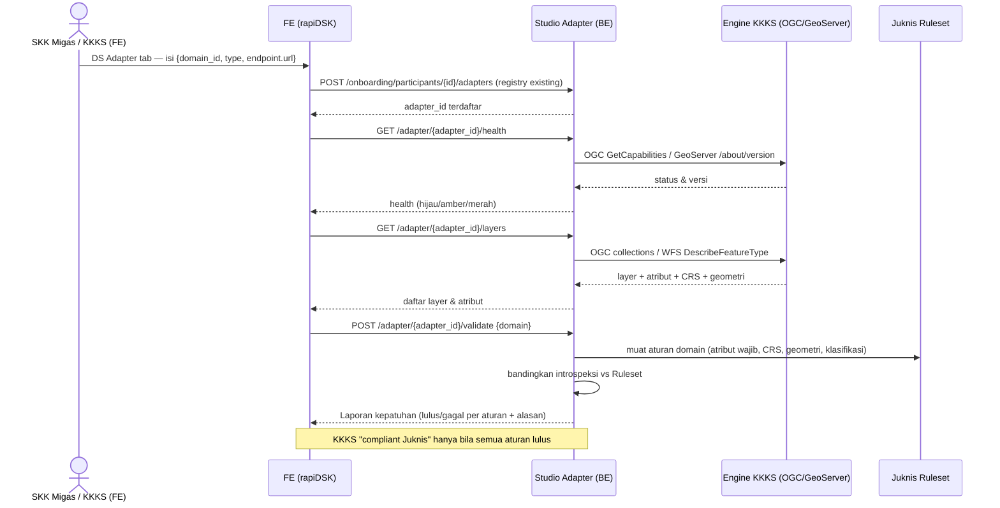
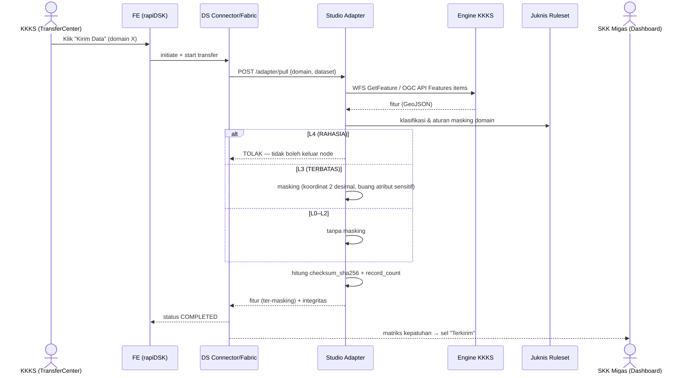
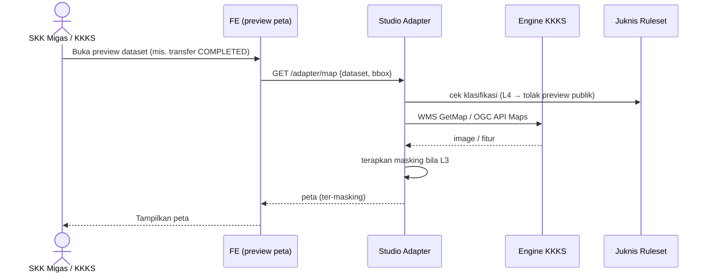

# ADR — Studio Adapter: Konektor Data Space ↔ KKKS Engine (data-plane)

> **Nama produk: Studio Adapter** — konektor yang menghubungkan engine data KKKS ke **Data Space rapiDSK**, memvalidasi kepatuhan **Juknis SKK Migas**, dan menyiapkan data (dengan masking klasifikasi) untuk pertukaran.
> Status: **Usulan (Draft)** · Tanggal: 2026-06-08 · Penulis: Tim Frontend (analis)
> Keputusan: **murni data-plane (tanpa AI)**; **protokol-first** (OGC API Features/WFS); tipe engine KKKS **menunggu survei**; kepatuhan divalidasi dari `docs/juknis/juknis-ruleset.json`.

---

## 1. Konteks & Masalah

Data Space rapiDSK berpola **Eclipse-Dataspace-Connector (EDC)**: `contract → agreement → connector initiate/start/status → transfer (checksum, record_count)`. Saat ini endpoint data KKKS hanya disimpan sebagai **URL + protokol** tanpa validasi/introspeksi (`PublishDatasetDialog`, `connector.ts`). Yang belum ada:
- Validasi konformансi endpoint KKKS (CRS, atribut wajib SIGI, klasifikasi),
- Introspeksi sumber (feature type, atribut, jumlah fitur),
- Penarikan + **masking L3/L4** data sebelum masuk pipeline transfer.

**Studio Adapter** mengisi celah ini sebagai **lapisan data-plane** antara DS connector dan engine data KKKS — analog *data-plane source extension* di pola EDC.

---

## 2. Keputusan

1. **Murni data-plane, tanpa AI.** Studio Adapter berkomunikasi dengan engine KKKS secara **deterministik** lewat **REST / OGC API Features / WFS** langsung. Tidak ada agent/LLM di jalur ini.
2. **Protokol-first, GeoServer-second.** Kontrak utama = **OGC API Features / WFS standar** (portabel lintas engine). Operasi spesifik GeoServer (provisioning workspace/datastore/style/user) hanya berlaku untuk **driver GeoServer**. Tipe engine KKKS **belum diketahui** → jalankan **survei** (Lampiran A) sebelum mengunci driver.
3. **Kredensial engine KKKS hanya di server** — tidak pernah menyentuh FE (konsisten pola `client.ts`).
4. **Sumber kebenaran kepatuhan** = `docs/juknis/juknis-ruleset.json` (dibaca adapter & wizard Setup Juknis; jangan hard-code dua tempat).

---

## 2.1 Penyelarasan dengan "DS Adapter" yang sudah ada (existing di kode)

Tim sudah mengimplementasikan **DS Adapter** (tab di `Settings`, khusus PROVIDER/KKKS). Studio Adapter **menumpang & memperluas** registry itu — **bukan menggantinya, tidak ada `/adapter/engines` baru**.

| Aspek | DS Adapter (SUDAH ADA) | Peran Studio Adapter (TAMBAHAN) |
|---|---|---|
| Registrasi adapter | `GET/POST/PATCH/DELETE /onboarding/participants/{id}/adapters` — body `{domain_id, type, endpoint:{url}}`, **1 adapter per domain wajib** | **Pakai ulang** registry ini sebagai sumber koneksi engine |
| Tipe adapter | `GIS_STUDIO, REST_API, OGC_WFS, OGC_WMS, ARCGIS, GEONODE` | Driver mengikuti `type`: `OGC_WFS`/`OGC_WMS`/`ARCGIS`/`GEONODE` → jalur OGC standar; `GIS_STUDIO`/`REST_API` per-driver |
| Test koneksi | superficial (client-side `fetch HEAD no-cors`) | **Diganti** health nyata (OGC `GetCapabilities`) + **validasi Juknis** |
| Connection pool | `/onboarding/connection-pools` (CONSUMER/PROVIDER, token, url_consumer/url_provider) = pool connector EDC | Tetap milik connector; output `/adapter/pull` menyuplai data ke transfer |

> Nama: **"Studio Adapter"** = layanan/produk operasional; **`GIS_STUDIO`** = salah satu `type` adapter di registry; **"DS Adapter"** = nama tab/registry existing. Konsisten, bukan duplikat.

## 3. Arsitektur

### 3.1 Komponen

```
┌────────── Frontend (rapiDSK Web) ──────────┐
│  • Validasi & Deteksi Layer (di Publish)   │
│  • Badge kesehatan engine (Datasets/Prov.) │
│  • Halaman "Engine KKKS" (registrasi)      │
│  • Preview peta (transfer COMPLETED)       │
└───────────────┬─────────────────────────────┘
                │ HTTPS (REST JSON)
┌───────────────▼──────── BE: Studio Adapter (service kkks-engine-adapter, FastAPI) ──────┐
│  Driver registry:  OGC API Features/WFS (standar)  |  GeoServer REST (driver)            │
│  Validator Juknis  ── baca docs/juknis/juknis-ruleset.json                                │
│  Masking L3/L4     ── presisi koordinat + drop atribut sensitif                           │
│  Kredensial engine KKKS (server-side secret store)                                        │
└───────────────┬───────────────────────────────────────┬──────────────────────────────────┘
                │ HTTPS (OGC/WFS/REST)                    │ panggil saat transfer
        ┌───────▼─────────┐                       ┌───────▼──────────┐
        │  Engine KKKS    │                       │  DS Connector     │ → SKK Migas
        │ (GeoServer/OGC) │                       │  (EDC-style)      │
        └─────────────────┘                       └───────────────────┘
```

### 3.2 Driver (protokol-first)

| Driver | Dipakai untuk | Catatan |
|---|---|---|
| **OGC API Features / WFS** (standar) | Introspeksi skema, query/pull fitur, validasi | **Jalur utama** — portabel lintas engine (GeoServer, pygeoapi, ArcGIS, MapServer) |
| **GeoServer REST** | Operasi manajemen/provisioning (workspace, datastore, layer, style, user) | Hanya bila engine = GeoServer; engine lain mungkin tak punya padanan |

> Hasil survei (Lampiran A) menentukan driver mana yang aktif per KKKS.

### 3.3 Katalog Kemampuan Studio Adapter

Seluruh kemampuan diimplementasikan sebagai **operasi REST/OGC langsung** (bukan agent). Operasi management = GeoServer-specific.

| Kelompok kemampuan | Operasi (OGC/WFS atau GeoServer REST) | Peran di Studio Adapter | Sifat | Fase |
|---|---|---|---|---|
| **Resource Endpoints** | OGC API Features `collections`, WFS `GetCapabilities`, WMS | Akses katalog & layanan | read | 1 |
| **System & Service Operations** | GeoServer REST `/about/version`, `/about/status`; (OGC `GetCapabilities`) | Health & versi engine | read (+admin 🔒) | 1 |
| **Workspace Management / List Workspaces** | GeoServer REST `/workspaces` (GET/POST) | Inventarisasi & provisioning | read / write 🔒 | 1 / 3 |
| **Datastore & Coveragestore Management** | GeoServer REST `/datastores`, `/coveragestores` | Siapkan sumber data node | write 🔒 | 3 |
| **Layer Management / Get Layer Information** | OGC `collections/{id}`; GeoServer REST `/layers`, `/featuretypes` | Introspeksi layer (validasi) & provisioning | read / write 🔒 | 1 / 3 |
| **Layer Group Management** | GeoServer REST `/layergroups` | Komposisi grup layer | write 🔒 | 3 |
| **User & User Group Management** | GeoServer REST `/security/*` | Kelola akses node | write 🔒 (admin) | 3 |
| **Feature Type & Attribute Management** | WFS `DescribeFeatureType` / OGC schema; GeoServer REST `/featuretypes` | **Validasi konformансi Juknis** (atribut SIGI vs Ruleset) | read (+write 🔒) | 1 |
| **Query Features** | WFS `GetFeature` / OGC API Features `items` | **Validasi isi + Pull data untuk transfer** | read | 1 / 3 |
| **Generate Map** | WMS `GetMap` / OGC API Maps | **Preview peta** dataset | read | 2 |
| **Style Management + Style XML Utilities** | GeoServer REST `/styles` (SLD) | Styling tampilan | write 🔒 / helper | 3 |

> 🔒 = aksi write/provisioning → **wajib konfirmasi pengguna** sebelum dieksekusi.
> Output **Query Features / Generate Map / Pull** tunduk **masking L3/L4** dari Ruleset (koordinat dikaburkan, atribut sensitif dibuang; **L4 tidak dipublikasikan**) sebelum keluar node KKKS.
> Operasi management (workspace/datastore/style/user) **spesifik GeoServer**; untuk engine non-GeoServer, hanya jalur OGC API Features/WFS (introspeksi, query, validasi, preview) yang berlaku.

### 3.4 Sequence Diagram Alur (untuk tim BE & FE)

Aktor/komponen:
- **KKKS** / **SKK Migas** — pengguna di FE.
- **FE** — rapiDSK Web.
- **SA** — Studio Adapter (service `kkks-engine-adapter`).
- **Engine** — engine data KKKS (GeoServer / OGC server).
- **Ruleset** — `docs/juknis/juknis-ruleset.json`.
- **Connector** — DS connector/fabric (EDC-style).

#### A. Registrasi & Validasi Kepatuhan Engine KKKS (onboarding)



#### B. Publish Dataset + Validasi (KKKS di FE)

```mermaid
sequenceDiagram
    actor K as Operator KKKS
    participant FE as FE (PublishDatasetDialog)
    participant SA as Studio Adapter
    participant E as Engine KKKS
    participant R as Juknis Ruleset

    K->>FE: Pilih domain + URL endpoint → klik "Validasi & Deteksi Layer"
    FE->>SA: POST /adapter/validate {url, domain}
    SA->>E: WFS DescribeFeatureType + GetFeature (sample)
    E-->>SA: skema + sample fitur (atribut, geometri, CRS)
    SA->>R: aturan domain
    SA-->>FE: hasil validasi (atribut wajib lengkap? CRS=EPSG:4326? geometri sah?)
    alt Konform
        FE->>FE: auto-isi field + aktifkan tombol Publish
        K->>FE: Publish → status PUBLISHED (alur existing)
    else Tidak konform
        FE-->>K: Tampilkan pelanggaran; Publish diblokir
    end
```

#### C. Transfer Data ke SKK Migas + Masking L3/L4



#### D. Generate Map — Preview Peta (read-only, ter-masking)



> Kredensial engine **selalu** di server (tidak pernah di FE). Aksi 🔒 (write/provisioning) lewat **konfirmasi pengguna**. Output query/map/pull tunduk masking dari **Ruleset** sebelum keluar node KKKS.

---

## 4. Yang dibangun di Backend — **Studio Adapter** (service `kkks-engine-adapter`, FastAPI/Python)

> `{adapter_id}` di bawah = id record dari **registry DS Adapter existing** (`/onboarding/participants/{id}/adapters`). Registrasi/CRUD **tidak diulang** — Studio Adapter hanya menambah operasi di atasnya.

| Kapabilitas | Endpoint (usulan) | Implementasi |
|---|---|---|
| Registrasi koneksi engine | **pakai ulang** `…/participants/{id}/adapters` (DS Adapter existing) | tidak ada endpoint baru |
| Health & versi (ganti test superficial) | `GET /adapter/{adapter_id}/health` | OGC `GetCapabilities` / GeoServer `/about/version` |
| Introspeksi layer & atribut | `GET /adapter/{adapter_id}/layers` | OGC collections / WFS `DescribeFeatureType` |
| **Validasi konformансi Juknis** | `POST /adapter/{adapter_id}/validate` | introspeksi + sample `GetFeature`, bandingkan vs `juknis-ruleset.json` |
| Pull fitur untuk transfer (+checksum, record_count, masking) | `POST /adapter/{adapter_id}/pull` | WFS GetFeature / OGC items → masking L3/L4 → ke connector |
| Preview peta | `GET /adapter/{adapter_id}/map` | WMS GetMap / OGC API Maps (ter-masking) |
| (Admin, driver GeoServer) provisioning | `POST /adapter/{adapter_id}/provision` | GeoServer REST workspace/datastore/layer/style |

Output `pull` memetakan langsung ke `TransferItem` (`checksum_sha256`, `record_count`, `total_size`) → connector memanggil Studio Adapter saat `start`. Driver dipilih dari `type` adapter di registry.

---

## 5. Yang dibangun di Frontend (hormati directive: tanpa ubah visual; panel baru bergaya sama)

| # | Lokasi | Tambahan |
|---|---|---|
| 1 | `PublishDatasetDialog` | Tombol **"Validasi & Deteksi Layer"** → `/adapter/validate` & `/layers`; cegah publish bila tidak konформ |
| 2 | `Datasets` / `Providers` | **Badge kesehatan engine** dari `/health` |
| 3 | **Perluas DS Adapter tab** (`Settings`, PROVIDER) yang sudah ada | Ganti "Test Connection" superficial → **health nyata + Validasi Juknis**; tampilkan layer & status kepatuhan per domain |
| 4 | `TransferCenter` / preview | Pratinjau peta & metadata (CRS, jumlah fitur) sebelum/sesudah kirim |

FE hanya berbicara ke **Studio Adapter** (HTTPS); tidak pernah ke engine langsung dan tidak memegang kredensial engine.

---

## 6. Governance & Keamanan

- **Kredensial engine** hanya di server-side store.
- **Klasifikasi Juknis**: **L4 RAHASIA tidak boleh keluar** node KKKS; **L3 TERBATAS** wajib masking atribut/koordinat di sisi adapter sebelum fitur ditarik/ditampilkan.
- **Aksi destruktif** (provisioning/delete) di-gate konfirmasi pengguna.
- **Network**: engine KKKS harus terjangkau adapter/fabric (hint sudah ada di `PublishDatasetDialog`).

---

## 7. Roadmap bertahap

1. **Fase 0 — Survei** (Lampiran A): tentukan tipe engine KKKS → kunci driver.
2. **Fase 1 — Probe & Validasi (read-only)**: `/health`, `/layers`, `/validate`; FE tombol validasi + badge.
3. **Fase 2 — Preview peta**: `/adapter/map` ter-masking.
4. **Fase 3 — Pull + transfer**: `query_features` → masking L3/L4 → checksum/record_count ke connector; (driver GeoServer) provisioning admin.

---

## 8. Risiko & Keputusan Terbuka

| Risiko / pertanyaan | Catatan |
|---|---|
| Engine KKKS bukan GeoServer | Mitigasi: jalur utama OGC API Features/WFS; operasi management GeoServer-only. **Tunggu survei.** |
| Konsistensi versi/skema engine | Probe `GetCapabilities`/`/about/version` saat registrasi |
| Integrasi dengan "DS Adapter tab" yang sudah ada | **✅ Diselaraskan (§2.1)** — Studio Adapter memakai ulang registry `/onboarding/participants/{id}/adapters`, tidak membuat endpoint registrasi baru |

---

## Lampiran A — Survei Engine Data KKKS (Fase 0)

1. Perangkat lunak server geospasial + versi? (GeoServer / pygeoapi / ArcGIS Server / MapServer / REST kustom / lainnya)
2. Protokol yang diekspos? (OGC API Features / WFS 2.0 / WMS / REST kustom)
3. CRS data? (apakah EPSG:4326/WGS84 tersedia)
4. Endpoint terjangkau jaringan fabric SKK Migas? (publik / VPN / whitelist IP)
5. Mekanisme autentikasi endpoint? (basic / API key / OAuth / tanpa auth)
6. Atribut wajib SIGI per domain sudah tersedia di layer? (per 5 domain)
7. Estimasi volume data per domain (jumlah fitur) — perencanaan transfer.

> Hasil survei menentukan apakah jalur OGC API Features/WFS standar cukup, atau driver GeoServer REST perlu diaktifkan untuk provisioning.
