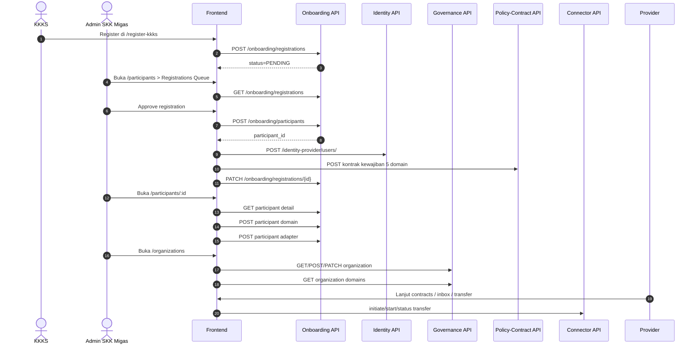

# Audit 8185: Organizations, Onboarding, Participants

Tanggal audit: 2026-06-11  
Scope repo: `d:\laragon\www\dataspace-new`  
Basis compare:

- source FE aktif di worktree saat ini
- runtime API FE yang mengarah ke `:8185`
- live/backend contract yang sebelumnya sudah dicocokkan ke OpenAPI `8185`

---

## 1. Ringkasan Cepat

Kondisi sekarang sudah **lebih maju** daripada audit flow lama:

- route lama `/onboarding` dan `/providers` secara FE sudah **dikonsolidasikan** ke halaman baru `/participants`
- `/participants` sekarang sudah memecah dua concern utama:
  - `Active Participants`
  - `Registrations Queue`
- detail participant sudah punya UI untuk:
  - edit/hapus participant
  - assign/unassign domain participant
  - create/edit/delete adapter dataplane

Tetapi masih ada gap penting:

- `/organizations` belum setara penuh dengan CRUD backend yang tersedia
- relasi `organization -> participant -> user operator` masih belum tampil sebagai satu model yang solid
- beberapa validator FE masih lebih longgar atau tidak eksplisit dibanding validator BE
- onboarding approval masih sangat orchestration-heavy di FE

Verdict praktis:

- **Flow operasional inti ada**
- **merge `/providers` + `/onboarding queue` ke `/participants` sudah benar**
- **`/organizations` tetap lebih aman dipisah**, jangan digabung penuh ke participants

---

## 2. API Base dan Runtime Sekarang

Current FE API base:

- fallback di `src/api/client.ts` = `http://localhost:8185/api/v1`
- `.env.example` = `http://localhost:8185/api/v1`
- `.env.production` = `http://45.158.126.171:8185/api/v1`

Artinya:

- FE sekarang memang sudah diarahkan ke **8185**, bukan 8184
- kalau build production dipakai, browser akan call:
  - `http://45.158.126.171:8185/api/v1`

Gateway/cluster yang saat ini dipakai FE:

- auth / identity: `/identity-provider/*`
- governance: `/governance/*`
- onboarding: `/onboarding/*`
- catalog: `/data-catalog/*`
- policy-contract: `/policy-contract/*`
- audit: `/audit-compliance/*`
- connector/transfer: `/connector/*`

---

## 3. Flow FE yang Sekarang Jalan

## 3.1 Structure menu/route

Current FE route utama:

- `/organizations`
- `/participants`
- `/participants/:id`
- `/datasets`
- `/schemas`
- `/vocabularies`
- `/policies`
- `/contracts`
- `/inbox`
- `/transfers`

Flow yang sekarang paling masuk akal dibaca adalah:

1. setup governance di `/organizations`
2. terima pendaftaran KKKS di `/participants` tab `Registrations Queue`
3. hasil approval menjadi participant aktif di `/participants` tab `Active Participants`
4. buka detail participant untuk assign domain + adapter
5. lanjut ke contracts / inbox / transfer

## 3.2 Sequence flow sekarang



---

## 4. Compare Endpoint BE vs FE

## 4.1 `/organizations`

### Backend 8185 tersedia

- `GET /governance/organizations/`
- `POST /governance/organizations/`
- `GET /governance/organizations/{id}`
- `PATCH /governance/organizations/{id}`
- `DELETE /governance/organizations/{id}`
- `GET /governance/organizations/{organization_id}/domains`
- `POST /governance/organizations/{organization_id}/domains`
- `GET /governance/organizations/{organization_id}/domains/{id}`
- `PATCH /governance/organizations/{organization_id}/domains/{id}`
- `DELETE /governance/organizations/{organization_id}/domains/{id}`

### FE saat ini

Sudah ada:

- list organizations
- create organization
- update organization service/hook
- delete organization service/hook
- list organization domains
- create organization domain service

Belum ada / belum rapi:

- belum ada UI CRUD domain organization
- belum ada detail organization by id
- form create masih berorientasi FE lama, belum eksplisit menampilkan semua aturan backend
- `organization_type` di FE sebenarnya dipakai sebagai substitusi `code`, jadi naming concept-nya masih rancu

### Validator BE

`OrganizationCreateRequest`

- `name`: min 3, max 255
- `code`: min 2, max 20
- `description`: min 10

`OrganizationUpdateRequest`

- `name`: optional, min 3
- `description`: optional, min 10

### Gap FE terhadap validator

- FE memang sudah cek nama minimal 3
- FE belum menjelaskan ke user bahwa `code` itu field formal backend
- FE masih mengizinkan auto-generated `code/description` lewat service bila form tidak isi penuh
- ini membantu flow cepat, tapi bisa bikin data governance kurang bersih

### Verdict

Untuk `/organizations`:

- **BE: full CRUD**
- **FE: partial CRUD**
- prioritas berikutnya: **domain CRUD**, lalu rapikan form `code/description`

---

## 4.2 `/onboarding/registrations`

### Backend 8185 tersedia

- `POST /onboarding/registrations`
- `GET /onboarding/registrations`
- `PATCH /onboarding/registrations/{id}`

Catatan:

- ini memang **bukan full CRUD**
- tidak ada delete registration di backend
- tidak ada detail registration khusus yang wajib dipakai FE saat ini

### FE saat ini

Sudah ada:

- public registration create
- admin list registrations
- approve
- reject
- resend invitation

Approve flow di FE melakukan orkestrasi:

1. create participant
2. create operator user
3. create 5 contracts kewajiban
4. patch registration jadi `APPROVED`

### Validator BE

`RegistrationCreateRequest`

- `organization_name`: min 3
- `wilayah_kerja`: min 1
- `operator_name`: min 2
- `operator_email`: email valid
- `operator_phone`: optional, max 64

`RegistrationUpdateRequest`

- `status`: optional
- `note`: optional
- `participant_id`: optional uuid

### Gap FE

- validasi FE dasar sudah ada, tapi belum semua edge case terlihat di form
- approval masih berat di FE; kalau salah satu step gagal, flow orchestration ikut gagal
- status operator sesudah approval masih banyak infer dari `email`, bukan binding relation yang eksplisit

### Verdict

Untuk `/onboarding/registrations`:

- **FE coverage sudah cukup untuk business flow**
- bukan area yang butuh digabung dengan `organizations`
- area ini sudah tepat digabung ke **`/participants` sebagai tab queue**

---

## 4.3 `/onboarding/participants` dan bekas `/providers`

### Backend 8185 tersedia

- `GET /onboarding/participants`
- `POST /onboarding/participants`
- `GET /onboarding/participants/{id}`
- `PATCH /onboarding/participants/{id}`
- `DELETE /onboarding/participants/{id}`
- `GET /onboarding/participants/{participant_id}/domains`
- `POST /onboarding/participants/{participant_id}/domains`
- `GET /onboarding/participants/{participant_id}/domains/{id}`
- `PATCH /onboarding/participants/{participant_id}/domains/{id}`
- `DELETE /onboarding/participants/{participant_id}/domains/{id}`
- `GET /onboarding/participants/{participant_id}/adapters`
- `POST /onboarding/participants/{participant_id}/adapters`
- `GET /onboarding/participants/{participant_id}/adapters/{id}`
- `PATCH /onboarding/participants/{participant_id}/adapters/{id}`
- `DELETE /onboarding/participants/{participant_id}/adapters/{id}`

### FE saat ini

Sudah ada:

- list active participants
- participant detail
- edit participant
- delete participant
- list/add/delete participant domains
- list/add/update/delete adapters

Masih belum optimal:

- create participant manual belum dijadikan UI mandiri; create masih dominan lewat approval queue
- participant domain belum ada edit flow nyata di UI, yang ada add/delete
- mapping participant ke organization governance masih dicocokkan via nama organisasi, belum relation id yang kuat

### Validator BE

`ParticipantCreateRequest`

- `organization_name`: min 3
- `organization_type`: enum
  - `GOV_LOCAL`
  - `GOV_PROV`
  - `GOV_CENTRAL`
  - `ENTERPRISE`
- `address`: min 3
- `contact_person`: required

`ParticipantUpdateRequest` pada spec backend tampil dengan nama schema yang agak aneh, tetapi field efektifnya:

- `organization_name`: optional
- `organization_type`: optional enum
- `address`: optional
- `contact_person`: optional

### Verdict

Untuk area participant/provider:

- **merge lama `/providers` -> `/participants` itu keputusan yang benar**
- sekarang FE sudah lebih dekat ke full participant management
- next step yang paling penting bukan bikin menu baru, tapi **menguatkan binding participant ke governance organization dan ke user**

---

## 5. Apa yang Sebaiknya Digabung, Apa yang Jangan

## 5.1 Yang bagus digabung

### A. `/providers` + `/onboarding/registrations`

Sudah benar digabung ke `/participants`, karena secara operasional ini satu lifecycle:

1. calon participant masuk queue
2. disetujui
3. menjadi participant aktif
4. dikasih domain
5. dikasih adapter

Model UI yang enak:

- tab `Registrations`
- tab `Active Participants`
- detail participant untuk domain/adapter/user binding

### B. domain + adapter di bawah detail participant

Ini juga sudah benar, karena domain assignment dan adapter config memang konteksnya melekat ke participant tertentu.

## 5.2 Yang jangan digabung penuh

### `/organizations` jangan dilebur habis ke `/participants`

Alasannya:

- organization governance adalah master data tata kelola
- participant adalah actor operasional pertukaran data
- satu nama bisa mirip, tapi tanggung jawabnya beda

Yang aman:

- tetap pisah menu `Organizations`
- tapi di detail participant tampilkan relasi ke governance organization yang terhubung

### Relasi yang ideal

```text
Organization (governance master)
  -> has many governance domains
  -> may relate to many participants

Participant (operational node)
  -> belongs to one governance organization secara eksplisit
  -> has many participant-domain links
  -> has many adapters
  -> has many users/operator accounts
```

---

## 6. Defect Log Kamu: Valid atau Tidak

Hasil konfirmasi terhadap temuanmu:

1. User tidak otomatis ter-assign ke participant org yang sesuai  
   Status: **valid**  
   Catatan: create user memang mengirim `participant_id`, tapi pembacaan hubungan ini di FE belum konsisten terlihat solid setelah login/listing.

2. Email aktivasi berisi URL localhost  
   Status: **valid dan kritikal**  
   Catatan: ini issue backend/config deployment, bukan sekadar tampilan FE.

3. Dashboard activity kosong padahal endpoint audit ada  
   Status: **valid**  
   Catatan: endpoint audit ada, tetapi integrasi widget dashboard belum penuh.

4. FE tampilkan 403 tanpa keterangan  
   Status: **sebelumnya valid, sekarang sudah mulai dibenahi**  
   Catatan: parser error FE sudah diperluas supaya message backend lebih kelihatan, tapi coverage UI per-screen tetap perlu dicek.

5. Tidak ada UI create/edit/delete Schema, Vocabulary, Policy  
   Status: **untuk sprint sebelumnya valid, sekarang sebagian area mulai dibuka tapi belum semua flow setara penuh**

6. Connector onboarding/config masih manual  
   Status: **masih valid secara konsep**, walau participant adapter UI sekarang sudah mulai ada untuk register endpoint adapter.

---

## 7. Checklist SIT/UAT Step-by-Step Sampai Data Transfer

Checklist yang paling realistis dengan FE sekarang:

1. Public user buka `/register-kkks`
2. Isi data KKKS valid
3. Pastikan record masuk `Registrations Queue`
4. Admin buka `/participants`
5. Approve registration
6. Pastikan participant baru muncul di `Active Participants`
7. Pastikan user operator dibuat
8. Pastikan email aktivasi mengarah ke host deploy, bukan localhost
9. Buka detail participant
10. Pastikan participant punya relasi domain yang benar
11. Tambahkan adapter endpoint bila belum ada
12. Setup organization/domain governance di `/organizations` bila belum tersedia
13. Jalankan setup juknis bila paket domain belum terbentuk
14. Publish dataset
15. Pastikan kontrak kewajiban ada
16. Provider approve/activate contract
17. Buat/aktifkan agreement
18. Jalankan transfer dari `/transfers`
19. Poll status sampai `COMPLETED`
20. Verifikasi audit trail / activity log

Good path minimum yang harus lolos:

- registration submit
- approval sukses
- operator activation sukses
- participant detail bisa dibuka
- domain/adapters bisa dikelola
- transfer bisa `COMPLETED`

---

## 8. Concern Utama yang Masih Tersisa

## 8.1 Concern data model

- binding `user -> participant -> organization` belum terlihat kokoh dari FE
- matching organization ke participant masih ada yang bergantung pada nama

## 8.2 Concern UX

- field governance dan operational kadang masih tercampur istilahnya
- next step setelah create/update belum selalu jelas di UI
- error state sudah lebih baik, tapi perlu dicek per halaman

## 8.3 Concern API contract

- FE sudah makin banyak memanggil endpoint 8185
- tapi belum semua validator BE diekspose jelas di form
- orchestration onboarding masih rawan partial failure antar step

---

## 9. Prioritas Aman Berikutnya

Prioritas yang aman tanpa merusak flow inti:

1. Rapikan `/organizations`
   - tambah UI CRUD domain
   - eksplisitkan `code` dan `description`

2. Kuatkan participant binding
   - simpan dan tampilkan relation `organization_id`
   - tampilkan user operator yang menempel ke participant

3. Tambah status/next-step panel
   - setelah approve registration
   - setelah add domain
   - setelah add adapter

4. Audit semua validator FE di path ini
   - registration
   - organization create/update
   - participant edit
   - adapter create/update

5. Buat regression test untuk flow:
   - registration -> approve
   - participant detail -> add domain
   - participant detail -> add adapter
   - transfer sampai selesai

---

## 10. Bottom Line

Jawaban paling jujur untuk kondisi sekarang:

- `8185` memang endpoint yang sekarang dipakai FE
- `/providers` secara konsep **sudah sedang dipensiunkan** dan digabung ke `/participants`
- penggabungan itu **benar**
- `/organizations` **jangan digabung penuh** ke `/participants`
- backend untuk organizations dan participants sebenarnya sudah cukup kaya
- frontend sudah mengejar cukup jauh, tapi masih ada gap pada:
  - relasi data
  - validator
  - domain CRUD organization
  - clarity next-step

Kalau kamu butuh satu kalimat keputusan:

**State sekarang sudah layak disebut “Participants module sedang matang”, sedangkan “Organizations module masih partial walau backend-nya sudah full CRUD”.**
