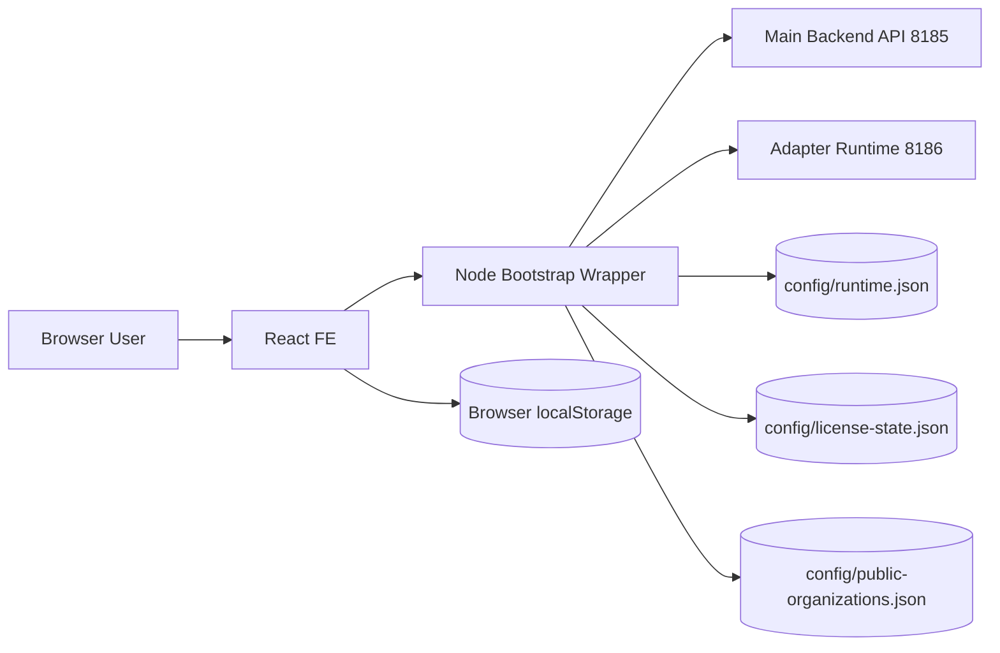
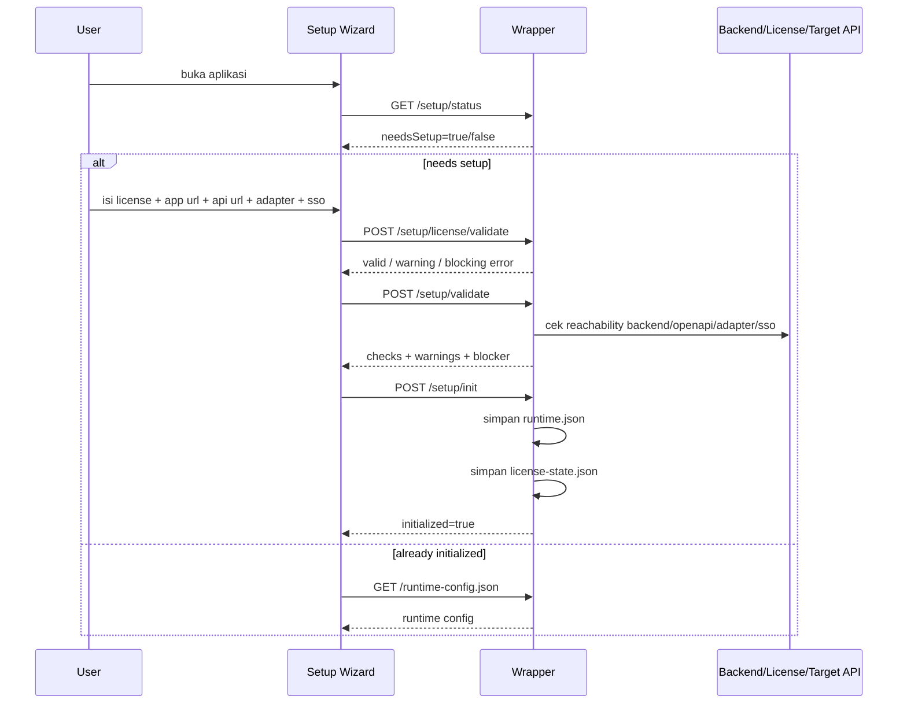
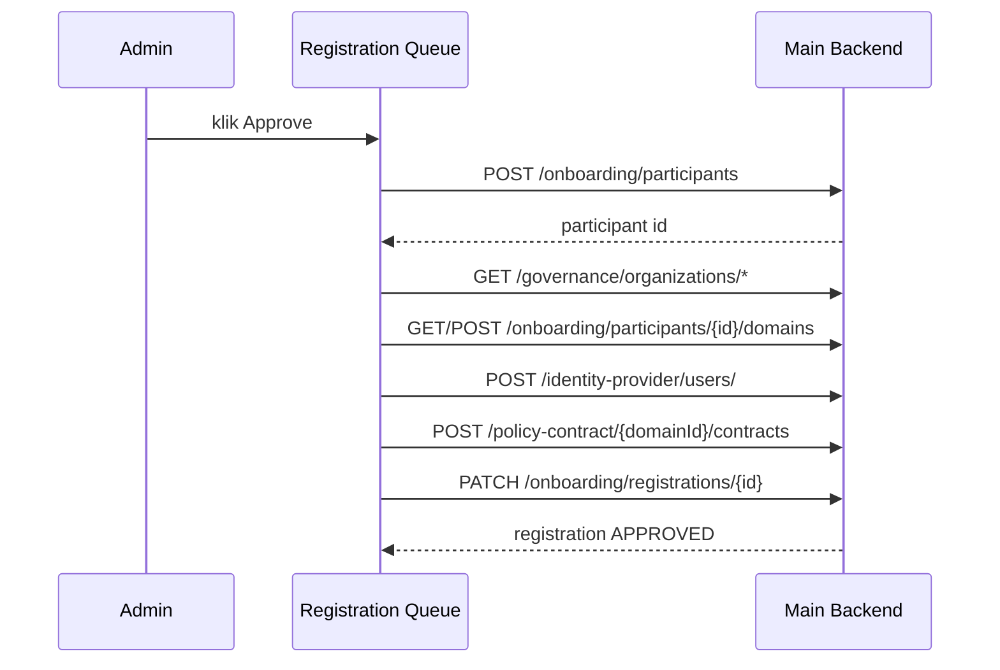
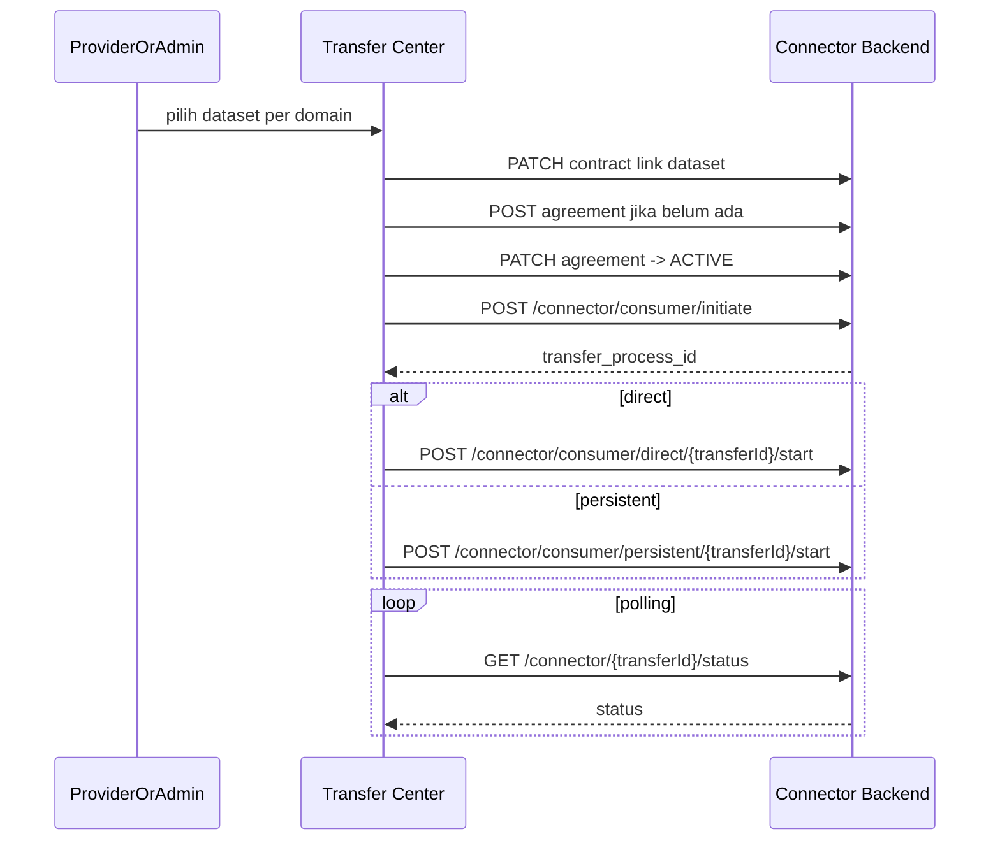
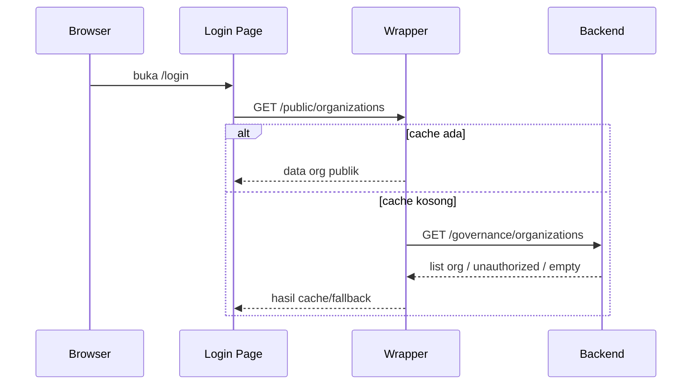

# Blueprint Existing Dataspace Connector
Tanggal: 30 Juni 2026
Status: Existing implementation blueprint
Basis: source code FE `dataspace-new`, wrapper runtime Node, dan kontrak API yang saat ini dipanggil FE

## 1. Tujuan Dokumen
Dokumen ini menjelaskan blueprint implementasi **yang benar-benar ada saat ini** pada aplikasi Dataspace Connector, sehingga bisa dipakai untuk:

- menyamakan persepsi produk, engineering, dan operasional
- membandingkan implementation baseline ini dengan sistem lain
- memetakan flow eksisting sebelum refactor atau integrasi lanjutan
- menjadi acuan audit fitur FE, wrapper runtime, dan integrasi API backend

Dokumen ini sengaja berfokus pada **existing code path**, bukan target ideal jangka panjang.

## 2. Ringkasan Eksekutif
Secara garis besar, aplikasi ini adalah **front-end browser-based** untuk orkestrasi data space yang dibungkus dengan **Node bootstrap wrapper**. Di atasnya ada tiga area besar:

1. **Runtime wrapper**
   Menyediakan setup awal, runtime config, license state, proxy API, public organization cache, dan adapter proxy.

2. **Operational portal**
   Menyediakan login, setup juknis, governance organization, participant onboarding, dataset catalog, contract/agreement, transfer, audit, dan settings provider/admin.

3. **Adapter-assisted provider workflow**
   Menyediakan alur proses data provider untuk validasi/ingest/publish dataset melalui adapter service.

Blueprint eksisting ini belum menampilkan portal peta nasional seperti mockup target akhir. Implementasi saat ini lebih condong ke **governance + onboarding + data exchange operations**.

## 3. Scope Sistem Existing
### 3.1 In scope
- Setup runtime wrapper dan license gate
- Login lokal dan SSO opsional
- Public KKKS registration
- Admin approval queue
- Governance organization dan domain management
- Juknis application untuk 5 domain
- Participant operational management
- Dataset, schema, vocabulary, policy management
- Contract dan agreement management
- Transfer orchestration via connector endpoints
- Adapter wizard untuk provider
- Audit trail FE integration
- Deployment config dan runtime reconfiguration

### 3.2 Out of scope / belum penuh
- Portal map view nasional sebagai landing utama
- Public catalog anonymous browsing
- Full backend-driven governance org picker sebelum login tanpa wrapper cache
- Field resmi `participant.organization_id` di backend
- Full federated RBAC dan complete cross-node federation
- Real-time streaming observability yang detail
- Full production-grade install wizard orchestration untuk multi-node deployment

### 3.3 Readiness level mapping terhadap acuan Level 1-4
Mapping ini dibaca dari code existing dan flow yang benar-benar sudah dipakai FE saat ini.

| Level | Acuan minimum | Status existing | Catatan |
|---|---|---|---|
| Level 1 - Basic | GIS portal aktif, GWS minimal, metadata, konektivitas | Parsial | Portal operasional sudah ada, tetapi belum menjadi portal peta nasional publik seperti target layout akhir. |
| Level 2 - Standard | Level 1 + connector, metadata lengkap, QC, naming standar | Parsial menuju ada | Modul dataset, schema, vocabulary, policy, contract, dan transfer sudah ada, tetapi mutu metadata dan QC tetap bergantung backend dan adapter. |
| Level 3 - Advanced | Connector data space, federated RBAC, harvesting otomatis, CSW aktif | Parsial | Sudah ada orkestrasi contract/agreement/transfer dan role model, tetapi federasi formal dan harvesting lintas node belum utuh. |
| Level 4 - Full | ATS penuh, OSDU, event streaming real-time, adapter tier lanjut | Belum | Existing code belum menunjukkan coverage penuh ke ATS, OSDU, dan streaming event real-time end-to-end. |

Kesimpulan praktis:
- baseline existing paling dekat ada di antara Level 2 dan sebagian Level 3
- kekuatan utamanya ada di governance, onboarding, contract, dan transfer orchestration
- gap utamanya ada di federation formal, public geo portal penuh, dan automasi lintas node yang lebih matang

## 4. Komponen Arsitektur
## 4.1 Lapisan utama
| Lapisan | Komponen | Fungsi |
|---|---|---|
| Presentation | React + Vite + TanStack Query + Radix UI | UI, state screen, role-based routing |
| Runtime wrapper | `server/bootstrap.cjs` | setup runtime, config persistence, license gate, proxy API, adapter proxy, public org cache |
| Backend main | API 8185 | identity, governance, onboarding, policy-contract, data-catalog, connector, audit |
| Adapter service | API 8186 / adapter runtime | health, metadata, OGC collections, ingest, publish |
| Local persisted state | `config/*.json`, browser localStorage | runtime config, license state, public org cache, session helper |

## 4.2 Entry point FE
Route tree utama ada di [src/App.tsx](../src/App.tsx).

Route penting:

| Route | Fungsi |
|---|---|
| `/setup` | first-run wizard runtime |
| `/login` | login page |
| `/register-kkks` | public registration form |
| `/confirm-email` | email confirmation |
| `/setup-juknis` | setup governance package |
| `/organizations` | governance organizations |
| `/participants` | active participants + registration queue |
| `/participants/:id` | participant detail |
| `/datasets` | catalog dataset |
| `/schemas` | schema management |
| `/vocabularies` | vocabulary management |
| `/policies` | dataset policy management |
| `/contracts` | contract management |
| `/inbox` | provider incoming requests |
| `/transfers` | transfer center |
| `/audit` | audit trail |
| `/settings` | account, adapter, provider flow |
| `/deployment-config` | runtime config admin |

## 4.3 Runtime mode
Ada dua mode jalan yang harus dibedakan jelas:

| Mode | Command | Karakter |
|---|---|---|
| FE dev only | `npm run dev` | Vite dev server, cocok untuk UI dev, bukan representasi final wrapper flow |
| Browser bundle runtime | `npm run build` lalu `npm run start:bundle` | mode yang benar untuk setup wizard, runtime config, license state, public organization cache, dan proxy wrapper |

Catatan penting:
- Flow pre-login public organization cache hanya valid penuh pada mode wrapper.
- Testing installer/wrapper lintas browser harus dilakukan di `start:bundle`, bukan `dev`.

## 5. Role Model Existing
Role canonical FE ada di [src/context/AuthContext.tsx](../src/context/AuthContext.tsx) dan [src/config/rbac.ts](../src/config/rbac.ts).

Role canonical:

- `SUPER_ADMIN`
- `ADMIN`
- `PROVIDER`
- `CONSUMER`
- `VIEWER`
- `AUDITOR`
- `GIS_ANALYST`

Ringkasan akses menu:

| Role | Fokus |
|---|---|
| `SUPER_ADMIN` | akses penuh semua route, termasuk runtime/deployment |
| `ADMIN` | governance, participant ops, deployment, monitoring |
| `PROVIDER` | dataset, inbox, transfer, adapter/settings |
| `CONSUMER` | dashboard, contracts, policies, dataset read |
| `AUDITOR` | audit, contracts, participant read |
| `VIEWER` | dataset-centric read |
| `GIS_ANALYST` | dataset-centric read/analysis |

### 5.1 Matriks peran vs area kerja
| Area | Super Admin | Admin | Provider | Consumer | Auditor |
|---|---|---|---|---|---|
| Setup runtime | Ya | Ya | Tidak | Tidak | Tidak |
| Setup Juknis | Ya | Ya | Tidak | Tidak | Tidak |
| Organizations | Ya | Ya | Tidak | Tidak | Tidak |
| Participants | Ya | Ya | Baca terbatas via flow lain | Ya | Ya |
| Connection Pools | Ya | Ya | Tidak | Tidak | Tidak |
| Dataset | Ya | Ya | Ya | Ya | Baca |
| Schema / Vocabulary / Policy | Ya | Ya | Ya | Ya | Baca |
| Contracts / Agreements | Ya | Ya | Ya | Ya | Baca |
| Transfer | Ya | Ya | Ya | Tidak dominan | Baca terbatas |
| Adapter / Process Data | Bisa monitor | Bisa monitor | Ya | Tidak | Tidak |
| Audit | Ya | Ya | Tidak | Tidak | Ya |

## 6. Persistence Model
## 6.1 Server-side persistence
| File | Fungsi |
|---|---|
| `config/runtime.json` | runtime endpoint config |
| `config/license-state.json` | license activation state |
| `config/public-organizations.json` | cache daftar organisasi untuk pre-login |

## 6.2 Browser-side persistence
| Key | Fungsi |
|---|---|
| `auth_token` | token login lokal |
| `user_info` | cached user identity |
| `remember_device` | remember me |
| `cached_orgs` | browser cache daftar org |
| `preferred_organization_id` | preferensi org aktif |
| `preferred_organization_name` | preferensi nama org aktif |
| `preferred_participant_id` | participant aktif |
| `active_domain_id` | domain aktif |
| `transfer_mode_map` | mode transfer per proses |
| `transfer_body_map` | payload transfer per proses |

Catatan:
- existing code sudah mulai memindahkan resolusi binding ke backend-driven inference berbasis participant-domain vs organization-domain
- tetapi browser storage masih dipakai untuk convenience state

### 6.3 Sumber relasi yang benar-benar dipakai existing
Kalau dibaca dari flow code yang ada sekarang, source of truth existing belum satu field tunggal. Urutannya seperti ini:

1. `user -> participant` paling stabil bila backend mengembalikan `participant_id` atau user dibuat dari flow approval registration.
2. `participant -> domain` adalah relasi operasional paling penting dan paling sering dipakai untuk domain aktif, contract, transfer, dan adapter.
3. `organization -> domain` dipakai untuk inferensi governance organization aktif.
4. `user pilih organisasi saat login` masih berfungsi sebagai konteks awal, tetapi validitas final tetap harus disaring lagi terhadap participant/domain yang berhasil di-resolve.

Artinya, blueprint existing ini lebih tepat disebut:
`binding berbasis participant-domain dengan bantuan organization-context`, belum `organization-driven binding` yang benar-benar formal di backend.

## 7. Blueprint Arsitektur Existing

### 7.1 Kepemilikan flow per lapisan
| Concern | FE | Wrapper | Backend utama | Adapter |
|---|---|---|---|---|
| Routing UI | Ya | Tidak | Tidak | Tidak |
| Runtime setup | Sebagian UI | Ya | Tidak | Tidak |
| License state | Tampil status | Ya | Opsional server lisensi | Tidak |
| Public organization pre-login | Konsumsi | Ya | Fallback bila memungkinkan | Tidak |
| Login/auth | Form + state | Proxy | Ya | Tidak |
| Governance | UI | Proxy | Ya | Tidak |
| Onboarding | UI | Proxy | Ya | Tidak |
| Connection pool | UI | Inspect helper | Ya | Tidak |
| Contract/agreement | UI | Proxy | Ya | Tidak |
| Transfer control plane | UI | Proxy | Ya | Tidak |
| Transfer data plane helper | UI | Proxy | Ya | Bisa jadi target data |
| Ingestion/validation | UI wizard | Proxy | Tidak | Ya |
| Publish dari adapter | UI wizard | Proxy | Sebagian lewat catalog/connector | Ya |

## 8. Alur Utama Existing
### 8.0 Ringkasan alur besar aplikasi
Jika seluruh code existing disederhanakan, urutannya seperti ini:

1. instance dihidupkan lewat wrapper
2. admin melakukan setup runtime
3. admin menyiapkan governance organization, domain, dan juknis
4. provider mendaftar lewat registrasi publik
5. admin approve registrasi menjadi participant, user operator, dan kewajiban kontrak
6. user login dan sistem resolve participant/domain context
7. provider menyiapkan dataset atau proses adapter
8. consumer/admin mengelola contract dan agreement
9. provider/admin menjalankan transfer
10. auditor/admin memantau audit trail dan compliance state

## 8.1 First-run setup runtime
Tujuan:
- mengikat aplikasi ke endpoint backend
- mengaktifkan runtime config
- mengatur adapter endpoint
- mengatur SSO opsional
- menyimpan state ke wrapper

Sequence:

Endpoint wrapper terkait:
- `GET /setup/status`
- `POST /setup/license/validate`
- `POST /setup/validate`
- `POST /setup/init`
- `GET /runtime-config.json`

## 8.2 Public KKKS registration
Tujuan:
- operator/provider baru mendaftarkan KKKS secara self-service
- masuk ke antrean admin

Source code utama:
- [src/pages/RegisterKKKS.tsx](../src/pages/RegisterKKKS.tsx)

Flow:
1. user buka `/register-kkks`
2. FE ambil governance organization list
3. user pilih organisasi governance
4. FE mengunci `organization_name` mengikuti organisasi governance yang dipilih
5. user isi `wilayah_kerja`, operator, email, telepon, note
6. FE kirim registration ke onboarding backend
7. backend menyimpan status `PENDING`

Endpoint:
- `GET /governance/organizations/`
- `POST /onboarding/registrations`

## 8.3 Admin approval registration queue
Tujuan:
- mengonversi registration menjadi participant aktif + user operator + kewajiban kontrak

Source code utama:
- [src/pages/participants/RegistrationsTab.tsx](../src/pages/participants/RegistrationsTab.tsx)

Flow saat `Approve`:
1. buat participant `ENTERPRISE`
2. resolve governance organization referensi
3. bind domain organisasi governance ke participant
4. buat user operator kategori/group provider
5. terbitkan kewajiban kontrak otomatis untuk domain yang dibind
6. update registration menjadi `APPROVED`

Sequence:

Catatan penting existing:
- approval saat ini bergantung pada keberadaan participant consumer/regulator
- domain binding participant menjadi fondasi untuk flow login, dataset, transfer, dan adapter
- inilah titik automation paling penting bila blueprint ini mau disandingkan dengan sistem lain

## 8.4 Login dan binding konteks user
Tujuan:
- autentikasi user
- menentukan role canonical
- menentukan participant aktif
- menentukan governance organization yang sah

Source code utama:
- [src/components/login/LoginPage.tsx](../src/components/login/LoginPage.tsx)
- [src/context/AuthContext.tsx](../src/context/AuthContext.tsx)
- [src/context/DomainContext.tsx](../src/context/DomainContext.tsx)

Flow existing:
1. login page memuat daftar organisasi dari `/public/organizations`
2. jika kosong, FE coba source lain
3. user pilih organisasi
4. FE login ke endpoint auth
5. FE decode JWT
6. FE ambil organizations, registrations, participants
7. FE resolve participant user
8. FE ambil domain participant
9. FE resolve governance org dengan membandingkan participant domains vs organization domains
10. FE simpan context user + preferred org + preferred participant
11. `DomainContext` menentukan domain aktif

Catatan penting:
- ini bukan pure backend binding formal, melainkan **backend-driven inference**
- inference utama sekarang memakai **domain overlap**, bukan lagi semata local storage binding
- pre-login organization picker masih bergantung wrapper cache publik

### 8.4.1 Blueprint binding login yang benar dari existing code
Secara existing, login yang benar harus dibaca begini:

1. user memilih organisasi sebagai konteks awal
2. user kirim kredensial ke auth backend
3. token diterima
4. FE membaca user profile, registrations, participants, dan domain binding
5. FE mencari participant yang memang milik user itu
6. FE mencari domain participant
7. FE mencocokkan domain participant dengan domain governance organization
8. bila cocok, organization context dianggap valid
9. bila tidak cocok, FE jatuh ke mekanisme inferensi atau fallback

Jadi dropdown organisasi di login bukan sumber kebenaran tunggal. Ia lebih tepat sebagai `initial organization context selector`, lalu diverifikasi ulang oleh participant-domain resolution.

## 8.5 Setup Juknis
Tujuan:
- menyiapkan baseline governance domain dan policy package 5 domain

Source code utama:
- [src/pages/SetupJuknis.tsx](../src/pages/SetupJuknis.tsx)
- [src/api/services/juknis.ts](../src/api/services/juknis.ts)

Flow:
1. pilih atau buat governance organization
2. pilih atau buat governance domain
3. review 5 row default domain juknis
4. set klasifikasi dan retention per row
5. apply package ke domain
6. backend membuat policy/dictionary/schema baseline

Endpoint:
- `GET /governance/organizations/`
- `POST /governance/organizations/`
- `GET /governance/organizations/{orgId}/domains`
- `POST /governance/organizations/{orgId}/domains`
- `POST /policy-contract/{domainId}/apply-juknis`

## 8.6 Governance Organization & Domain Management
Tujuan:
- mengelola organisasi governance dan domain turunannya

Area:
- `/organizations`
- dipakai juga oleh setup juknis, register KKKS, login cache, participant binding

Entity kunci:
- `organization`
- `organization domain`

Function existing:
- list organizations
- create/update/delete organization
- list/create/update/delete organization domain

## 8.7 Participant Management
Tujuan:
- mengelola participant operasional setelah onboarding

Area:
- `/participants`
- `/participants/:id`

Struktur:
- tab `Active Participants`
- tab `Registrations Queue`

Kemampuan existing:
- create/update/delete participant
- assign governance organization secara UI
- add/remove participant domains
- add/remove participant adapters
- issue auto contract obligations
- resend invitation operator
- lihat dataplane readiness

Catatan:
- relasi participant ↔ organization belum menjadi field resmi backend
- relasi formal yang paling stabil saat ini adalah participant ↔ domains

### 8.7.1 Participant detail sebagai simpul operasional
Secara blueprint, halaman detail participant paling masuk akal dipahami sebagai simpul untuk:

- identitas participant
- domain binding participant
- adapter binding participant
- readiness dataplane
- koneksi ke contract, transfer, dan kewajiban domain

Kalau ada gap data organisasi, tempat paling masuk akal untuk menampilkannya adalah di detail participant, bukan hanya di daftar global.

## 8.8 Data Catalog
Tujuan:
- menampilkan dan mengelola dataset provider yang dipublish

Source code utama:
- [src/api/services/data-catalog.ts](../src/api/services/data-catalog.ts)

Flow existing:
1. FE membaca dataset by `domainId`
2. FE normalize respons menjadi model dataset FE
3. publish dataset dilakukan dengan payload endpoint + metadata
4. dataset kemudian dipakai pada contract dan transfer

Endpoint:
- `GET /data-catalog/{domainId}/datasets`
- `GET /data-catalog/{domainId}/datasets/{id}`
- `PATCH /data-catalog/{domainId}/datasets/{id}`
- `DELETE /data-catalog/{domainId}/datasets/{id}`
- `POST /data-catalog/{domainId}/datasets`

## 8.9 Schemas, Vocabularies, Policies
Tujuan:
- mengelola metadata contractability dan semantic structure

Source:
- `schemas.ts`
- `vocabularies.ts`
- `governance.ts` untuk dataset policies

Endpoint groups:

Schemas:
- `GET /data-catalog/{domainId}/schemas`
- `POST /data-catalog/{domainId}/schemas`
- `PATCH /data-catalog/{domainId}/schemas/{id}`
- `DELETE /data-catalog/{domainId}/schemas/{id}`

Vocabularies:
- `GET /data-catalog/{domainId}/vocabularies`
- `POST /data-catalog/{domainId}/vocabularies`
- `PATCH /data-catalog/{domainId}/vocabularies/{id}`
- `DELETE /data-catalog/{domainId}/vocabularies/{id}`
- `GET /data-catalog/{domainId}/vocabularies/{id}/terms`

Policies:
- `GET /policy-contract/{domainId}/dataset-policies`
- `POST /policy-contract/{domainId}/dataset-policies`
- `PATCH /policy-contract/{domainId}/dataset-policies/{policyId}`
- `DELETE /policy-contract/{domainId}/dataset-policies/{policyId}`

## 8.10 Contract dan Agreement
Tujuan:
- mengelola izin pertukaran data antara consumer dan provider

Source:
- [src/api/services/policy-contract.ts](../src/api/services/policy-contract.ts)

Flow existing:
1. consumer/admin membuat contract
2. dataset bisa ditautkan ke contract
3. agreement dibuat dari contract
4. agreement diaktivasi
5. transfer memakai agreement aktif

Status penting:
- contract: `REQUESTED`, `APPROVED`, `ACTIVE`, `REJECTED`, `CANCELLED`, `EXPIRED`
- agreement: `APPROVED`, `ACTIVE`, `REJECTED`

## 8.11 Transfer Center
Tujuan:
- menjalankan data exchange berdasarkan kontrak, agreement, dataset, dan connection pool

Source:
- [src/pages/TransferCenter.tsx](../src/pages/TransferCenter.tsx)
- [src/api/services/connector.ts](../src/api/services/connector.ts)

Decision point utama:
- harus ada domain aktif
- harus ada contract aktif
- harus ada dataset terpilih
- harus ada agreement aktif
- harus ada connection pool participant
- connection pool harus punya minimal:
  - connector endpoint
  - well-known JWT URL

Mode transfer:
- direct stream
- persistent transfer

Sequence:

Endpoint existing:
- `GET /connector/{domainId}/transfers`
- `POST /connector/consumer/initiate`
- `POST /connector/consumer/direct/{transferId}/start`
- `POST /connector/consumer/persistent/{transferId}/start`
- `GET /connector/consumer/persistent/{transferId}/download`
- `GET /connector/{transferId}/status`

Catatan:
- FE menyimpan mode transfer dan body transfer di localStorage untuk retry/resume convenience
- readiness transfer sangat dipengaruhi connection pool

### 8.11.1 Blueprint control plane vs data plane
Supaya tidak rancu saat dibandingkan:

Control plane existing mengurus:
- kontrak
- agreement
- pemilihan dataset
- connection pool readiness
- initiate transfer
- polling status

Data plane existing mengurus:
- start direct stream
- start persistent transfer
- download persistent hasil transfer

Jadi existing FE tidak sekadar melempar URL. Ia sudah mengorkestrasi syarat control plane sebelum eksekusi data plane dimulai.

## 8.12 Connection Pools
Tujuan:
- menjadi data koneksi antar participant yang dipakai saat transfer

Entity utama:
- `participant_id`
- `type`
- metadata koneksi

Metadata kritikal:
- endpoint connector participant
- `well_known_jwt_url`

Endpoint:
- `GET /onboarding/connection-pools`
- `POST /onboarding/connection-pools`
- `PATCH /onboarding/connection-pools/{id}`
- `DELETE /onboarding/connection-pools/{id}`

Peran operasional:
- tanpa connection pool valid, transfer tidak boleh dimulai
- FE juga punya runtime inspect endpoint admin pada wrapper

### 8.12.1 Isi minimum connection pool yang dibutuhkan flow
Untuk flow existing sekarang, connection pool minimal harus bisa memberi:

- endpoint connector participant
- `well_known_jwt_url`
- identitas participant sumber dan tujuan

Kalau salah satu dari dua alamat penting itu tidak ada atau tidak reachable, transfer center secara fungsional belum siap.

## 8.13 Provider Adapter / Process Data Flow
Tujuan:
- mendukung ingestion/validasi/publish dataset dari sisi provider

Area:
- `/settings` pada role provider
- komponen `AdapterFlowWizard`
- service `adapter-runtime.ts`

Flow konseptual existing:
1. provider punya participant aktif
2. provider punya domain participant
3. provider punya adapter endpoint pada participant
4. provider memilih domain kerja
5. provider menjalankan salah satu jalur:
   - remote metadata/collection check
   - ingest GeoJSON
   - ingest shapefile
   - publish hasil ke dataset
6. hasil adapter dipantau di panel yang sama

Endpoint adapter existing via wrapper:
- `GET /adapter-runtime/health`
- `GET /adapter-runtime/v1/ogc/collections`
- `GET /adapter-runtime/v1/ogc/providers`
- `GET /adapter-runtime/v1/metadata`
- `GET /adapter-runtime/v1/metadata/{domain}`
- `POST /adapter-runtime/v1/ingest/{domain}`
- `POST /adapter-runtime/v1/ingest/{domain}/shapefile`
- `POST /adapter-runtime/v1/publish/{domain}`

Catatan:
- adapter runtime diakses lewat wrapper dengan header `x-adapter-base-url`
- sumber adapter endpoint utamanya berasal dari runtime config dan/atau participant adapter

### 8.13.1 Blueprint adapter berdasarkan flow kerja provider
Alur kerja provider yang paling masuk akal dari existing code adalah:

1. provider punya domain aktif
2. provider memastikan service adapter sudah terpasang di runtime atau deployment
3. provider memilih domain kerja
4. provider memilih jalur data:
   - remote source
   - GeoJSON
   - shapefile
5. provider membuat task validasi atau ingest
6. provider memantau status task
7. provider membaca hasil validasi atau OGC items
8. provider mempublish hasil menjadi dataset yang siap dipakai contract atau transfer

Dengan kata lain, adapter berada di sisi `pre-catalog` dan `pre-transfer`.

## 8.14 Audit Trail
Tujuan:
- menampilkan audit log dari backend

Endpoint existing:
- `GET /audit-compliance/audit-logs`

Peran:
- admin
- super admin
- auditor

## 8.15 Deployment Config
Tujuan:
- memungkinkan admin mengubah runtime config tanpa rebuild FE

Flow:
1. admin buka `/deployment-config`
2. edit `publicAppUrl`, `apiBaseUrl`, `adapterEndpoint`, dan SSO
3. FE panggil wrapper admin endpoint
4. wrapper validasi lalu simpan `runtime.json`
5. admin bisa revalidate license

Endpoint wrapper:
- `POST /admin/runtime-config`
- `GET /admin/license-status`
- `POST /admin/license/revalidate`

## 9. Public Organization Cache Flow
Masalah eksisting:
- login meminta organisasi sebelum user login
- backend organization list protected by JWT
- maka login page tidak bisa langsung baca backend protected endpoint

Solusi existing di code:
1. wrapper expose `GET /public/organizations`
2. wrapper membaca `config/public-organizations.json`
3. bila kosong, wrapper mencoba fetch dari backend runtime
4. FE admin dapat menyinkronkan cache publik via wrapper

Flow:

Catatan:
- jika endpoint backend protected dan wrapper belum punya cache, hasil tetap bisa kosong
- karena itu cache publik harus dianggap bagian deployment operational readiness

## 10. API Map by Existing Module
Catatan pembacaan:
- daftar di bawah adalah peta endpoint yang dipakai atau diproyeksikan langsung oleh service FE existing
- wrapper menambah endpoint sendiri untuk kebutuhan runtime, cache, dan proxy
## 10.1 Identity & auth
- `POST /identity-provider/auth/login`
- `POST /identity-provider/auth/external-login`
- `POST /identity-provider/auth/refresh-token`
- `POST /identity-provider/auth/revoke-token`
- `POST /identity-provider/auth/validate`
- `GET /identity-provider/user/categories/`
- `GET /identity-provider/user/groups/`
- `GET /identity-provider/users/`
- `POST /identity-provider/users/`
- `PATCH /identity-provider/users/{id}`
- `DELETE /identity-provider/users/{id}`
- `POST /identity-provider/users/confirm-email`
- `POST /identity-provider/users/resend-email-confirmation`

## 10.2 Onboarding
- `POST /onboarding/registrations`
- `GET /onboarding/registrations`
- `PATCH /onboarding/registrations/{id}`
- `POST /onboarding/participants`
- `GET /onboarding/participants`
- `GET /onboarding/participants/{id}`
- `PATCH /onboarding/participants/{id}`
- `DELETE /onboarding/participants/{id}`
- `GET /onboarding/participants/{participantId}/domains`
- `POST /onboarding/participants/{participantId}/domains`
- `PATCH /onboarding/participants/{participantId}/domains/{id}`
- `DELETE /onboarding/participants/{participantId}/domains/{id}`
- `GET /onboarding/participants/{participantId}/adapters`
- `POST /onboarding/participants/{participantId}/adapters`
- `PATCH /onboarding/participants/{participantId}/adapters/{id}`
- `DELETE /onboarding/participants/{participantId}/adapters/{id}`
- `GET /onboarding/connection-pools`
- `POST /onboarding/connection-pools`
- `PATCH /onboarding/connection-pools/{id}`
- `DELETE /onboarding/connection-pools/{id}`

## 10.3 Governance
- `GET /governance/organizations/`
- `POST /governance/organizations/`
- `PATCH /governance/organizations/{id}`
- `DELETE /governance/organizations/{id}`
- `GET /governance/organizations/{orgId}/domains`
- `POST /governance/organizations/{orgId}/domains`
- `PATCH /governance/organizations/{orgId}/domains/{domainId}`
- `DELETE /governance/organizations/{orgId}/domains/{domainId}`

## 10.4 Data catalog
- `GET /data-catalog/{domainId}/datasets`
- `GET /data-catalog/{domainId}/datasets/{id}`
- `PATCH /data-catalog/{domainId}/datasets/{id}`
- `DELETE /data-catalog/{domainId}/datasets/{id}`
- `POST /data-catalog/{domainId}/datasets`
- `GET /data-catalog/{domainId}/schemas`
- `POST /data-catalog/{domainId}/schemas`
- `PATCH /data-catalog/{domainId}/schemas/{id}`
- `DELETE /data-catalog/{domainId}/schemas/{id}`
- `GET /data-catalog/{domainId}/vocabularies`
- `POST /data-catalog/{domainId}/vocabularies`
- `PATCH /data-catalog/{domainId}/vocabularies/{id}`
- `DELETE /data-catalog/{domainId}/vocabularies/{id}`

## 10.5 Policy-contract
- `POST /policy-contract/{domainId}/apply-juknis`
- `GET /policy-contract/{domainId}/dataset-policies`
- `POST /policy-contract/{domainId}/dataset-policies`
- `PATCH /policy-contract/{domainId}/dataset-policies/{policyId}`
- `DELETE /policy-contract/{domainId}/dataset-policies/{policyId}`
- `GET /policy-contract/{domainId}/contracts`
- `GET /policy-contract/{domainId}/contracts/{id}`
- `POST /policy-contract/{domainId}/contracts`
- `PATCH /policy-contract/{domainId}/contracts/{id}`
- `GET /policy-contract/{domainId}/agreements`
- `POST /policy-contract/{domainId}/agreements`
- `PATCH /policy-contract/{domainId}/agreements/{id}`

## 10.6 Connector / transfer
- `POST /connector/consumer/initiate`
- `POST /connector/consumer/direct/{transferId}/start`
- `POST /connector/consumer/persistent/{transferId}/start`
- `GET /connector/consumer/persistent/{transferId}/download`
- `GET /connector/{transferId}/status`
- `GET /connector/{domainId}/transfers`

## 10.7 Adapter runtime via wrapper
- `GET /adapter-runtime/health`
- `GET /adapter-runtime/v1/ogc/collections`
- `GET /adapter-runtime/v1/ogc/providers`
- `GET /adapter-runtime/v1/metadata`
- `GET /adapter-runtime/v1/metadata/{domain}`
- `POST /adapter-runtime/v1/ingest/{domain}`
- `POST /adapter-runtime/v1/ingest/{domain}/shapefile`
- `POST /adapter-runtime/v1/publish/{domain}`

## 10.8 Wrapper-only runtime endpoints
- `GET /setup/status`
- `POST /setup/license/validate`
- `POST /setup/validate`
- `POST /setup/init`
- `GET /runtime-config.json`
- `POST /admin/runtime-config`
- `GET /admin/license-status`
- `POST /admin/license/revalidate`
- `POST /admin/connection-pool/inspect`
- `GET /public/organizations`
- `POST /admin/public-organizations/cache`

## 11. Existing Operational Blueprint per Actor
## 11.1 Super Admin
- setup runtime wrapper
- buka setup juknis
- kelola organizations
- kelola connection pools
- kelola participant
- pilih provider context pada transfer center
- update deployment config dan license state

## 11.2 Admin
- approve registration queue
- kelola governance organizations dan domains
- kelola participant operasional
- kelola connection pools
- pantau contract, audit, deployment

## 11.3 Provider
- login dengan organisasi terkait
- melihat inbox
- melihat dataset
- publish dataset
- menjalankan adapter process flow
- mengirim transfer data untuk kewajiban domain

## 11.4 Consumer
- memonitor contract/agreement
- mengakses dataset yang diizinkan
- memantau domain readiness

## 11.5 Auditor
- memeriksa audit trail
- memeriksa contract/policy state
- memeriksa participant readiness

## 12. Known Gaps pada Existing Blueprint
## 12.1 Gaps arsitektural
- pre-login organization picker masih memerlukan cache wrapper atau endpoint publik khusus
- belum ada relasi resmi `participant.organization_id` di backend
- sebagian browser local state masih dipakai sebagai helper context

## 12.2 Gaps operasional
- bundle mode dan dev mode punya perilaku berbeda
- flow pre-login tidak boleh diuji hanya dengan `npm run dev`
- public organization cache perlu disiplin sinkronisasi

## 12.3 Gaps domain/business
- blueprint target map-centric nasional belum terealisasi penuh
- readiness Level 3/4 federation belum lengkap
- adapter flow masih bergantung service readiness eksternal

## 12.4 Gaps UX
- jika cache organisasi kosong, pre-login org picker bisa kosong
- jika backend protected endpoint berubah, login flow sensitif
- beberapa modul masih membutuhkan penyederhanaan narasi dan konsistensi binding

## 12.5 Gaps blueprint yang perlu dijaga saat refactor
- jangan memindahkan source of truth domain aktif tanpa menyesuaikan login, participant detail, transfer, dan adapter sekaligus
- jangan mengubah approval registration tanpa menjaga pembuatan participant, user operator, dan kewajiban kontrak tetap atomik
- jangan memindahkan logic runtime setup ke FE murni, karena wrapper saat ini memegang lisensi, file config, public cache, dan proxy
- jangan menyamakan dev mode dengan bundle mode saat audit flow

## 13. Checklist Pembanding Saat Disandingkan dengan Sistem Lain
Gunakan checklist ini untuk membandingkan baseline ini dengan blueprint lain:

### 13.1 Runtime & deployment
- Apakah ada wrapper runtime atau langsung SPA?
- Apakah config runtime bisa diubah tanpa rebuild?
- Apakah ada first-run setup?
- Apakah ada public pre-login cache?

### 13.2 Identity
- Apakah organization dipilih sebelum login atau sesudah login?
- Apakah organization list publik atau protected?
- Apakah user terikat formal ke participant?
- Apakah participant terikat formal ke organization?

### 13.3 Governance
- Apakah organization dan domain punya CRUD penuh?
- Apakah setup juknis membentuk baseline package otomatis?
- Apakah classification dan retention sudah termodelkan?

### 13.4 Onboarding
- Apakah ada public registration?
- Apakah approval otomatis membuat participant dan user?
- Apakah kewajiban kontrak otomatis terbit?

### 13.5 Data lifecycle
- Apakah dataset publish sudah satu alur dengan schema/policy?
- Apakah contract dan agreement terhubung ke dataset?
- Apakah transfer hanya bisa jalan bila connection pool valid?

### 13.6 Adapter
- Apakah adapter diposisikan sebagai provider-side operational tool?
- Apakah adapter hanya health check atau sampai ingest/publish?
- Apakah adapter endpoint runtime dapat diubah tanpa rebuild?

### 13.7 Readiness mapping
- Sistem pembanding itu setara Level 1, 2, 3, atau 4?
- Apakah yang sudah ada hanya portal data, atau sudah sampai contract-driven transfer?
- Apakah federation formal dan binding organization-participant sudah first-class di backend?
- Apakah adapter menjadi bagian inti workflow provider atau hanya tool tambahan?

## 14. Kesimpulan Blueprint Existing
Existing implementation ini paling tepat dipahami sebagai:

**browser-based dataspace operations portal dengan wrapper runtime, governance bootstrap, participant onboarding, contract-driven transfer, dan provider adapter workflow.**

Ia sudah memiliki fondasi kuat untuk:
- onboarding participant
- governance domain bootstrap
- contract/agreement/transfer orchestration
- runtime wrapper deployment

Namun masih memiliki ketergantungan penting pada:
- wrapper runtime mode
- public organization cache
- binding participant-domain sebagai sumber relasi paling stabil

Jika dokumen ini dipakai sebagai baseline pembanding, maka sistem ini bukan sekadar katalog data, melainkan **operational connector portal** yang menjembatani governance, onboarding, dan transfer execution.

### 14.1 Posisi blueprint ini untuk kebutuhan komparasi
Kalau nanti kamu sandingkan dengan sistem lain, dokumen ini paling berguna untuk tiga pertanyaan:

1. existing ini sebenarnya portal jenis apa?  
Jawab: portal operasional connector dengan wrapper runtime, bukan sekadar landing map atau katalog.

2. flow paling kritikalnya ada di mana?  
Jawab: setup runtime, approval onboarding, binding participant-domain, contract/agreement, dan transfer readiness.

3. bagian mana yang masih harus dianggap evolving?  
Jawab: organization binding formal, public pre-login org source, adapter maturity, dan alignment readiness level 3 ke 4.

## 15. Lampiran File Acuan Code
- [src/App.tsx](../src/App.tsx)
- [src/config/rbac.ts](../src/config/rbac.ts)
- [src/components/login/LoginPage.tsx](../src/components/login/LoginPage.tsx)
- [src/context/AuthContext.tsx](../src/context/AuthContext.tsx)
- [src/context/DomainContext.tsx](../src/context/DomainContext.tsx)
- [src/pages/Setup.tsx](../src/pages/Setup.tsx)
- [src/pages/SetupJuknis.tsx](../src/pages/SetupJuknis.tsx)
- [src/pages/RegisterKKKS.tsx](../src/pages/RegisterKKKS.tsx)
- [src/pages/Participants.tsx](../src/pages/Participants.tsx)
- [src/pages/participants/RegistrationsTab.tsx](../src/pages/participants/RegistrationsTab.tsx)
- [src/pages/TransferCenter.tsx](../src/pages/TransferCenter.tsx)
- [src/pages/DeploymentConfig.tsx](../src/pages/DeploymentConfig.tsx)
- [src/api/services/governance.ts](../src/api/services/governance.ts)
- [src/api/services/policy-contract.ts](../src/api/services/policy-contract.ts)
- [src/api/services/data-catalog.ts](../src/api/services/data-catalog.ts)
- [src/api/services/providers.ts](../src/api/services/providers.ts)
- [src/api/services/connector.ts](../src/api/services/connector.ts)
- [src/api/services/adapter-runtime.ts](../src/api/services/adapter-runtime.ts)
- [server/bootstrap.cjs](../server/bootstrap.cjs)
