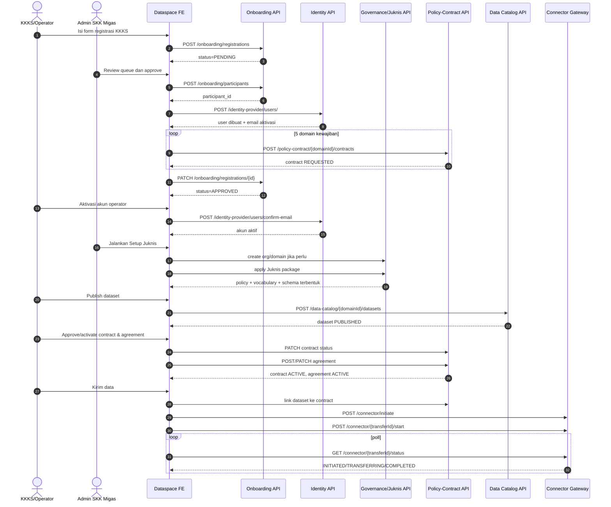
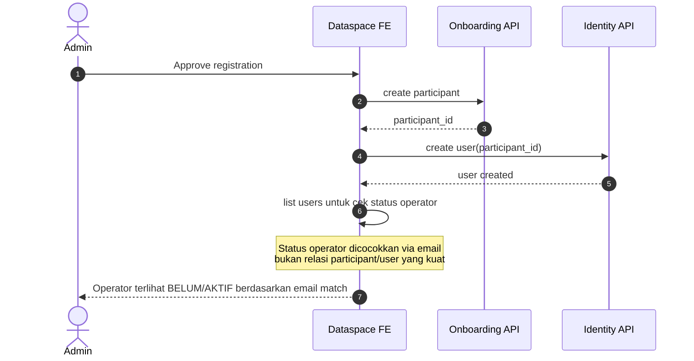

# Dataspace-New Flow Audit and All-Section Test Plan

Tanggal audit: 2026-06-09  
Scope repo: `d:\laragon\www\dataspace-new`

---

## 1. Ringkasan Eksekutif

Repo `dataspace-new` saat ini adalah frontend React/Vite untuk workflow federated dataspace yang sudah dipusatkan ke flow:

1. `Register KKKS`
2. `Onboarding Queue`
3. `Setup Juknis`
4. `Organizations / Providers / Datasets / Schemas / Vocabularies / Policies / Contracts`
5. `Provider Inbox`
6. `Transfer Center`
7. `Audit / API Docs / Settings`

Kesimpulan cepat:

- **Ada Keycloak** dan sudah diintegrasikan di source code.
- **Keycloak belum sehat di workspace ini** karena dependency `keycloak-js` tidak ada di `node_modules`.
- **Fallback local login masih ada** dan tetap aktif kalau env Keycloak kosong.
- **Gateway transfer yang dipakai sekarang** adalah service `connector.ts`, bukan runtime channel/page `v2` lama.
- **Flow bisnis sudah ada**, tapi **belum bisa dianggap fully proven end-to-end** karena:
  - build production gagal
  - lint gagal
  - automated test coverage hampir nol
  - beberapa flow bergantung pada seed/backend state tertentu

---

## 2. Hasil Auto-Check yang Saya Jalankan

## 2.1 `npm test`

Status: `PASS`

Hasil:

- hanya ada `1` test file
- hanya ada `1` test
- test yang ada hanya smoke/example, belum menguji flow bisnis

Current test directory:

- `src/test/example.test.ts`
- `src/test/setup.ts`

Makna:

- repo punya harness Vitest
- tapi **belum punya coverage flow aplikasi**

## 2.2 `npm run build`

Status: `FAIL`

Error utama:

- Rollup gagal resolve import `keycloak-js` dari `src/auth/keycloak.ts`

Validasi tambahan:

- `package.json` memang mencantumkan `keycloak-js`
- `npm ls keycloak-js` menunjukkan `(empty)`
- folder `node_modules/keycloak-js` tidak ada

Makna:

- source code SSO sudah masuk
- dependency fisik belum terpasang di workspace ini
- **current branch tidak buildable untuk production**

## 2.3 `npm run lint`

Status: `FAIL`

Ringkasan:

- `23 errors`
- `37 warnings`

Error dominan:

- `@typescript-eslint/no-explicit-any`
- `@typescript-eslint/no-empty-object-type`
- `@typescript-eslint/no-require-imports`

File flow utama yang kena:

- `src/pages/RegisterKKKS.tsx`
- `src/pages/OnboardingQueue.tsx`
- `src/pages/SetupJuknis.tsx`
- `src/pages/ProviderInbox.tsx`
- `src/pages/TransferCenter.tsx`
- `src/pages/Datasets.tsx`
- `src/pages/Organizations.tsx`
- `src/pages/ConfirmEmail.tsx`
- `src/pages/Audit.tsx`

Makna:

- UI flow memang ada
- tapi code quality gate belum bersih

---

## 3. Auth Flow Sekarang

## 3.1 Ada Keycloak?

Jawaban: **ada**

Evidence:

- `src/auth/keycloak.ts`
- `src/auth/KeycloakProvider.tsx`
- `src/context/AuthContext.tsx`
- `src/api/client.ts`
- `src/components/login/LoginPage.tsx`

## 3.2 Cara jalannya auth sekarang

### Mode A - Keycloak SSO

Aktif bila env berikut terisi:

- `VITE_KEYCLOAK_URL`
- `VITE_KEYCLOAK_REALM`
- `VITE_KEYCLOAK_CLIENT_ID`

Flow:

1. `main.tsx` membungkus app dengan `KeycloakProvider`
2. `KeycloakProvider` memanggil `initKeycloak()`
3. `keycloak.init()` berjalan dengan mode `check-sso`
4. kalau user sudah punya sesi IAM, app otomatis authenticated
5. axios interceptor ambil token Keycloak via `ensureValidToken()` lalu inject `Authorization: Bearer ...`
6. `AuthContext` membangun `AuthUser` dari `keycloak.tokenParsed`

Catatan:

- `onLoad: "check-sso"`
- `silentCheckSsoRedirectUri = /silent-check-sso.html`
- token auto-refresh saat hampir expired

### Mode B - Local JWT Fallback

Aktif bila env Keycloak kosong.

Flow:

1. login page submit username/password
2. call `POST /identity-provider/auth/login`
3. simpan `auth_token` ke localStorage
4. `AuthContext` decode JWT lokal
5. role canonical di-derive dari claim category/group

## 3.3 Verdict auth

- Auth **sudah dual-mode**
- Tapi untuk workspace ini:
  - **SSO path belum sehat** karena package `keycloak-js` hilang
  - **fallback local login lebih realistis untuk dipakai sekarang**

---

## 4. API Base, Node, dan Gateway yang Dipakai

## 4.1 Environment penting

Dari `.env.example`:

- `VITE_API_BASE_URL=http://localhost:8184/api/v1`
- `VITE_NODE_BASE_URL=http://localhost:8000`

Interpretasi:

- backend GX-Space / fabric API ada di `8184`
- node geospasial / OGC ada di `8000`

## 4.2 API client

`src/api/client.ts`

- default base URL: `VITE_API_BASE_URL || http://localhost:8184/api/v1`
- token priority:
  1. Keycloak token
  2. localStorage `auth_token`

## 4.3 Gateway transfer yang dipakai sekarang

Service: `src/api/services/connector.ts`

Endpoint:

- `GET /connector/{domainId}/transfers`
- `POST /connector/initiate`
- `POST /connector/{transferProcessId}/start`
- `GET /connector/{transferProcessId}/status`

Jadi gateway/runtime yang dipakai page transfer sekarang adalah:

- **connector-based transfer gateway**
- bukan `channels / transfer-processes / data-transfers` style lama

---

## 5. API Surface yang Dipakai Sekarang

## 5.1 Identity / Auth

- `POST /identity-provider/auth/login`
- `POST /identity-provider/auth/external-login`
- `POST /identity-provider/auth/validate`
- `GET /identity-provider/user/categories/`
- `GET /identity-provider/user/groups/`
- `POST /identity-provider/users/`
- `GET /identity-provider/users/`
- `POST /identity-provider/users/confirm-email`
- `POST /identity-provider/users/resend-email-confirmation`

## 5.2 Governance

- `GET /governance/organizations/`
- `POST /governance/organizations/`
- `GET /governance/organizations/{orgId}/domains`
- `POST /governance/organizations/{orgId}/domains`

## 5.3 Onboarding

- `POST /onboarding/registrations`
- `GET /onboarding/registrations`
- `PATCH /onboarding/registrations/{id}`
- `POST /onboarding/participants`
- `GET /onboarding/participants`
- `GET /onboarding/participants/{id}`

## 5.4 Data Catalog

- `GET /data-catalog/{domainId}/datasets`
- `GET /data-catalog/{domainId}/datasets/{id}`
- `POST /data-catalog/{domainId}/datasets`
- `GET /data-catalog/{domainId}/schemas`
- `GET /data-catalog/{domainId}/vocabularies`
- `GET /data-catalog/{domainId}/vocabularies/{id}/terms`

## 5.5 Policy / Contract

- `GET /policy-contract/{domainId}/dataset-policies`
- `GET /policy-contract/{domainId}/contracts`
- `GET /policy-contract/{domainId}/contracts/{id}`
- `POST /policy-contract/{domainId}/contracts`
- `PATCH /policy-contract/{domainId}/contracts/{id}`
- `GET /policy-contract/{domainId}/agreements`
- `POST /policy-contract/{domainId}/agreements`
- `PATCH /policy-contract/{domainId}/agreements/{id}`

## 5.6 Audit

- `GET /audit-compliance/audit-logs`

## 5.7 Juknis bootstrap

- `juknisApi.apply(...)`

Catatan:

- file service `juknis.ts` ada dan dipakai `SetupJuknis.tsx`
- endpoint persisnya perlu disamakan dengan backend spec saat test integration penuh

## 5.8 Connector / Transfer

- `GET /connector/{domainId}/transfers`
- `POST /connector/initiate`
- `POST /connector/{transferProcessId}/start`
- `GET /connector/{transferProcessId}/status`

---

## 6. Flow Aktual Saat Ini

## 6.1 Public Registration Flow

Route:

- `/register-kkks`

Flow:

1. KKKS isi form publik
2. frontend validasi minimum
3. kirim ke `POST /onboarding/registrations`
4. status awal `PENDING`

Output bisnis:

- satu registration item masuk antrian onboarding

## 6.2 Onboarding Approval Flow

Route:

- `/onboarding`

Flow:

1. admin load daftar registration
2. admin approve registration
3. frontend create participant `ENTERPRISE`
4. frontend create operator user `PROVIDER`
5. frontend terbitkan `5` kontrak kewajiban via loop `contractsApi.create(...)`
6. registration di-mark `APPROVED`

Dependency penting:

- `domainId` aktif harus ada
- user category `PROVIDER` harus ada
- user group `PROVIDER` harus ada
- participant SKK Migas harus ada

Kalau salah satu tidak ada:

- flow approve akan gagal

## 6.3 Juknis Bootstrap Flow

Route:

- `/setup-juknis`

Flow:

1. pilih / buat organisasi
2. pilih / buat governance domain
3. review paket 5 domain Juknis
4. apply Juknis
5. backend diharapkan membuat:
  - dataset-policies
  - contract-policies
  - vocabularies
  - schemas

Dependency:

- org harus ada
- domain harus ada
- backend juknis apply harus hidup

## 6.4 Catalog Preparation Flow

Routes:

- `/datasets`
- `/schemas`
- `/vocabularies`
- `/policies`

Observed actions:

- dataset list
- dataset register dialog
- dataset publish dialog
- schema list
- vocabularies list + term detail dialog
- policies list/statistics

Catatan:

- dari scan cepat, section ini **lebih kuat di read/list + dialog flow**
- perlu integration test nyata untuk memastikan semua mutation backend memang lengkap

## 6.5 Contract Request Flow

Route:

- `/contracts`

Observed actions:

- detail contract dialog
- request contract dialog
- consumer/superadmin/admin bisa request contract

Dependency:

- domain aktif
- participant provider ada
- dataset-policy / policy context ada

## 6.6 Provider Action Flow

Route:

- `/inbox`

Flow:

1. provider lihat kontrak yang `provider_id`-nya cocok dengan dirinya
2. untuk `REQUESTED`: provider bisa `APPROVED` atau `REJECTED`
3. untuk `APPROVED`: provider bisa ubah jadi `ACTIVE`
4. untuk `ACTIVE`: provider bisa buat agreement bila belum ada

## 6.7 Transfer Fulfilment Flow

Route:

- `/transfers`

Flow:

1. load dataset published milik provider
2. cari kontrak `ACTIVE` yang match domain
3. kalau siap:
  - link dataset ke contract
  - create agreement jika belum ada
  - activate agreement jika belum `ACTIVE`
  - initiate transfer
  - start transfer
  - poll status sampai `COMPLETED` atau `FAILED`

Dependency penting:

- dataset published ada
- contract active ada
- dataset-policy id tersedia
- domain aktif tersedia

## 6.8 Audit and API Inspection

Routes:

- `/audit`
- `/api-docs`

Flow:

- audit load log dari backend
- api docs load OpenAPI dari backend / fallback local

---

## 7. Apakah Flow Sudah Bisa Semua?

Jawaban singkat:

- **Belum bisa dibilang semua sudah bisa**
- **Sebagian flow sudah ada dan plausible**
- **Sebagian flow bergantung pada prasyarat backend/state**
- **Secara engineering repo belum sehat penuh**

## 7.1 Yang paling mungkin jalan sekarang

- local login fallback
- public KKKS registration submit
- list registrations
- create participant
- create operator user
- list organizations/domains
- apply Juknis
- list providers/datasets/schemas/vocabularies/policies/contracts
- provider approve/reject/activate contract
- create agreement
- transfer initiate/start/status
- audit list
- api docs viewer

## 7.2 Yang belum proven / belum aman diklaim selesai

- Keycloak SSO production path
- build production bundle
- lint-clean deployment quality
- full mutation coverage di semua section catalog
- deterministic integration test untuk approval -> contract -> agreement -> transfer

## 7.3 Blocker utama

1. `keycloak-js` missing di workspace
2. automated tests nyaris tidak ada
3. lint masih error di banyak file flow utama
4. flow onboarding approval butuh seed:
   - `PROVIDER` category
   - `PROVIDER` group
   - SKK participant
   - active domain
5. transfer flow butuh seed:
   - dataset-policy
   - contract active
   - published dataset

---

## 8. All-Section Test Plan

## 8.1 Prinsip

Setiap section dites dalam 3 lapis:

1. `Good path`
2. `Bad path / validation`
3. `Crash / dependency failure / fallback`

Jenis test yang disarankan:

- `Static health`
  - build
  - lint
  - test
- `UI smoke`
  - route render
  - dialog open
  - empty state
- `Service integration`
  - API call success/failure
- `Workflow integration`
  - multi-step business path

---

## 8.2 Matrix Per Section

| Section | Good Path | Bad Path | Crash/Fallback |
| --- | --- | --- | --- |
| Login | login local sukses | username/password salah | Keycloak env aktif tapi package hilang / init fail |
| Register KKKS | submit registration valid | field wajib kosong / email invalid | backend 500 / timeout |
| Onboarding Queue | approve pending registration | approve tanpa provider category/group | SKK participant tidak ada / domainId null |
| Setup Juknis | create org -> create domain -> apply | nama/code/description invalid | juknis apply gagal / partial result |
| Organizations | list + create org/domain | input terlalu pendek | backend domain endpoint down |
| Providers | list participant/provider | provider id tidak ada | participants endpoint error |
| Datasets | register/publish dataset | schema/provider/domain missing | publish backend reject / invalid classification |
| Schemas | list schema | domain kosong | schema endpoint 404/500 |
| Vocabularies | list vocabulary + load terms | vocabulary id salah | terms endpoint error |
| Policies | list policy | domain kosong | dataset-policy endpoint gagal |
| Contracts | request contract + view detail | body kurang | detail contract gagal |
| Provider Inbox | approve/reject/activate | provider buka kontrak bukan miliknya | status patch gagal |
| Transfer Center | link dataset -> agreement -> transfer complete | dataset/contract belum ready | transfer stuck / status FAILED |
| Audit | load + filter + export | empty logs | audit endpoint down |
| API Docs | load live openapi | search miss | backend openapi down -> fallback local |
| Confirm Email | confirm token + password | token invalid / password lemah | confirm endpoint 500 |
| Settings | render state | invalid local state | future API not wired |

---

## 8.3 Payload Injeksi yang Disarankan

### A. Register KKKS

Good:

```json
{
  "organization_name": "PT Uji KKKS Alpha",
  "wilayah_kerja": "WK Alpha Offshore",
  "operator_name": "Operator Alpha",
  "operator_email": "operator.alpha@test.local",
  "operator_phone": "+628111111111",
  "note": "Registrasi pengujian otomatis"
}
```

Bad:

```json
{
  "organization_name": "A",
  "wilayah_kerja": "",
  "operator_name": "B",
  "operator_email": "salah-email"
}
```

Crash:

- kirim payload valid saat backend mock return `500`
- kirim payload valid saat timeout `>30s`

### B. Create Participant on Approval

Good:

```json
{
  "organization_name": "PT Uji KKKS Alpha",
  "organization_type": "ENTERPRISE",
  "address": "Indonesia",
  "contact_person": {
    "name": "Operator Alpha",
    "email": "operator.alpha@test.local",
    "phone": "+628111111111"
  }
}
```

Bad:

```json
{
  "organization_name": "",
  "organization_type": "ENTERPRISE",
  "address": "",
  "contact_person": {
    "name": "",
    "email": "x",
    "phone": ""
  }
}
```

Crash:

- participant created, user create fails
- user created, contract generation fails on item ke-3

### C. Create User Operator

Good:

```json
{
  "username": "operator_alpha_1234",
  "email": "operator.alpha@test.local",
  "full_name": "Operator Alpha",
  "password": "TempAa1!",
  "category_id": "provider-category-id",
  "group_id": "provider-group-id",
  "participant_id": "participant-id"
}
```

Bad:

```json
{
  "username": "aa",
  "email": "bad-email",
  "password": "123"
}
```

Crash:

- duplicate email
- category/group mismatch

### D. Request Contract

Good:

```json
{
  "consumer_id": "skk-participant-id",
  "provider_id": "provider-participant-id",
  "name": "[Lapangan] Kewajiban Data - PT Uji KKKS Alpha",
  "description": "Kewajiban penyediaan data lapangan untuk pengujian otomatis."
}
```

Bad:

```json
{
  "consumer_id": "",
  "provider_id": "",
  "name": "ab",
  "description": "x"
}
```

Crash:

- create contract success tapi fetch list berikutnya gagal

### E. Publish Dataset

Good:

```json
{
  "provider_id": "provider-participant-id",
  "schema_id": "schema-id",
  "name": "Dataset Uji Sumur Alpha",
  "version": "1.0.0",
  "domainKey": "sumur",
  "url": "https://node.test.local/ogc/features/sumur-alpha",
  "protocol": "OGC_API_FEATURES",
  "classification": "L3"
}
```

Bad:

```json
{
  "provider_id": "",
  "schema_id": "",
  "name": "",
  "version": "x",
  "domainKey": "",
  "url": "not-url",
  "protocol": "",
  "classification": "L9"
}
```

Crash:

- dataset publish berhasil tapi tidak muncul di refresh list

### F. Transfer Initiation

Good:

```json
{
  "domain_id": "domain-id",
  "agreement_id": "agreement-id",
  "dataset_id": "dataset-id"
}
```

Bad:

```json
{
  "domain_id": "",
  "agreement_id": "",
  "dataset_id": ""
}
```

Crash:

- initiate success, start fails
- start success, polling status berhenti di `INITIATED`
- status return `FAILED` dengan `error_message`

---

## 9. Rencana Otomasi Test

## Phase 0 - Health Gate

Commands:

- `npm test`
- `npm run build`
- `npm run lint`
- `npm ls keycloak-js`

Expected saat sehat:

- test > 1 file
- build pass
- lint pass
- `keycloak-js` installed

## Phase 1 - Service Contract Tests

Tambahkan test untuk:

- auth login fallback
- registration create
- registration approve orchestration
- Juknis apply
- contract request
- agreement create
- connector initiate/start/status

Saran tooling:

- `vitest`
- `msw` atau axios mock adapter

## Phase 2 - Workflow Tests

Skenario minimal:

1. `public registration -> admin approval -> participant/user/5 contracts created`
2. `setup juknis -> policies/schemas/vocabularies visible`
3. `provider approves contract -> activates -> creates agreement`
4. `dataset publish -> transfer initiate -> status completed`

## Phase 3 - Crash / Resilience Tests

Kasus wajib:

1. backend `401`
2. backend `403`
3. backend `409`
4. backend `422`
5. backend `500`
6. timeout
7. empty list
8. partial success in orchestration
9. missing seed dependency

## Phase 4 - Browser E2E

Saat repo sudah buildable:

- pakai `Playwright`
- skenario:
  - login
  - register KKKS
  - approve queue
  - apply juknis
  - create contract
  - provider approve
  - transfer
  - audit check

---

## 10. Verdict Testability Saat Ini

## Yang bisa saya cek otomatis sekarang

- repo health gate dasar
- dependency integrity
- source-based flow analysis

## Yang belum bisa saya prove otomatis dari workspace ini saja

- full API integration end-to-end
- transfer success real ke backend live
- real Keycloak browser redirect loop

Alasannya:

- backend tidak saya bootstrap dari repo ini
- integration harness belum ada
- build belum sehat

---

## 11. Prioritas Perbaikan Sebelum Full Automation

1. install `keycloak-js`
2. pastikan `npm run build` hijau
3. bereskan lint errors di file flow utama
4. tambah service-level tests untuk:
   - onboarding
   - identity
   - policy-contract
   - connector
5. tambah workflow tests untuk:
   - registration approval
   - juknis apply
   - transfer center

---

## 12. Bottom Line

Kalau ditanya:

### "Ada Keycloak gak?"

Ada. Sudah terpasang di source, tapi dependency fisiknya belum ada di workspace ini, jadi build gagal.

### "API apa yang dipakai?"

Yang aktif sekarang terpusat di:

- `/identity-provider/*`
- `/governance/*`
- `/onboarding/*`
- `/data-catalog/*`
- `/policy-contract/*`
- `/audit-compliance/*`
- `/connector/*`

### "Gateway apa yang dipakai?"

Flow transfer pakai gateway/connector endpoints:

- `/connector/{domainId}/transfers`
- `/connector/initiate`
- `/connector/{transferProcessId}/start`
- `/connector/{transferProcessId}/status`

### "Flow-nya sudah bisa semua?"

Belum aman bilang semua. Flow bisnisnya sudah ada, tapi health engineering dan automated proof-nya belum cukup.

### "Bisa dibuat all section test plan?"

Bisa. Dokumen ini adalah baseline test plan-nya, lengkap dengan:

- flow aktual
- good path
- bad path
- crash/fallback
- payload injeksi
- tahapan otomasi

---

## 13. Tambahan SIT/UAT dan Compare ke Panduan Onboarding

Dokumen acuan user:

- `D:\project\Yasatech\ghanem\dataspace\Panduan_Onboarding_SKKMigas.pdf`

Status pembacaan:

- file PDF terdeteksi di mesin
- mesin ini tidak punya extractor PDF yang bisa saya pakai langsung
- compare di bawah disusun dari:
  - source code `dataspace-new`
  - hasil auto-check repo
  - screenshot readiness level yang user lampirkan
  - hasil SIT/UAT user: "sudah bisa sampai data transfer"

Artinya:

- bagian yang saya tandai `confirmed by code` benar-benar tervalidasi dari implementasi
- bagian yang saya tandai `guide-only / unverified` masih perlu verifikasi ke isi PDF penuh atau backend live

---

## 14. Readiness Level 1-4 vs Kondisi Saat Ini

Ringkasan acuan readiness dari screenshot panduan:

- `Level 1 / Basic`
  - GIS Portal aktif
  - GWS minimal `WMS + WFS`
  - dokumen metadata sesuai
  - VPN terkoneksi dengan SKK Migas
- `Level 2 / Standard`
  - Level 1 +
  - SPARK Connector tersertifikasi
  - dokumen metadata lengkap
  - `QC_STATUS` terverifikasi
  - penamaan GWS sesuai lampiran
- `Level 3 / Advanced`
  - Level 2 +
  - Data Space Connector
  - federated RBAC
  - metadata harvesting otomatis
  - CSW endpoint aktif
- `Level 4 / Full`
  - Level 3 +
  - ATS SPARK lulus
  - OSDU compatibility
  - real-time event streaming
  - Tier 1/2 Adapter

### 14.1 Assessment posisi sekarang

| Acuan | Bukti di repo saat ini | Status |
| --- | --- | --- |
| Level 1 - portal aktif | portal FE ada, auth ada, route operasional ada | `Ya` |
| Level 1 - WMS/WFS minimal | `Settings.tsx` punya konfigurasi endpoint `WMS/WFS/WCS`, tapi masih mock/local state | `Parsial` |
| Level 1 - metadata sesuai | ada Juknis bootstrap, vocabulary, schema, dataset publish | `Parsial` |
| Level 1 - VPN ke SKK Migas | tidak ada bukti dari repo FE | `Belum terverifikasi` |
| Level 2 - SPARK Connector tersertifikasi | tidak ada bukti sertifikasi / status compliance | `Belum` |
| Level 2 - metadata lengkap | bootstrap ada, tapi add/edit schema-vocab-policy belum ada | `Parsial` |
| Level 2 - QC_STATUS terverifikasi | tidak tampak di UI/API FE saat ini | `Belum` |
| Level 2 - naming GWS sesuai lampiran | belum ada validator/naming rule khusus di FE | `Belum terverifikasi` |
| Level 3 - Data Space Connector | flow `connector/initiate -> start -> status` sudah ada | `Ya` |
| Level 3 - federated RBAC | ada role guard + Keycloak, tapi relasi user-org-participant masih lemah | `Parsial` |
| Level 3 - metadata harvesting otomatis | tidak ada flow/endpoint yang terlihat | `Belum` |
| Level 3 - CSW endpoint aktif | tidak ada route/service FE untuk CSW | `Belum` |
| Level 4 - ATS lulus | tidak ada bukti | `Belum` |
| Level 4 - OSDU compatibility | tidak ada bukti | `Belum` |
| Level 4 - event streaming real-time | tidak ada bukti | `Belum` |
| Level 4 - Tier 1/2 Adapter | tidak ada UI/flow adapter | `Belum` |

### 14.2 Verdict readiness

Kalau dipetakan secara jujur:

- aplikasi ini **sudah lewat Level 1 secara portal/workflow dasar**
- aplikasi ini **punya sebagian elemen Level 2**
- aplikasi ini **sudah menyentuh elemen Level 3** karena ada contract, agreement, transfer connector, RBAC, dan auth federation path
- tapi **belum bisa diklaim Level 3 penuh**

Kesimpulan praktis:

- posisi paling aman saat ini adalah **Level 2 kuat, menuju Level 3**
- bukan Level 3 penuh
- jelas belum Level 4

---

## 15. Compare Flow Panduan vs Flow Aktual

### 15.1 Flow yang sudah match

| Tahap | Implementasi sekarang | Status |
| --- | --- | --- |
| Registrasi KKKS publik | `/register-kkks` -> `POST /onboarding/registrations` | `Match` |
| Verifikasi / approval oleh admin | `/onboarding` | `Match` |
| Pembuatan participant provider | `POST /onboarding/participants` saat approve | `Match` |
| Pembuatan akun operator + email aktivasi | `POST /identity-provider/users/` + confirm email flow | `Match` |
| Setup governance domain / Juknis | `/setup-juknis` | `Match` |
| Pembuatan kewajiban 5 domain | loop `contractsApi.create(...)` saat approval | `Match` |
| Publish dataset provider | dialog publish dataset | `Match` |
| Persetujuan contract / activation / agreement | `/inbox` | `Match` |
| Transfer data ke connector | `/transfers` | `Match` |

### 15.2 Flow yang belum lengkap atau belum match

| Tahap | Kondisi sekarang | Gap |
| --- | --- | --- |
| Binding organisasi ke user/operator | FE hanya mengikat kuat saat create, sesudah itu status operator dicocokkan via email | relasi user-org-participant belum solid |
| Add/edit schema | page hanya list | CRUD belum ada |
| Add/edit vocabulary | page hanya list dan view terms | CRUD belum ada |
| Add/edit policy | page hanya registry/list | CRUD belum ada |
| Next-step guidance setelah create/apply | ada copy pendek, belum ada guided checklist | UX operasional kurang memandu |
| Install/config connector adapter | tidak ada page/flow FE khusus | area infra belum terwakili |
| Validasi FE end-to-end | sebagian form minimal, sebagian mutation tidak punya wizard checks | rawan lolos payload setengah valid |
| Map-centric portal seperti layout target | repo saat ini belum punya route map utama seperti mockup target | masih coverage version, belum target layout penuh |

---

## 16. SIT/UAT Findings yang Terkonfirmasi

### 16.1 Matrix temuan

| Temuan SIT/UAT | Bukti di code | Dampak | Area |
| --- | --- | --- | --- |
| Org belum ngiket kuat ke user | `OnboardingQueue.tsx` membuat `participant_id`, tapi status operator sesudahnya dicari dari email karena list user tidak expose relasi participant | rawan mismatch akun, filtering, dan audit linkage | `BE + FE` |
| Banyak validasi FE belum jalan konsisten | `RegisterKKKS` validasi masih minimum; `Settings` dan banyak flow masih lokal/mock; lint error tinggi di file flow utama | payload kotor bisa lolos sampai backend | `FE` |
| Belum ketemu add/edit schema | `Schemas.tsx` hanya list, `schemas.ts` hanya `list()` | admin/provider tidak bisa maintain schema | `FE + kemungkinan BE` |
| Belum ketemu add/edit vocabulary | `Vocabularies.tsx` hanya list/detail term, `vocabularies.ts` hanya `list()` + `terms()` | vocabulary tidak bisa dikelola dari UI | `FE + kemungkinan BE` |
| Belum ketemu add/edit policy | `Policies.tsx` hanya list, `policiesApi` hanya `list()` | policy lifecycle belum tersedia di FE | `FE + kemungkinan BE` |
| Informasi next step setelah add/apply kurang | flow sukses hanya kasih toast / info singkat | user bingung langkah berikutnya | `FE / Product` |
| Connector adapter install/config belum ada di FE | tidak ada route/service adapter lifecycle; yang ada hanya transfer runtime | onboarding node/connector belum terbantu UI | `FE + Infra/BE` |
| Keycloak ada tapi belum sehat di workspace | build gagal karena `keycloak-js` hilang | SSO readiness belum stabil | `FE / DevOps` |
| Settings integrasi belum real | GeoServer/IdP config masih state lokal, belum persist API | bisa menipu kesiapan Level 1-2 bila dibaca sekilas | `FE + BE` |

### 16.2 Temuan paling kritikal

1. **Relasi user-participant-organization belum utuh**
   - ini paling berbahaya untuk approval, filtering, dan audit
   - sekarang flow approve tampak sukses, tapi state pasca-approve tidak dipresentasikan dengan relasi yang kuat

2. **Catalog governance masih bootstrap-only**
   - Juknis bisa membuat `schema`, `vocabulary`, `policy`
   - tapi setelah tercipta, FE belum menyediakan lifecycle management

3. **Transfer path ada, tetapi connector readiness belum terwakili**
   - runtime transfer ada
   - instalasi, sertifikasi, adapter, compliance, dan konfigurasi connector belum terlihat

---

## 17. Sequence Diagram Mermaid

### 17.1 Happy path sekarang



### 17.2 Failure point yang sekarang paling terasa



---

## 18. Coverage API vs Kebutuhan SIT/UAT

| Kebutuhan | FE service sekarang | Coverage |
| --- | --- | --- |
| Registrasi KKKS | ada | `Lengkap untuk flow dasar` |
| Approval + participant creation | ada | `Lengkap untuk flow dasar` |
| User invite + confirm email | ada | `Lengkap untuk flow dasar` |
| Setup organisasi/domain | ada | `Lengkap untuk flow dasar` |
| Apply Juknis | ada | `Cukup, perlu verifikasi endpoint final` |
| Publish dataset | ada | `Lengkap untuk flow dasar` |
| Contract / agreement / transfer | ada | `Lengkap untuk flow dasar` |
| List schema | ada | `Read only` |
| Add/edit schema | tidak ada method FE | `Belum` |
| List vocabulary | ada | `Read only` |
| Add/edit vocabulary | tidak ada method FE | `Belum` |
| List policy | ada | `Read only` |
| Add/edit policy | tidak ada method FE | `Belum` |
| Connector adapter install/config | tidak ada route/service | `Belum` |
| Federated org-user linkage visibility | tidak ada shape response yang cukup di FE | `Parsial` |
| GeoServer/WMS/WFS persist config | UI mock ada, API persist tidak terlihat | `Parsial / mock` |
| Keycloak config persist | UI mock ada, env/runtime real ada, save API tidak ada | `Parsial` |
| CSW / harvesting / OSDU / ATS / streaming | tidak terlihat di FE service | `Belum` |

### 18.1 Catatan tentang `docs/fastapi.yaml`

Local file `docs/fastapi.yaml`:

- lebih mirip spec referensi umum
- path-nya tidak identik dengan service FE yang aktif sekarang
- tidak cukup kuat dipakai sebagai bukti bahwa CRUD schema/vocabulary/policy atau readiness Level 3-4 sudah tersedia

Jadi untuk audit ini:

- **source FE aktif** lebih layak dipakai sebagai dasar penilaian
- `fastapi.yaml` saya anggap **reference/legacy spec**, bukan kontrak implementasi final

---

## 19. Rekomendasi Tindak Lanjut

### 19.1 FE yang paling perlu dibuat

1. `Organization/User Binding View`
   - tampilkan relasi `organization -> participant -> operator user`
   - jangan lagi infer status operator dari email saja

2. `Schema CRUD`
   - create
   - edit version/status
   - attach ke vocabulary

3. `Vocabulary CRUD`
   - create vocabulary
   - add/edit/delete terms
   - versioning

4. `Policy CRUD`
   - dataset policy
   - contract policy
   - rule builder / classification editor

5. `Connector Adapter Setup`
   - prereq checklist
   - endpoint / credential / certificate config
   - install status / health check
   - compliance / certification status

6. `Next-Step Guidance`
   - setelah `approve`
   - setelah `apply Juknis`
   - setelah `publish dataset`
   - setelah `activate agreement`

### 19.2 BE yang perlu dipastikan

1. user list/detail expose:
   - `participant_id`
   - `organization_id`
   - activation state yang konsisten

2. CRUD endpoint untuk:
   - schema
   - vocabulary
   - vocabulary terms
   - policy

3. connector / adapter admin endpoint:
   - install/config
   - health
   - status
   - certificate / trust / connectivity

4. readiness/compliance endpoint:
   - `QC_STATUS`
   - CSW status
   - ATS status
   - OSDU compatibility

### 19.3 Prioritas SIT/UAT lanjutan

1. uji ulang flow approve dengan user yang sama 2 kali
2. uji ulang resend activation lalu confirm email
3. uji publish dataset tanpa `participantId`
4. uji `Setup Juknis` saat schema/policy sudah ada
5. uji transfer saat agreement belum active
6. uji transfer saat connector return `FAILED`
7. uji semua form dengan payload invalid dan data duplikat

---

## 20. Bottom Line Tambahan

Kalau digabungkan antara source code, hasil auto-check, dan SIT/UAT user:

- flow **registrasi -> approval -> operator activation -> dataset publish -> agreement -> transfer** memang **sudah ada dan realistis jalan**
- gap kamu soal:
  - org belum ngiket ke user
  - validasi FE belum rapi
  - tidak ada add/edit schema-vocab-policy
  - tidak ada connector adapter setup
  - next step kurang jelas
  memang **valid dan terkonfirmasi**

Posisi paling fair untuk repo ini sekarang:

- **bukan sekadar mockup**
- **sudah punya workflow inti**
- tapi **masih coverage version**
- dan **masih belum setara layout/kapabilitas target portal dataspace penuh yang map-centric dan compliance-complete**
