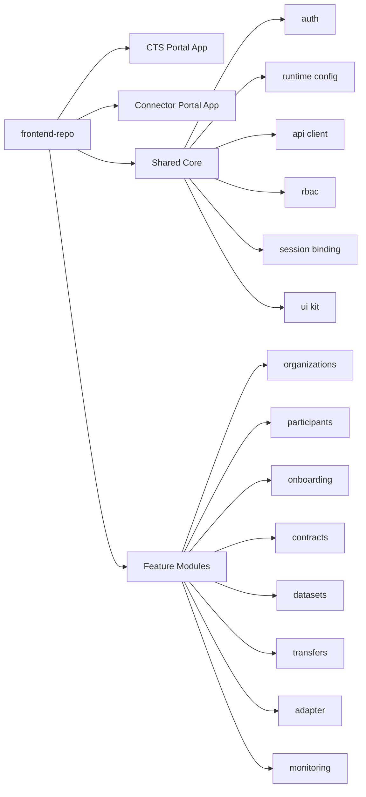
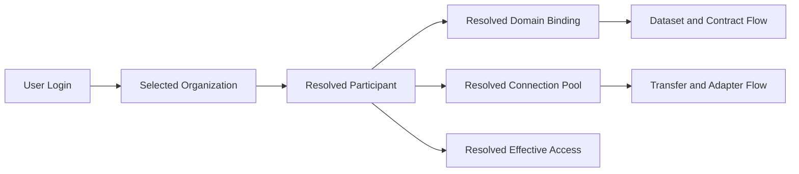
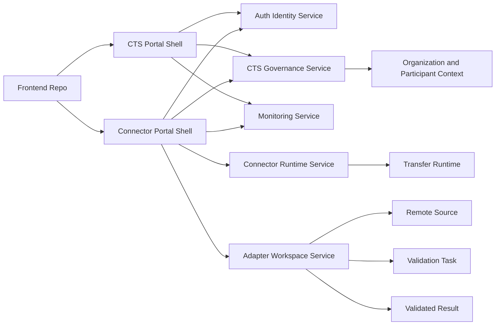

# Frontend Portal Blueprint

## 1. Tujuan Dokumen

Dokumen ini memetakan bentuk frontend yang paling sehat untuk konteks Data Space saat ini, dengan fokus khusus pada pemisahan portal, struktur repository, batas modul, dan arah migrasi dari aplikasi frontend existing.

Tujuan utamanya:

- Menetapkan bentuk frontend yang tidak mengacak flow onboarding, binding, transfer, dan adapter.
- Menentukan apakah perlu satu repo atau dua repo frontend.
- Memisahkan tanggung jawab antara portal governance dan portal operasional connector.
- Menyediakan blueprint yang bisa langsung disandingkan ke FSD, TSD, atau TRD.

## 2. Ringkasan Keputusan Arsitektur FE

Keputusan yang direkomendasikan untuk fase sekarang adalah:

- Tetap memakai **1 repository frontend**.
- Di dalam repository tersebut dibuat **2 app shell**:
  - **CTS Portal**
  - **Connector Portal**
- Shared logic, API client, auth, runtime config, dan komponen UI tetap berada di lapisan bersama.
- Adapter tetap menjadi modul operasional di dalam Connector Portal, bukan portal governance terpisah.

Alasan utama:

- Boundary modul saat ini belum cukup stabil untuk langsung dipisah menjadi dua repo.
- Flow binding `organization -> participant -> domain -> connection pool -> transfer` masih harus dijaga tetap tunggal.
- Auth, RBAC, API typing, dan session binding akan jauh lebih aman bila masih dikelola dari satu codebase.

## 3. Konteks Portal

### 3.1 CTS Portal

Portal ini dipakai untuk fungsi tata kelola dan kendali pusat.

Cocok untuk role:

- Super Admin
- Governance Admin
- Regulator
- Auditor pusat

Fokus utama:

- Organization master
- Participant master
- Approval onboarding / register KKKS / juknis
- Domain binding
- User IAM, category, group, RBAC
- Connection pool registry
- Monitoring pusat
- Deployment config
- Audit dan sinkronisasi data inti

### 3.2 Connector Portal

Portal ini dipakai untuk pekerjaan operasional harian provider dan consumer.

Cocok untuk role:

- Provider Admin
- Provider Operator
- Consumer Operator

Fokus utama:

- Dashboard operasional
- Dataset catalog
- Contracts operasional
- Incoming requests / approvals yang sudah turun ke participant
- Transfer center
- Monitoring transfer
- Adapter / wizard proses data
- Publish / validasi hasil data
- Profile / account

### 3.3 Adapter Service

Adapter bukan portal governance. Adapter adalah service pendukung ingest, validate, preview, dan publish data. Dari sisi frontend, adapter lebih aman diposisikan sebagai modul di Connector Portal.

Adapter perlu diperlakukan berbeda dari CTS karena pola API, state kerja, dan UX-nya juga berbeda:

- CTS berorientasi master data, approval, IAM, governance, contract, agreement, dan transfer readiness.
- Adapter berorientasi workflow teknis bertahap:
  - daftar koneksi sumber
  - eksplorasi layer
  - validasi / ingestion task
  - monitoring task background
  - ambil hasil validasi
  - publish hasil

Artinya pemisahan portal tidak cukup hanya memindahkan menu. Harus ada pemisahan **service model** dan **task model**.


## 4. Keputusan Jumlah Repo FE

### Rekomendasi Fase Sekarang

Gunakan **1 repo frontend** dengan **2 shell app**.

### Rekomendasi Fase Lanjut

Setelah boundary modul stabil, baru pertimbangkan pemecahan menjadi:

- `cts-portal-fe`
- `connector-portal-fe`

### Kenapa Belum 2 Repo

Kalau dua repo dilakukan terlalu cepat, risikonya:

- Duplikasi auth flow
- Duplikasi runtime config
- Duplikasi session binding
- Duplikasi API typing dan mapping error
- Potensi drift antara portal governance dan portal operasional
- Bug sinkronisasi makin sulit dideteksi

## 5. Blueprint Struktur Repository

Struktur repository yang direkomendasikan:

```text
src/
  apps/
    cts/
      App.tsx
      routes.tsx
      menu.ts
      pages/
    connector/
      App.tsx
      routes.tsx
      menu.ts
      pages/

  core/
    api/
    auth/
    runtime/
    rbac/
    bindings/
    layout/
    ui/
    errors/

  modules/
    organizations/
    participants/
    onboarding/
    contracts/
    datasets/
    transfers/
    adapter/
    monitoring/
    access-control/
    deployment-config/
```

Penjelasan:

- `apps/*` hanya menangani shell, route root, dan navigasi portal.
- `core/*` berisi fondasi yang dipakai lintas portal.
- `modules/*` berisi domain business feature yang bisa dipakai salah satu atau kedua portal.

## 6. Mapping Modul per Portal

### 6.1 Modul yang Menjadi Milik CTS Portal

- Organizations
- Participants
- Register KKKS
- Onboarding approval
- Participant detail governance
- Domain mapping
- Connection pool
- User binding
- IAM category / group / role
- RBAC matrix
- Monitoring global
- Deployment config
- Audit trail governance

### 6.2 Modul yang Menjadi Milik Connector Portal

- Dashboard provider/consumer
- Dataset catalog
- Schemas
- Vocabularies
- Policies
- Contracts operasional
- Incoming requests
- Transfer center
- Adapter wizard
- Validation result
- Publish dataset
- Profile

### 6.3 Modul Shared tetapi Dimiliki Source of Truth CTS

Beberapa modul tetap bisa dibaca oleh Connector Portal, tetapi source of truth tetap di CTS:

- Organization
- Participant
- Domain binding
- Connection pool
- User category / group / role

Artinya Connector Portal hanya membaca hasil akhir relasi, bukan membentuk master-nya sendiri.

## 7. Rule Source of Truth

Rule paling penting untuk frontend:

```text
user login
-> selected organization
-> resolved participant
-> resolved domain binding
-> resolved connection pool
-> resolved effective role/access
-> dataset / contract / transfer / adapter flow
```

Kalau jalur ini tidak tunggal, maka bug berikut akan terus muncul:

- User memilih organization A, tapi session masuk ke participant B.
- Domain terlihat di dashboard, tetapi tidak muncul di adapter.
- Transfer menyatakan participant belum siap padahal data dashboard sudah ada.
- Connection pool tidak ikut terbaca walau participant sudah aktif.
- Menu tampil, tetapi action backend gagal karena context participant salah.

## 8. Routing Blueprint

### 8.1 Opsi Routing yang Direkomendasikan

Tetap satu aplikasi frontend, tetapi dibagi root path:

- `/cts/*`
- `/connector/*`

### 8.2 Contoh Routing

`CTS Portal`

- `/cts/dashboard`
- `/cts/organizations`
- `/cts/participants`
- `/cts/register-kkks`
- `/cts/onboarding`
- `/cts/access-control`
- `/cts/connection-pools`
- `/cts/monitoring`
- `/cts/deployment-config`

`Connector Portal`

- `/connector/dashboard`
- `/connector/datasets`
- `/connector/contracts`
- `/connector/inbox`
- `/connector/transfers`
- `/connector/adapter`
- `/connector/schemas`
- `/connector/vocabularies`
- `/connector/policies`
- `/connector/profile`

## 9. Runtime Config Blueprint

Frontend sebaiknya tidak meng-hardcode identitas service berdasarkan angka port. FE cukup mengenal logical service.

### Contoh Mapping Runtime

```json
{
  "services": {
    "auth": "/api/auth",
    "cts": "/api/cts",
    "connector": "/api/connector",
    "adapter": "/api/adapter",
    "monitoring": "/api/monitoring"
  }
}
```

Gateway atau bootstrap server yang bertugas memetakan ke host sebenarnya.

Contoh target aktual saat ini:

- CTS API -> `http://100.66.10.14:8181`
- Adapter API -> `http://100.66.10.14:8182`

Dengan model ini, perpindahan host atau port tidak memaksa refactor besar di layer UI.


## 10. Adaptasi Khusus Adapter

### 10.1 Kenapa Adapter Harus Diperlakukan Berbeda

Berdasarkan API live yang sudah ditangkap di codebase dan dokumen audit internal, adapter memiliki karakter yang berbeda dari CTS:

- Adapter memiliki **long-running background task**.
- Adapter memiliki **state teknis per sumber data**, bukan per contract governance.
- Adapter memiliki **preview/explore flow** sebelum publish.
- Adapter memiliki **remote source abstraction** yang tidak dimiliki CTS.
- Adapter berpotensi berubah endpoint atau deployment lebih sering dibanding CTS.

Karena itu, dari sisi FE adapter tidak cocok bila hanya dipandang sebagai subform biasa di bawah dataset.

### 10.2 Logical Capability Adapter dari API Live

Kemampuan logical yang sudah tercermin dari mapping API adapter live saat ini:

- health adapter service
- register remote source connection
- list remote source connection
- update remote source connection
- browse layer GeoServer
- browse layer ArcGIS
- describe layer
- preview item / feature
- ingestion GeoJSON
- ingestion Shapefile
- ingestion GeoServer
- ingestion ArcGIS
- list ingestion tasks
- detail ingestion task
- list OGC collections / items hasil validasi

Contoh endpoint family yang sudah tercermin di project:

- `/remote-sources/connections/`
- `/remote-sources/geoserver/{connection_id}/layers`
- `/remote-sources/geoserver/{connection_id}/describe`
- `/remote-sources/geoserver/{connection_id}/preview`
- `/remote-sources/arcgis/{connection_id}/layers`
- `/remote-sources/arcgis/{connection_id}/describe`
- `/remote-sources/arcgis/{connection_id}/preview`
- `/remote-sources/arcgis/{connection_id}/preview-geojson`
- `/data-ingestion/geojson`
- `/data-ingestion/shapefile`
- `/data-ingestion/geoserver`
- `/data-ingestion/arcgis`
- `/data-ingestion/`
- `/data-ingestion/{id}`

### 10.3 Konsekuensi ke Blueprint FE

Kalau CTS dan adapter dicampur tanpa boundary service yang jelas, akan muncul masalah:

- wizard provider jadi terlihat kosong hanya karena context domain belum resolve
- provider tidak tahu apakah error berasal dari domain binding, adapter endpoint, atau koneksi remote source
- perubahan adapter deployment ikut merusak shell operasional lain
- validasi teknis data tercampur dengan governance workflow

Karena itu adapter sebaiknya diposisikan sebagai:

- modul milik `Connector Portal`
- tetapi dengan **service layer terpisah**
- dan dengan **task state terpisah** dari dataset/contract/transfer state

### 10.4 Posisi Adapter yang Direkomendasikan

Struktur yang paling aman:

```text
Connector Portal
├── Dashboard
├── Dataset Catalog
├── Contracts
├── Transfer Center
└── Adapter Workspace
    ├── Connection Setup
    ├── Source Explorer
    ├── Validation Tasks
    ├── Validated Results
    └── Publish Queue
```

Jadi adapter bukan sekadar satu tab “Proses Data”, tetapi workspace operasional kecil dengan state sendiri.

## 11. Split Service Blueprint

### 11.1 Split yang Direkomendasikan

Untuk frontend, split service yang paling sehat adalah:

- `Auth / Identity Service`
- `CTS Governance Service`
- `Connector Runtime Service`
- `Adapter Workspace Service`
- `Monitoring Service`

### 11.2 Mapping Service ke Kebutuhan Bisnis

`Auth / Identity Service`

- login
- validate session
- refresh token
- user IAM basic profile

`CTS Governance Service`

- organizations
- domains
- participants
- onboarding
- connection pool
- policy / contract / agreement
- RBAC governance

`Connector Runtime Service`

- dataset operational
- transfer initiate / status / history
- provider-side transfer tools
- readiness projection

`Adapter Workspace Service`

- remote source connection
- source preview
- validation tasks
- validation result collections
- publish handoff

`Monitoring Service`

- heartbeats
- transfer events
- projections
- technical activity logs

### 11.3 Mapping Portal ke Service

`CTS Portal`

- Auth / Identity Service
- CTS Governance Service
- Monitoring Service

`Connector Portal`

- Auth / Identity Service
- CTS Governance Service
- Connector Runtime Service
- Adapter Workspace Service
- Monitoring Service

Catatan penting:

- Connector Portal tetap membaca sebagian data dari CTS Governance Service untuk context resmi.
- Adapter Workspace Service tidak boleh menentukan organization atau participant sendiri.
- Adapter hanya bekerja setelah context participant dan domain sudah resolve dari CTS.

## 12. Possibility Matrix

### 12.1 Opsi A - Tetap 1 Repo, 2 Shell, Adapter sebagai Workspace

Ini opsi paling direkomendasikan.

Nilai:

- kompleksitas migrasi: rendah ke sedang
- risiko sinkronisasi: paling rendah
- kecepatan delivery: paling tinggi
- reuse code: paling tinggi

### 12.2 Opsi B - 1 Repo, 3 Shell

Shell:

- CTS Portal
- Connector Portal
- Adapter Console

Ini possible, tapi belum ideal sekarang.

Nilai:

- kompleksitas migrasi: sedang
- risiko UX terfragmentasi: sedang
- reuse code: tetap tinggi
- kebutuhan boundary auth: lebih besar

### 12.3 Opsi C - 2 Repo FE

Repo:

- `cts-portal-fe`
- `connector-portal-fe`

Adapter tetap menempel ke connector.

Nilai:

- kompleksitas migrasi: tinggi
- risiko drift: tinggi
- effort shared library: tinggi
- cocok hanya bila tim dan deployment benar-benar dipisah

## 13. Task Breakdown

### 13.1 Task Fondasi

1. Pisahkan routing `cts/*` dan `connector/*`
2. Pusatkan runtime config service logical
3. Pusatkan session resolver
4. Bekukan source of truth context dari CTS

### 13.2 Task Adapter-Specific

1. Bentuk `Adapter Workspace` sebagai modul eksplisit
2. Pisahkan state:
   - active domain
   - active source connection
   - active task
   - latest validated result
3. Tambahkan health and connectivity status adapter
4. Tambahkan source explorer:
   - list layer
   - describe
   - preview
5. Tambahkan task monitor:
   - queued
   - running
   - success
   - failed
6. Tambahkan publish handoff ke dataset flow

### 13.3 Task Integrasi

1. Hubungkan domain binding provider ke adapter workspace
2. Kunci adapter supaya hanya bisa berjalan bila participant context valid
3. Hubungkan hasil validasi ke dataset catalog
4. Tampilkan error state yang membedakan:
   - domain belum bind
   - endpoint adapter belum ada
   - remote source gagal
   - task validation gagal
   - publish handoff gagal

## 14. Risk Matrix

### 14.1 Risiko Arsitektur

- **Risk A1**: Adapter tetap dianggap bagian kecil dari dataset form
  - dampak: flow validasi tetap membingungkan
  - severity: tinggi

- **Risk A2**: Connector Portal membuat fallback context sendiri
  - dampak: domain dan participant bisa tidak sinkron
  - severity: kritikal

- **Risk A3**: Endpoint adapter tetap di-hardcode ke angka port atau nama environment kasar
  - dampak: deployment dan switch environment rawan salah
  - severity: tinggi

### 14.2 Risiko Operasional

- **Risk O1**: Domain binding belum resmi di backend
  - dampak: adapter wizard kosong walau domain governance ada
  - severity: kritikal

- **Risk O2**: Remote source connection tidak diuji sebelum task dibuat
  - dampak: task gagal terlambat diketahui
  - severity: tinggi

- **Risk O3**: Publish hasil validasi tidak sinkron ke dataset domain yang benar
  - dampak: dataset salah domain atau tidak terbaca kontrak
  - severity: tinggi

- **Risk O4**: Connection pool connector siap, tetapi adapter endpoint belum siap
  - dampak: transfer dan ingestion readiness kelihatan campur
  - severity: sedang

## 15. Credit Ratio dan Prioritas

### 15.1 Ratio Nilai Perubahan

Estimasi nilai perubahan terhadap hasil akhir FE:

- context binding stabilization: **30%**
- CTS vs Connector shell separation: **20%**
- adapter workspace formalization: **25%**
- transfer and monitoring consolidation: **15%**
- cosmetics / layout cleanup: **10%**

Maknanya:

- kalau adapter tidak dibenahi, meskipun portal dipisah rapi, value keseluruhan tetap timpang
- tetapi kalau binding context belum beres, adapter sebagus apa pun tetap mudah kosong atau salah domain

### 15.2 Ratio Effort

Perkiraan effort frontend relatif:

- shell split: **20**
- session and context stabilization: **30**
- adapter workspace restructuring: **30**
- service config and runtime cleanup: **10**
- QA and regression hardening: **10**

Total asumsi effort: **100 poin**

### 15.3 Prioritas Implementasi

Urutan paling sehat:

1. stabilkan context binding
2. pisahkan shell CTS vs Connector
3. bentuk adapter workspace
4. rapikan service config logical
5. baru poles UX dan visual

## 16. Rekomendasi Final dengan Fokus Adapter

Dengan kebutuhan utama sekarang, blueprint FE yang paling masuk akal adalah:

- **1 repo frontend**
- **2 shell portal**
- **1 adapter workspace di Connector Portal**
- **1 session resolver tunggal dari CTS**
- **1 runtime config logical service**

Jangan langsung buat adapter jadi portal ketiga penuh dulu. Yang perlu dipisah dulu adalah:

- shell governance vs shell operasional
- service layer CTS vs adapter
- state domain/participant vs state task validation adapter

Kalau ini dijalankan, hasilnya:

- governance tetap bersih
- provider flow jadi lebih jelas
- adapter tidak lagi terasa nempel
- split service future-proof kalau nanti benar-benar mau jadi beberapa FE terpisah


## 17. Batas UI dan Ownership

### 10.1 Yang Harus Terkunci di CTS Portal

- Create / edit / delete organization
- Create / edit / delete participant
- Bind participant ke organization
- Bind participant ke domain
- Set connection pool participant
- Set IAM category / group / role
- Atur RBAC matrix
- Issue approval onboarding

### 10.2 Yang Boleh Dijalankan di Connector Portal

- Memilih organization aktif yang sudah diizinkan
- Menjalankan proses operasional berdasarkan participant yang resolve dari session
- Menjalankan adapter flow
- Menjalankan transfer
- Melihat kontrak, dataset, policies, dan hasil publish

### 10.3 Yang Tidak Boleh Lagi Diacak

Connector Portal tidak boleh diam-diam membuat fallback relasi sendiri dengan name matching atau state lokal yang tidak tervalidasi. Semua context operasional harus resolve dari binding resmi.

## 18. Flow Session Frontend

### 11.1 Flow Login yang Direkomendasikan

1. User membuka halaman login.
2. FE memuat daftar organization yang memang boleh dipilih pada context login.
3. User memilih organization.
4. FE mengirim request login dengan context organization yang dipilih.
5. Setelah login sukses, FE resolve effective session:
   - user identity
   - organization aktif
   - participant aktif
   - role/group/category
6. FE menentukan user diarahkan ke shell mana:
   - governance roles -> CTS Portal
   - provider/consumer roles -> Connector Portal
7. Semua halaman setelah itu membaca context yang sama dari session resolver.

### 11.2 Rule Redirect

- Multi-role user boleh diberi portal chooser.
- Superadmin boleh mengakses CTS Portal sebagai default.
- Provider/consumer tidak boleh bypass organization context.

## 19. Migrasi dari FE Existing

### Phase 1: Rapikan Boundary

- Inventaris semua menu existing.
- Tandai mana yang governance, mana yang operasional.
- Rapikan route guard berdasarkan role.
- Rapikan session resolver tunggal.

### Phase 2: Bentuk App Shell

- Buat `apps/cts`
- Buat `apps/connector`
- Pindahkan menu dan route per shell
- Pertahankan shared modules

### Phase 3: Rapikan Runtime Service Layer

- Satukan naming service
- Buang referensi angka port di copy UI
- Centralize runtime config

### Phase 4: Stabilkan Binding

- Pastikan organization -> participant -> domain -> connection pool bisa dibaca konsisten
- Pastikan adapter dan transfer membaca context yang sama
- Pastikan dashboard tidak lagi memakai fallback yang berbeda jalur

### Phase 5: Evaluasi Split Repo

Baru setelah stabil:

- nilai ownership tim
- nilai kebutuhan release terpisah
- nilai kebutuhan deployment terpisah

Kalau memang perlu, baru pecah jadi dua repo.

## 20. Risiko Jika Tetap Satu Shell Campur

Kalau FE existing tetap dibiarkan campur:

- Navigation makin sulit dipahami
- Role guard makin rawan bocor
- Provider bisa melihat modul governance yang tidak relevan
- Session context makin mudah bypass
- Bug binding makin sulit dilacak
- Adapter, transfer, dan onboarding makin saling mengandalkan fallback

## 21. Rekomendasi Final

Rekomendasi yang paling aman untuk kondisi sekarang:

- Gunakan **1 repo FE**
- Bentuk **2 portal shell**
- Tetapkan **CTS sebagai source of truth master data**
- Jadikan **Connector Portal sebagai tempat operasi harian**
- Tempatkan **Adapter sebagai modul operasional di Connector Portal**
- Gunakan **runtime config logical service**, bukan hardcoded port sebagai identitas bisnis

Dengan pendekatan ini:

- migrasi bisa bertahap
- flow existing tidak perlu dihancurkan total
- bug binding lebih mudah ditutup
- ownership modul jadi jauh lebih jelas

## 22. Lampiran Mermaid

### 15.1 Struktur FE



### 15.2 Resolution Chain



### 22.3 Portal Ownership

```mermaid
flowchart TD
    A[/] --> B{Portal Type}
    B -->|Governance| C[/cts]
    B -->|Provider or Consumer| D[/connector]

    C --> C1[Organizations]
    C --> C2[Participants]
    C --> C3[Onboarding]
    C --> C4[Access Control]
    C --> C5[Connection Pool]
    C --> C6[Monitoring]

    D --> D1[Dashboard]
    D --> D2[Datasets]
    D --> D3[Contracts]
    D --> D4[Transfer Center]
    D --> D5[Adapter Wizard]
    D --> D6[Schemas Vocabularies Policies]
```


### 22.4 Split Service dan Adapter Workspace


