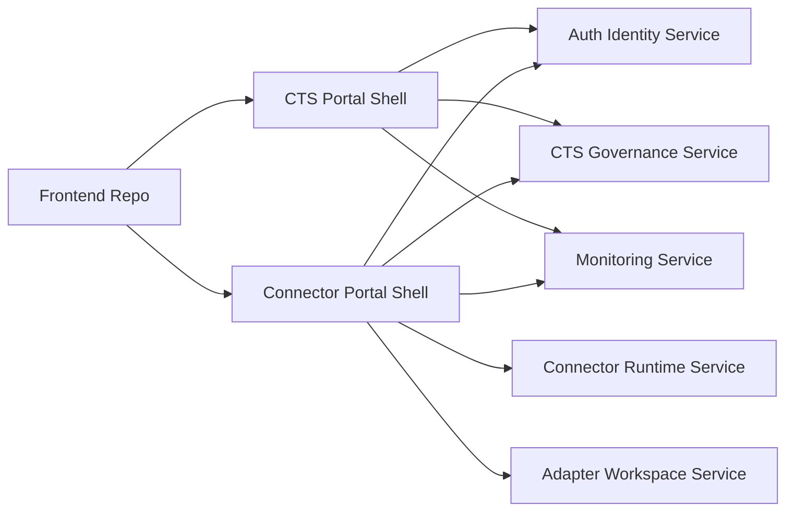
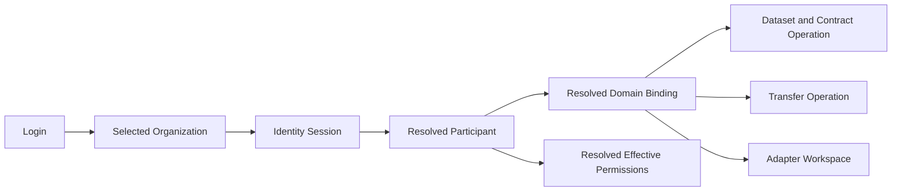
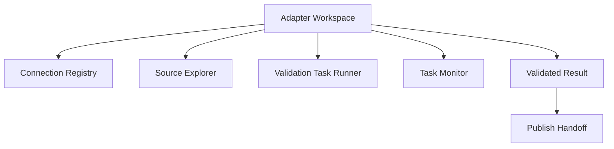
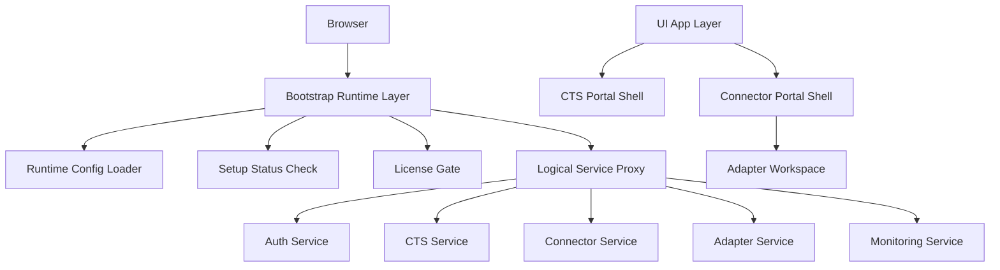
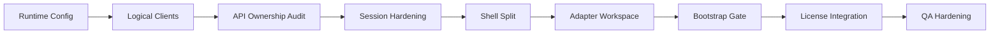

# Frontend Split Service Blueprint Detailed

## 1. Tujuan

Dokumen ini adalah versi tajam dari blueprint frontend Data Space dengan fokus pada:

- pemisahan shell frontend
- pemetaan halaman ke service
- penegasan posisi adapter
- sinkronisasi kebutuhan FE dengan API live yang sudah tergambar di project
- kemungkinan pemisahan service dan implikasinya
- task implementasi, risiko, dan prioritas

Dokumen ini sengaja fokus ke **frontend architecture dan frontend operating model**, bukan desain backend penuh.

## 2. Baseline Existing yang Dipakai

Baseline yang dipakai berasal dari source FE dan dokumen internal project saat ini:

- route app existing di `src/App.tsx`
- menu dan role gating di `src/config/rbac.ts`
- CTS/governance service di `src/api/services/governance.ts`
- connector runtime service di `src/api/services/connector.ts`
- adapter workspace service di `src/api/services/adapter-service.ts`
- adapter runtime proxy di `src/api/services/adapter-runtime.ts`
- audit existing di dokumen `TSD_BLUEPRINT_END_TO_END_SETUP_JUKNIS_TO_TRANSFER_2026-07-06.md`

Logical API live yang menjadi acuan kerja saat ini:

- CTS / governance / identity / onboarding / connector runtime
- adapter service untuk remote source, ingestion, preview, dan result

## 3. Keputusan Arsitektur FE

### 3.1 Keputusan Inti

Untuk fase sekarang, bentuk yang paling sehat adalah:

- **1 repo frontend**
- **2 shell frontend**
  - `CTS Portal Shell`
  - `Connector Portal Shell`
- **1 shared core**
- **1 adapter workspace** yang hidup di dalam `Connector Portal`

### 3.2 Yang Tidak Direkomendasikan Sekarang

- langsung pecah jadi 2 repo terpisah
- langsung bikin adapter jadi portal ketiga penuh
- tetap mencampur governance dan provider operation di shell yang sama tanpa boundary

### 3.3 Alasan

Masalah terbesar existing bukan sekadar folder atau route, tetapi:

- context binding masih sensitif
- ownership data master belum tegas di layer UI
- adapter punya lifecycle yang berbeda dari contract/transfer
- banyak layar masih bergantung pada resolve konteks lintas modul

## 4. Shell Blueprint

### 4.1 CTS Portal Shell

Dipakai untuk area governance dan kontrol sistem.

Owner role:

- `SUPER_ADMIN`
- `ADMIN` governance
- `AUDITOR`

Concern utama:

- organizations
- domains
- participants
- onboarding and approval
- IAM / RBAC
- connection pool registry
- monitoring global
- deployment/runtime config

### 4.2 Connector Portal Shell

Dipakai untuk area operasional provider/consumer.

Owner role:

- `PROVIDER`
- `CONSUMER`
- sebagian `ADMIN`

Concern utama:

- dashboard operasional
- datasets
- contracts
- incoming request
- transfer center
- adapter workspace
- metadata catalog
- schema / vocabulary / policy operation

### 4.3 Adapter Workspace

Adapter workspace bukan sekadar halaman tambahan, tetapi sub-domain operasional dengan lifecycle sendiri:

- connection setup
- source explorer
- preview/describe
- ingestion task
- task monitoring
- validated result
- publish handoff

## 5. Service Split yang Direkomendasikan

### 5.1 Logical Service Layer

Frontend sebaiknya mengenal logical service berikut:

- `authIdentityService`
- `ctsGovernanceService`
- `connectorRuntimeService`
- `adapterWorkspaceService`
- `monitoringService`
- `runtimeConfigService`

### 5.2 Mapping Tanggung Jawab

`authIdentityService`

- login
- validate session
- token refresh
- confirm email
- user profile dasar

`ctsGovernanceService`

- governance organizations
- governance domains
- onboarding registrations
- participants
- participant domain binding
- connection pools
- schemas / vocabularies / policies baseline
- contracts / agreements
- setup juknis

`connectorRuntimeService`

- transfer initiate
- transfer status
- transfer history
- provider-side transfer tool
- persistent download
- readiness projection

`adapterWorkspaceService`

- remote source connection
- layer list
- describe layer
- preview layer
- create ingestion task
- task polling / status
- list validated collections/items

`monitoringService`

- connector heartbeat
- transfer projection
- transfer events
- audit signal tambahan

`runtimeConfigService`

- endpoint logical mapping
- bootstrap config
- deployment config
- first-run or admin config state

## 6. Peta Halaman Existing ke Shell

| Route | Halaman | Shell yang Tepat | Status Existing | Catatan |
|---|---|---|---|---|
| `/setup` | Setup | Shared bootstrap | Sudah ada | Bukan milik CTS atau Connector penuh |
| `/login` | Login | Shared bootstrap | Sudah ada | Menentukan context awal |
| `/register-kkks` | RegisterKKKS | CTS-facing public flow | Sudah ada | Masuk jalur onboarding |
| `/confirm-email` | ConfirmEmail | Shared auth | Sudah ada | Aktivasi user |
| `/setup-juknis` | SetupJuknis | CTS Portal | Sudah ada | Governance bootstrap |
| `/organizations` | Organizations | CTS Portal | Sudah ada | Master organization/domain |
| `/participants` | Participants | CTS Portal | Sudah ada | Registry & approval utama |
| `/participants/:id` | ParticipantDetail | CTS Portal | Sudah ada | Binding, sync, audit participant |
| `/connection-pools` | ConnectionPools | CTS Portal | Sudah ada | Admin-owned registry |
| `/access-control` | AccessControl | CTS Portal | Sudah ada | IAM/RBAC center |
| `/deployment-config` | DeploymentConfig | CTS Portal | Sudah ada | Runtime/system admin |
| `/audit` | Audit | CTS Portal | Sudah ada | Governance audit |
| `/compliance` | Compliance | CTS Portal | Sudah ada | Governance compliance |
| `/connector-monitoring` | ConnectorMonitoring | CTS Portal + bridge | Sudah ada | Monitoring lintas connector |
| `/` | Dashboard | Connector Portal | Sudah ada | Harus beda layout per role nantinya |
| `/datasets` | Datasets | Connector Portal | Sudah ada | Operasional dataset |
| `/contracts` | Contracts | Connector Portal | Sudah ada | Operational contract view |
| `/inbox` | ProviderInbox | Connector Portal | Sudah ada | Request masuk provider |
| `/transfers` | TransferCenter | Connector Portal | Sudah ada | Transfer operation center |
| `/schemas` | Schemas | Connector Portal | Sudah ada | Bisa tetap read/manage by role |
| `/vocabularies` | Vocabularies | Connector Portal | Sudah ada | Sama, role-based |
| `/policies` | Policies | Connector Portal | Sudah ada | Policy operasi domain |
| `/catalog-metadata` | CatalogMetadata | Connector Portal | Sudah ada | Cocok ke flow publish |
| `/contract-policies` | ContractPolicies | Connector Portal | Sudah ada | Operasional contract-policy link |
| `/settings` | Settings | Connector Portal | Sudah ada | Perlu dibelah jadi profile vs connection tools |
| `/api-docs` | ApiDocs | Shared util | Sudah ada | Bisa tetap shared |

## 7. Peta Halaman ke Service

| Halaman | Service Utama | Service Sekunder | Dependency Kritis |
|---|---|---|---|
| Login | authIdentityService | ctsGovernanceService | daftar organization login |
| RegisterKKKS | ctsGovernanceService | authIdentityService | governance organization context |
| ConfirmEmail | authIdentityService | - | confirm-email finalization |
| SetupJuknis | ctsGovernanceService | runtimeConfigService | domain, schema, vocabulary, policy |
| Organizations | ctsGovernanceService | - | org create/update/delete + domain CRUD |
| Participants | ctsGovernanceService | authIdentityService | approval, user create, binding |
| ParticipantDetail | ctsGovernanceService | monitoringService | participant binding, domain sync, org link |
| ConnectionPools | ctsGovernanceService | monitoringService | endpoint, jwks, readiness |
| AccessControl | authIdentityService | ctsGovernanceService | category/group/role matrix |
| Dashboard | ctsGovernanceService | connectorRuntimeService | active participant and domain context |
| Datasets | ctsGovernanceService | adapterWorkspaceService | domain, schema, vocabulary, publish |
| Contracts | ctsGovernanceService | connectorRuntimeService | contracts/agreements |
| ProviderInbox | ctsGovernanceService | - | incoming request/approval |
| TransferCenter | connectorRuntimeService | ctsGovernanceService | domain, contract, agreement, connection pool |
| ConnectorMonitoring | monitoringService | connectorRuntimeService | heartbeat, projection, provider tools |
| CatalogMetadata | ctsGovernanceService | adapterWorkspaceService | metadata and publish correlation |
| Settings | authIdentityService | adapterWorkspaceService | profile + adapter flow cleanup |
| DeploymentConfig | runtimeConfigService | ctsGovernanceService | endpoint logical config |

## 8. Adapter-Specific Mapping

### 8.1 Jalur API Adapter yang Sudah Tercermin

Dari service existing, adapter workspace saat ini sudah memodelkan jalur berikut:

`remote source connection`

- `GET /remote-sources/connections/`
- `POST /remote-sources/connections/`
- `PATCH /remote-sources/connections/{id}`

`GeoServer source exploration`

- `GET /remote-sources/geoserver/{connection_id}/layers`
- `GET /remote-sources/geoserver/{connection_id}/describe`
- `GET /remote-sources/geoserver/{connection_id}/preview`

`ArcGIS source exploration`

- `GET /remote-sources/arcgis/{connection_id}/layers`
- `GET /remote-sources/arcgis/{connection_id}/describe`
- `GET /remote-sources/arcgis/{connection_id}/preview`
- `GET /remote-sources/arcgis/{connection_id}/preview-geojson`

`ingestion task`

- `POST /data-ingestion/geojson`
- `POST /data-ingestion/shapefile`
- `POST /data-ingestion/geoserver`
- `POST /data-ingestion/arcgis`
- `GET /data-ingestion/`
- `GET /data-ingestion/{id}`

`validated results`

- `GET /ogc/collections`
- `GET /ogc/collections/{domainCode}/items`

### 8.2 Bentuk UI yang Tepat untuk Adapter

Kalau mengikuti karakter API live, adapter workspace yang sehat harus dibelah menjadi lima area:

1. `Connection Registry`
2. `Source Explorer`
3. `Validation Task Runner`
4. `Task Monitor`
5. `Validated Result & Publish Handoff`

### 8.3 Dependency Adapter yang Wajib dari CTS

Adapter tidak boleh jalan tanpa context resmi berikut:

- active organization
- active participant
- active domain binding
- allowed access role

Artinya adapter membaca dari CTS untuk:

- siapa participant aktif
- domain apa yang valid
- domain code apa yang dipakai
- apakah user memang berhak menjalankan proses

### 8.4 Dependency Adapter yang Tidak Boleh Dipinjam dari Fallback Lokal

Jangan biarkan adapter mengambil keputusan dari:

- name matching organization
- cache lokal tanpa validasi
- state dashboard yang sudah terlanjur salah
- domain inferred yang tidak datang dari binding resmi

## 9. Endpoint Family Map per Service

### 9.1 Auth / Identity

Endpoint family yang sudah tampak di codebase:

- `/identity-provider/auth/login`
- `/identity-provider/auth/validate`
- `/identity-provider/auth/refresh-token`
- `/identity-provider/users/confirm-email`
- `/identity-provider/users/resend-email-confirmation`
- `/identity-provider/users/*`

### 9.2 CTS Governance

Endpoint family yang sudah tampak di codebase:

- `/governance/organizations/`
- `/governance/organizations/{orgId}/domains`
- `/onboarding/registrations`
- `/onboarding/participants`
- `/onboarding/participants/{participantId}/domains`
- `/onboarding/connection-pools`
- `/policy-contract/{domainId}/dataset-policies`
- `/policy-contract/{domainId}/contracts`
- `/policy-contract/{domainId}/agreements`
- `/data-catalog/*`

### 9.3 Connector Runtime

Endpoint family yang sudah tampak di codebase:

- `/connector/consumer/initiate`
- `/connector/provider/initiate`
- `/connector/{domainId}/transfers`
- `/connector/{transferProcessId}/status`
- `/connector/consumer/direct/{transferProcessId}/start`
- `/connector/provider/direct/{transferProcessId}/start`
- `/connector/consumer/persistent/{transferProcessId}/start`
- `/connector/consumer/persistent/{transferProcessId}/download/...`

### 9.4 Monitoring

Endpoint family yang sudah tampak di codebase:

- `/cts/monitoring/connector-heartbeats`
- `/cts/monitoring/transfer-projections`
- `/connector/runtime/heartbeat/send`
- `/connector/runtime/transfer-events/publish`

### 9.5 Adapter Workspace

Endpoint family yang sudah tampak di codebase:

- `/adapter-service/api/v1/remote-sources/*`
- `/adapter-service/api/v1/data-ingestion/*`
- `/adapter-service/api/v1/ogc/*`
- `/adapter-runtime/*` untuk proxy runtime adapter tertentu

## 10. Split Boundary yang Benar

### 10.1 Yang Harus Tinggal di CTS Portal

- create/edit/delete organization
- create/edit/delete governance domain
- approval registrasi dan create participant
- bind participant ke governance organization
- sync domain participant
- create/edit/delete connection pool
- IAM category/group/role management
- system deployment config

### 10.2 Yang Harus Tinggal di Connector Portal

- dataset operation
- incoming provider operation
- transfer operation
- adapter validation operation
- source preview
- result validation review
- publish handoff

### 10.3 Yang Harus Shared Tetapi Dibaca Saja

Connector Portal boleh membaca tapi jangan memiliki source of truth untuk:

- organization
- participant
- participant domain binding
- connection pool readiness summary
- effective permissions

## 11. Possibility Matrix

| Opsi | Bentuk | Kelebihan | Kekurangan | Nilai |
|---|---|---|---|---|
| A | 1 repo + 2 shell + adapter workspace | paling aman, migrasi bertahap, reuse tinggi | perlu disiplin boundary | paling direkomendasikan |
| B | 1 repo + 3 shell | adapter lebih eksplisit | UX makin pecah, auth boundary bertambah | possible, belum perlu |
| C | 2 repo FE | ownership tim lebih tegas | drift tinggi, duplikasi tinggi | nanti saja |

## 12. Task Breakdown Detail

### 12.1 Wave 1 - Context and Boundary

1. Bekukan session resolver tunggal
2. Pastikan login resolve participant context resmi
3. Pisahkan menu CTS vs Connector
4. Pisahkan route root CTS vs Connector

### 12.2 Wave 2 - Service Layer Cleanup

1. Bungkus endpoint menjadi logical service formal
2. Rapikan naming service
3. Hilangkan copy UI yang menyebut angka port
4. Satukan runtime config logical path

### 12.3 Wave 3 - Adapter Workspace Formalization

1. Pisah settings umum dari adapter workspace
2. Bentuk halaman adapter dengan lima blok:
   - connection registry
   - source explorer
   - validation task runner
   - task monitor
   - validated result
3. Bedakan empty state vs blocked state
4. Tambahkan connectivity status

### 12.4 Wave 4 - Transfer and Monitoring Hardening

1. Satukan readiness message
2. Kaitkan transfer dengan connection pool dan contract state
3. Tampilkan monitoring global terpisah dari provider operation
4. Siapkan retry/recovery UX

### 12.5 Wave 5 - Progressive Split

1. Buat shell `cts`
2. Buat shell `connector`
3. Pindahkan route per shell
4. Baru evaluasi apakah perlu repo split

## 13. Risk Matrix yang Lebih Tajam

| Risk ID | Risiko | Dampak | Severity | Mitigasi FE |
|---|---|---|---|---|
| R1 | login context tidak resolve participant resmi | provider masuk ke org/domain salah | kritikal | session resolver tunggal |
| R2 | adapter pakai fallback domain lokal | task validasi salah domain | kritikal | adapter wajib baca binding CTS |
| R3 | connection pool dan adapter readiness tercampur | user bingung penyebab gagal | tinggi | bedakan readiness panel |
| R4 | transfer runtime tetap menanggung concern governance | halaman transfer makin kusut | tinggi | pindahkan governance setup ke CTS |
| R5 | settings tetap jadi tempat campur semua hal | UX pecah dan sulit dipelihara | sedang | pisah profile vs adapter workspace |
| R6 | hardcoded env/port muncul di UI | deploy makin rawan salah | tinggi | runtime logical service |
| R7 | adapter dijadikan portal terpisah terlalu cepat | flow provider makin terfragmentasi | sedang | tetap workspace dulu |

## 14. Ratio Credit dan Prioritas

### 14.1 Ratio Nilai Bisnis

| Area | Nilai ke hasil akhir |
|---|---|
| context binding stabilization | 30% |
| adapter workspace formalization | 25% |
| CTS vs Connector shell split | 20% |
| transfer and monitoring hardening | 15% |
| visual/cosmetic cleanup | 10% |

### 14.2 Ratio Effort Frontend

| Area | Estimasi effort |
|---|---|
| context and session stabilization | 30 |
| adapter workspace restructuring | 25 |
| shell split | 20 |
| service config cleanup | 10 |
| monitoring and transfer hardening | 10 |
| docs and QA tightening | 5 |

Total effort relatif: `100`

### 14.3 Urutan Kerja Paling Aman

1. stabilkan context binding
2. rapikan service split
3. formalize adapter workspace
4. pisahkan CTS vs Connector shell
5. poles monitoring dan UX recovery

## 15. Blueprint Implementasi yang Disarankan

### 15.1 Struktur Repo

```text
src/
  apps/
    cts/
      routes.tsx
      menu.ts
      pages/
    connector/
      routes.tsx
      menu.ts
      pages/

  core/
    auth/
    runtime/
    api/
    session/
    permissions/
    layout/
    ui/
    errors/

  modules/
    organizations/
    participants/
    onboarding/
    connection-pools/
    contracts/
    datasets/
    transfers/
    monitoring/
    access-control/
    adapter/
      connection-registry/
      source-explorer/
      validation-tasks/
      validated-results/
      publish-handoff/
```

### 15.2 Rule Penting

- `apps/*` hanya shell
- `modules/*` hanya feature
- `core/*` hanya fondasi
- adapter tidak boleh mengelola source of truth participant
- transfer tidak boleh mengelola source of truth governance

## 16. Recommendation

Rekomendasi final untuk frontend saat ini:

- tetap **1 repo**
- pecah jadi **2 shell**
- bentuk **adapter workspace** yang formal
- pakai **logical service split**
- pakai **session resolver tunggal**
- jadikan CTS satu-satunya sumber resmi untuk context organisasi, participant, dan domain

Dengan model ini:

- provider flow jadi lebih waras
- governance area jadi lebih bersih
- adapter tidak lagi terasa tempelan
- split service bisa dibawa maju nanti tanpa bongkar total

## 17. Target Standalone Service Bundle

### 17.1 Arah Pengembangan

Target jangka menengah yang inline dengan kebutuhan sekarang adalah menjadikan frontend ini sebagai:

- browser-based portal
- standalone deployment bundle
- runtime-configurable
- license-aware
- service-encapsulated
- siap dipakai sebelum backend benar-benar dipecah

Artinya, frontend tidak lagi diposisikan sekadar aplikasi React biasa, tetapi sebagai:

- **portal shell**
- di atas **bootstrap runtime**
- yang mengatur **service abstraction**
- dan bisa dikunci oleh **license gate**

### 17.2 Bentuk Arsitektur Target

Lapisan target yang disarankan:

1. `UI App Layer`
   - CTS Portal Shell
   - Connector Portal Shell
   - Adapter Workspace
2. `Frontend Service Layer`
   - auth client
   - cts client
   - connector client
   - adapter client
   - monitoring client
3. `Bootstrap Runtime Layer`
   - runtime config loader
   - setup status checker
   - service availability checker
   - public runtime config provider
   - proxy logical service
4. `License and Protection Layer`
   - validate license key
   - validate licensed host
   - feature gating
   - expiry / revalidation
   - lock or unlock module

### 17.3 Kenapa Ini Inline dengan Blueprint Existing

Model ini tidak bertabrakan dengan blueprint sebelumnya. Justru melengkapi:

- split shell tetap dipakai
- adapter workspace tetap dipakai
- logical service split jadi lebih formal
- runtime config jadi gerbang sebelum app init
- licensing memberi lapisan kontrol tanpa mengacak feature module

### 17.4 Prinsip Wajib

- FE tidak boleh tahu angka port deployment sebagai identitas bisnis
- runtime config harus selesai di-load sebelum auth init
- license validation final tidak boleh ditaruh murni di browser
- feature gating harus dibaca dari runtime/license state
- module ownership tidak boleh campur kembali
- adapter tetap tunduk pada context resmi CTS

## 18. Goal Breakdown

### 18.1 Goal Utama

Goal utama roadmap ini adalah:

- membuat FE siap tumbuh menjadi service-aware frontend
- membuat deploy FE bisa dipindah endpoint tanpa rebuild
- membuat shell governance dan shell operasional jelas boundary-nya
- membuat adapter punya workspace yang kokoh
- menyiapkan place holder resmi untuk licensing dan protection

### 18.2 Goal per Fase

`Goal A - Foundation Stability`

- context binding tunggal
- route ownership jelas
- service ownership jelas
- tidak ada hardcoded host/port di layer UI

`Goal B - Service Encapsulation`

- semua API call masuk lewat logical client yang benar
- runtime config menjadi sumber base URL
- auth, CTS, connector, adapter, monitoring punya boundary yang tegas

`Goal C - Adapter Formalization`

- adapter tidak lagi jadi tab campuran
- provider mendapat alur teknis yang runtut
- status blocked vs empty vs failed bisa dibedakan

`Goal D - Bootstrap and License Readiness`

- app bisa di-lock sebelum fully initialized
- endpoint service bisa diganti dari runtime config
- lisensi bisa menghidupkan atau mematikan capability tertentu

`Goal E - Progressive Future Split`

- ketika backend dipecah, FE tidak perlu refactor besar
- ketika modul dijual per paket, feature gating sudah siap
- ketika deployment dipindah, bootstrap tetap jadi gerbang stabil

### 18.3 Goal per Layer

| Layer | Goal |
|---|---|
| UI App Layer | portal jelas, tidak campur concern |
| Frontend Service Layer | API abstraction rapi dan mudah dipindah |
| Bootstrap Runtime Layer | init aman, config dinamis, service route stabil |
| License Layer | activation, validation, gating, revalidation |

## 19. Step-by-Step Development Plan

### 19.1 Step 1 - Runtime Config Loader

Deliverable:

- loader runtime config sebelum render app
- logical service registry
- fallback handling kalau config belum valid

Hasil yang diharapkan:

- UI tidak lagi hardcode endpoint final
- environment switch bisa dilakukan dari config

### 19.2 Step 2 - Logical Client Separation

Deliverable:

- `authClient`
- `ctsClient`
- `connectorClient`
- `adapterClient`
- `monitoringClient`

Hasil yang diharapkan:

- service ownership mulai tegas
- retry/interceptor bisa dipisah

### 19.3 Step 3 - API Ownership Audit

Deliverable:

- audit semua file `src/api/services/*`
- tandai endpoint family per service
- rapikan service yang masih campur

Hasil yang diharapkan:

- mapping FE -> service -> endpoint menjadi konsisten

### 19.4 Step 4 - Session and Context Hardening

Deliverable:

- session resolver tunggal
- active organization resolver
- participant resolver
- domain binding resolver

Hasil yang diharapkan:

- provider tidak lagi gampang nyasar ke context salah

### 19.5 Step 5 - Shell Split

Deliverable:

- `CTS Portal Shell`
- `Connector Portal Shell`
- route group terpisah
- menu group terpisah

Hasil yang diharapkan:

- governance dan operation tidak lagi saling menumpuk

### 19.6 Step 6 - Adapter Workspace Formal

Deliverable:

- connection registry
- source explorer
- validation task runner
- task monitor
- validated results
- publish handoff

Hasil yang diharapkan:

- adapter terlihat sebagai workflow utuh, bukan tempelan

### 19.7 Step 7 - Bootstrap Gate

Deliverable:

- setup status check
- app lock saat config belum siap
- health summary awal

Hasil yang diharapkan:

- app tidak langsung tembak request ketika konfigurasi belum valid

### 19.8 Step 8 - License Validation Integration

Deliverable:

- license input di first-run / admin config
- license state storage
- revalidate flow
- feature gating

Hasil yang diharapkan:

- instance bisa dikontrol capability-nya tanpa rebuild

### 19.9 Step 9 - QA and Regression Hardening

Deliverable:

- smoke test bootstrap
- smoke test login context
- smoke test adapter workspace
- smoke test transfer center
- validator untuk config invalid / expired license

Hasil yang diharapkan:

- perubahan arsitektur tidak merusak flow existing

## 20. Timeline dan Estimasi

### 20.1 Estimasi Garis Besar

Estimasi ini untuk FE side dengan asumsi pengembangan bertahap dan tidak menghitung refactor backend besar.

| Fase | Fokus | Estimasi |
|---|---|---|
| Phase 1 | runtime config + logical client skeleton | 3 hari |
| Phase 2 | audit API ownership + cleanup service | 3 hari |
| Phase 3 | session/context hardening | 3 hari |
| Phase 4 | shell split CTS vs Connector | 4 sampai 5 hari |
| Phase 5 | adapter workspace formalization | 4 hari |
| Phase 6 | bootstrap gate + first-run control | 2 sampai 3 hari |
| Phase 7 | license integration stub + gating | 3 hari |
| Phase 8 | QA, regression, doc hardening | 2 sampai 3 hari |

Estimasi total:

- **24 sampai 27 hari kerja FE**

### 20.2 Timeline Realistis

`Sprint 1`

- runtime config loader
- logical client separation
- API ownership audit

`Sprint 2`

- session/context hardening
- shell split

`Sprint 3`

- adapter workspace formal
- bootstrap gate

`Sprint 4`

- license stub
- feature gating
- QA/regression

### 20.3 Timeline Cepat vs Aman

| Mode | Estimasi | Catatan |
|---|---|---|
| cepat | 15 sampai 18 hari | risiko technical debt lebih tinggi |
| moderat | 24 sampai 27 hari | paling seimbang |
| aman | 30+ hari | cocok bila sambil merapikan test dan boundary penuh |

## 21. Risk Ratio dan Exposure

### 21.1 Risk Ratio Utama

| Risk | Severity | Probability | Impact | Exposure |
|---|---|---|---|---|
| runtime config tidak siap sebelum auth init | tinggi | sedang | sangat tinggi | tinggi |
| service boundary dilanggar lagi oleh module lain | sedang | tinggi | tinggi | tinggi |
| session resolver tetap ambigu | kritikal | sedang | sangat tinggi | sangat tinggi |
| adapter context masih ambil fallback lokal | kritikal | tinggi | sangat tinggi | sangat tinggi |
| shell split memicu redirect loop | tinggi | sedang | tinggi | tinggi |
| license gate salah mengunci app | tinggi | rendah | sangat tinggi | sedang |
| feature gating terlalu ditaruh di FE | tinggi | sedang | tinggi | tinggi |
| bootstrap jadi terlalu gemuk dan susah dirawat | sedang | sedang | sedang | sedang |

### 21.2 Risk Ratio per Fase

| Fase | Risiko Dominan | Rasio Risiko |
|---|---|---|
| runtime config | app init gagal | 7/10 |
| logical clients | coupling setengah jadi | 5/10 |
| session hardening | user context salah | 9/10 |
| shell split | route guard pecah | 7/10 |
| adapter formalization | provider flow regress | 8/10 |
| bootstrap gate | startup logic macet | 6/10 |
| license integration | false lock / false allow | 8/10 |

### 21.3 Mitigasi yang Wajib Ada

- config preload sebelum auth provider mount
- fallback safe mode bila runtime config corrupt
- single source session resolver
- adapter guard berdasarkan participant-domain binding resmi
- feature flags dari bootstrap/license state, bukan hardcoded UI
- health summary page untuk debugging instance

## 22. End-State yang Dituju

Kalau roadmap ini selesai, bentuk FE yang dituju adalah:

- 1 repo yang rapi
- 2 shell yang jelas
- 5 logical clients yang stabil
- adapter workspace yang formal
- bootstrap runtime yang mengunci init
- license-aware deployment bundle
- siap dipindahkan ke banyak environment
- siap berkembang ke standalone services tanpa refactor besar

Dengan end-state ini:

- deploy lebih aman
- boundary bisnis lebih jelas
- adapter tidak lagi jadi concern liar
- shell governance dan operasional tidak saling mengganggu
- lisensi dan packaging enterprise bisa masuk dengan wajar

## 23. Mermaid

### 23.1 Shell dan Service



### 23.2 Context Resolution



### 23.3 Adapter Workspace




### 23.4 Standalone Bundle Target



### 23.5 Development Roadmap


