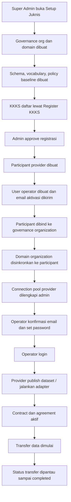
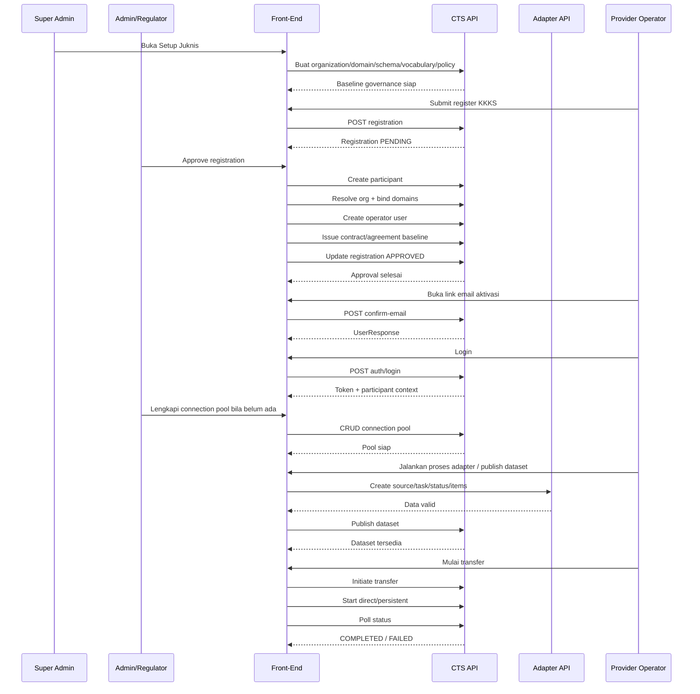

# TSD Blueprint Draft
## End-to-End Flow: Setup Juknis sampai Data Transfer

Tanggal: 6 Juli 2026  
Baseline FE: `dataspace-new`  
Baseline CTS API aktif: `http://100.66.10.14:8181/api/v1`  
Baseline Adapter API aktif: `http://100.66.10.14:8182`

---

## 1. Tujuan Dokumen

Dokumen ini merangkum flow end-to-end aplikasi dataspace dari tahap:

1. setup juknis
2. registrasi dan approval KKKS
3. aktivasi akun operator
4. binding organization dan domain
5. setup connection pool
6. publish dataset
7. kontrak dan agreement
8. transfer data

Dokumen ini diposisikan sebagai:

- blueprint existing implementation
- TSD draft untuk pembahasan FE/BE
- acuan audit gap terhadap target flow dataspace

Dokumen ini sengaja membedakan:

- apa yang sudah ada di FE
- apa yang sudah ada di BE
- apa yang masih inferensi / fallback
- apa yang masih gap

---

## 2. Boundary Sistem

### 2.1 Front-End

Front-end bertugas untuk:

- orkestrasi flow operasional
- input form dan validasi awal
- pembacaan konteks login, participant, domain, policy, contract
- menampilkan readiness dan error state

### 2.2 CTS API

CTS API bertugas untuk:

- identity provider
- governance organization/domain
- onboarding registration/participant/domain/adapter
- data catalog
- policy-contract
- connector transfer

### 2.3 Adapter API

Adapter API bertugas untuk:

- remote source registration
- ingestion task
- monitoring task validasi
- listing item hasil validasi
- publish hasil validasi ke dataset flow

### 2.4 Wrapper Runtime

Wrapper runtime bertugas untuk:

- runtime config
- public app bootstrap
- proxy
- setup bundle
- deployment config lokal

---

## 3. Aktor

### 3.1 Super Admin

- setup runtime
- setup juknis
- kelola organization/domain
- kelola participant
- kelola connection pool
- override participant context pada transfer center

### 3.2 Admin / Regulator

- review registrasi KKKS
- approve dan terbitkan operator
- kelola governance organization/domain
- sinkronkan domain participant
- pantau kontrak, agreement, transfer, audit

### 3.3 Provider / Operator KKKS

- aktivasi akun
- login dengan organisasi
- lihat domain aktif miliknya
- publish dataset
- jalankan flow adapter
- kirim data sesuai kontrak/agreement aktif

### 3.4 Consumer / Regulator Runtime

- memantau contract/agreement
- memantau kepatuhan per domain
- menerima data transfer

---

## 4. End-to-End Flow Besar

---

## 5. Flow Detail per Tahap

## 5.1 Tahap A - Setup Juknis

### Tujuan

Menyiapkan baseline governance agar domain, schema, vocabulary, dan policy tersedia sebelum provider mulai bekerja.

### Aktor

- superadmin
- admin/regulator

### Proses

1. buka halaman `Setup Juknis`
2. pilih atau buat governance organization regulator
3. buat domain baseline
4. bentuk schema, vocabulary, policy baseline
5. simpan sebagai paket governance awal

### Output yang diharapkan

- organization governance tersedia
- domain governance tersedia
- schema tersedia per domain
- vocabulary tersedia per domain
- policy tersedia per domain

### Endpoint yang terkait

- `GET /governance/organizations/`
- `POST /governance/organizations/`
- `GET /governance/organizations/{orgId}/domains`
- `POST /governance/organizations/{orgId}/domains`
- `GET /data-catalog/{domainId}/schemas`
- `POST /data-catalog/{domainId}/schemas`
- `GET /data-catalog/{domainId}/vocabularies`
- `POST /data-catalog/{domainId}/vocabularies`
- `GET /policy-contract/{domainId}/dataset-policies`
- `POST /policy-contract/{domainId}/dataset-policies`
- `POST /policy-contract/{domainId}/apply-juknis`

### FE saat ini

- sudah ada flow setup governance
- CRUD schema/vocabulary/policy mulai tersedia, tapi perlu konsistensi domain aktif

### Gap

- provider sering belum melihat artifact ini bila binding participant-domain belum rapi

---

## 5.2 Tahap B - Registrasi KKKS

### Tujuan

Membuka pintu registrasi provider secara publik sebelum approval regulator.

### Aktor

- provider calon peserta

### Proses

1. buka `/register-kkks`
2. isi data organisasi, wilayah kerja, operator, email operator
3. submit registration
4. data masuk ke registration queue

### Endpoint yang terkait

- `POST /onboarding/registrations`
- `GET /onboarding/registrations`

### Output yang diharapkan

- registration berstatus `PENDING`

### FE saat ini

- form publik tersedia
- queue approval tersedia di modul participants

### Gap

- relasi registration ke organization governance belum first-class di backend, masih dibantu resolve dari FE

---

## 5.3 Tahap C - Approval Registrasi dan Penerbitan Operator

### Tujuan

Membentuk participant provider, akun operator, dan kontrak kewajiban otomatis setelah admin menyetujui pendaftaran.

### Aktor

- admin/regulator

### Proses existing

1. admin buka queue registrasi di `/participants`
2. klik `Setujui & Terbitkan`
3. FE membuat participant provider
4. FE resolve governance organization yang cocok
5. FE sync domain governance ke participant
6. FE membuat user operator
7. FE menerbitkan kontrak kewajiban otomatis
8. FE update registration menjadi `APPROVED`

### Endpoint yang terkait

- `POST /onboarding/participants`
- `GET /onboarding/participants`
- `GET /governance/organizations/`
- `GET /governance/organizations/{orgId}/domains`
- `GET /onboarding/participants/{participantId}/domains`
- `POST /onboarding/participants/{participantId}/domains`
- `POST /identity-provider/users/`
- `PATCH /onboarding/registrations/{id}`
- `POST /policy-contract/{domainId}/contracts`
- `POST /policy-contract/{domainId}/agreements`

### Output yang diharapkan

- participant provider terbentuk
- user operator terbentuk
- email aktivasi terkirim
- domain participant terpasang
- kontrak kewajiban terbit

### FE saat ini

- flow ini sudah ada dan menjadi inti onboarding

### Gap

- kalau resolve governance organization salah, provider nanti masuk dengan konteks domain yang ngawur
- approval ini masih banyak bergantung pada sinkronisasi data FE, belum sepenuhnya atomik di BE

---

## 5.4 Tahap D - Aktivasi Akun Operator

### Tujuan

Menyelesaikan aktivasi user operator sesudah email undangan diterima.

### Aktor

- operator provider

### Proses target

1. operator buka tautan email
2. operator masuk ke `/confirm-email`
3. operator set password
4. backend memvalidasi token
5. backend menyimpan password
6. backend mengubah `is_verified=true`
7. backend mengubah `is_active=true`
8. operator bisa login

### Endpoint yang terkait

- `POST /identity-provider/users/confirm-email`
- `POST /identity-provider/users/resend-email-confirmation`

### Kontrak penting dari API aktif

- `confirm-email` mengarah ke response `UserResponse`
- `UserResponse` punya `is_active` dan `is_verified`

### FE saat ini

- form aktivasi sudah ada
- FE sekarang menampilkan status netral bila backend belum mengembalikan akun aktif penuh

### Gap kritikal

- indikasi kuat implementasi `confirm-email` di `8181` sedang tidak selalu menutup proses aktivasi user walau password berhasil disimpan

### Catatan TSD

Ini termasuk blocker bisnis, karena operator yang sudah mendapat email masih bisa mentok sebelum login.

---

## 5.5 Tahap E - Login dan Context Binding

### Tujuan

Menentukan organisasi, participant, dan domain aktif yang benar setelah user login.

### Aktor

- operator provider
- admin/superadmin

### Proses existing

1. user pilih organisasi di login page
2. FE kirim login ke `/identity-provider/auth/login`
3. FE baca token dan `participant_id` bila ada
4. FE cocokkan dengan approved registration
5. FE cocokkan dengan daftar organization dan participant
6. FE bentuk session binding:
   - organization id
   - organization name
   - participant id
7. `DomainContext` menentukan domain aktif

### Endpoint yang terkait

- `POST /identity-provider/auth/login`
- `POST /identity-provider/auth/validate`
- `GET /onboarding/registrations`
- `GET /onboarding/participants`
- `GET /governance/organizations/`

### FE saat ini

- context binding sudah jauh lebih kuat dibanding hanya matching nama
- token `participant_id` dipakai kalau tersedia

### Gap

- bila backend login/token tidak konsisten membawa participant context, FE masih harus fallback
- organization picker pre-login masih sensitif pada source data publik / cache / public endpoint

---

## 5.6 Tahap F - Binding Governance Organization dan Domain Participant

### Tujuan

Menjadikan participant punya domain operasional nyata yang sama dengan governance source.

### Aktor

- admin/regulator

### Proses

1. admin buka `Participant Detail`
2. pilih governance organization yang benar untuk participant
3. FE ambil domain organization itu
4. FE sinkronkan domain yang belum tertempel ke participant
5. provider setelah login baru melihat domain aktif dengan stabil

### Endpoint yang terkait

- `GET /governance/organizations/`
- `GET /governance/organizations/{orgId}/domains`
- `GET /onboarding/participants/{participantId}/domains`
- `POST /onboarding/participants/{participantId}/domains`
- `PATCH /onboarding/participants/{participantId}/domains/{id}`
- `DELETE /onboarding/participants/{participantId}/domains/{id}`

### FE saat ini

- panel sinkronisasi participant sudah ada
- status verified/inferred/missing sudah ada

### Gap

- source binding organization per participant masih ditolong state FE/local storage
- backend belum memberi relasi formal `participant -> governance organization`

---

## 5.7 Tahap G - Setup Connection Pool

### Tujuan

Melengkapi metadata koneksi participant untuk transfer connector-to-connector.

### Aktor

- superadmin
- admin/regulator

### Proses

1. admin buka `/connection-pools`
2. pilih participant provider
3. isi metadata:
   - endpoint
   - `well_known_jwt_url`
   - token
   - type
   - legacy url bila perlu
4. simpan
5. transfer center membaca pool ini sebagai prasyarat readiness

### Endpoint yang terkait

- `GET /onboarding/connection-pools`
- `POST /onboarding/connection-pools`
- `PATCH /onboarding/connection-pools/{id}`
- `DELETE /onboarding/connection-pools/{id}`

### FE saat ini

- CRUD connection pool sudah ada
- validator endpoint dan `well_known_jwt_url` sudah ada

### Catatan bisnis

Ini admin-owned, bukan area provider biasa.

### Gap

- masih perlu audit retry/reconnect behavior dari sisi connector bila transfer gagal di tengah jalan

---

## 5.8 Tahap H - Proses Data Adapter

### Tujuan

Menyiapkan dan memvalidasi data provider sebelum diterbitkan menjadi dataset.

### Aktor

- provider/operator

### Flow target adapter

#### Remote source

1. daftar remote source
2. pilih tipe `GeoServer` atau `ArcGIS`
3. buat ingestion task dengan reference connection/source
4. monitor status task
5. bila sukses, item hasil validasi muncul
6. publish hasil validasi menjadi dataset

#### File / GeoJSON

1. langsung buat ingestion task
2. monitor status
3. ambil item hasil validasi
4. publish hasil validasi menjadi dataset

### Endpoint adapter yang terkait

Dokumen ini tidak menulis URL kasar agar tetap netral, tetapi secara logical service menggunakan:

- health service adapter
- list/register remote source
- preview layer/source
- create ingestion task
- task status
- list OGC item hasil validasi
- publish hasil validasi

### FE saat ini

- wizard proses data provider sudah ada
- flow source -> validasi -> hasil sudah mulai dibentuk

### Gap

- bila domain binding participant belum benar, wizard provider terlihat kosong walau governance domain sudah ada
- service endpoint adapter masih harus dipastikan dari deployment config admin

---

## 5.9 Tahap I - Dataset Publish

### Tujuan

Mendaftarkan dataset provider ke domain yang benar sebelum ditautkan ke kontrak.

### Aktor

- provider/operator
- admin

### Proses

1. provider buka katalog dataset
2. pilih domain aktif
3. pilih schema yang sesuai domain
4. isi metadata dataset
5. publish dataset

### Endpoint yang terkait

- `GET /data-catalog/{domainId}/datasets`
- `GET /data-catalog/{domainId}/datasets/{id}`
- `POST /data-catalog/{domainId}/datasets`
- `PATCH /data-catalog/{domainId}/datasets/{id}`
- `DELETE /data-catalog/{domainId}/datasets/{id}`
- `GET /data-catalog/{domainId}/schemas`
- `GET /data-catalog/{domainId}/vocabularies`

### FE saat ini

- view/edit/delete/publish dataset sudah ada

### Gap

- validasi korelasi `dataset -> schema -> domain` harus dijaga keras
- dataset bisa terlihat ada, tapi transfer tetap gagal bila policy atau connection pool belum cocok

---

## 5.10 Tahap J - Contract dan Agreement

### Tujuan

Menjadikan kewajiban/persetujuan data formal aktif sebelum transfer dimulai.

### Aktor

- provider/operator
- consumer/regulator

### Proses existing

1. kontrak kewajiban sudah otomatis terbit setelah approval registration
2. provider buka `Permintaan Masuk` / contracts
3. provider approve / activate
4. agreement dibentuk atau diaktifkan
5. status kontrak dan agreement menjadi dasar transfer readiness

### Endpoint yang terkait

- `GET /policy-contract/{domainId}/contracts`
- `GET /policy-contract/{domainId}/contracts/{id}`
- `POST /policy-contract/{domainId}/contracts`
- `PATCH /policy-contract/{domainId}/contracts/{id}`
- `GET /policy-contract/{domainId}/agreements`
- `POST /policy-contract/{domainId}/agreements`
- `PATCH /policy-contract/{domainId}/agreements/{id}`

### FE saat ini

- kontrak/agreement sudah dipakai sebagai prasyarat transfer

### Gap

- sinkronisasi antara apply juknis, contract issuance, dan provider context masih harus dijaga supaya tidak ada domain yang ketinggalan

---

## 5.11 Tahap K - Data Transfer

### Tujuan

Menjalankan transfer data setelah control plane dan data plane siap.

### Aktor

- provider/operator
- superadmin untuk mode override context

### Prasyarat

- participant binding valid
- domain participant valid
- dataset tersedia
- schema/policy cocok
- contract aktif
- agreement aktif
- connection pool valid
- endpoint source tersedia

### Proses

1. buka `Transfer Data`
2. FE cek readiness per domain
3. FE cek policy mapping per dataset
4. FE cek connection pool participant
5. FE initiate transfer
6. FE start mode direct atau persistent
7. FE polling status
8. FE tampilkan hasil transfer dan histori

### Endpoint yang terkait

- `POST /connector/initiate`
- `GET /connector/{transfer_process_id}/status`
- `GET /connector/{domain_id}/transfers`
- `POST /connector/transfers/direct/{transfer_process_id}/start`
- `POST /connector/transfers/persistent/{transfer_process_id}/start`
- `GET /connector/transfers/persistent/{transfer_process_id}/download`

### FE saat ini

- transfer center sudah membaca:
  - contract/agreement
  - dataset
  - policy resolution
  - connection pool readiness

### Gap

- retry/reconnect flow masih perlu dipastikan lebih nyaman
- dataset multi-domain dan multi-policy perlu tetap dijaga supaya tidak salah taut

---

## 6. Sequence Diagram End-to-End

---

## 7. Source of Truth Saat Ini

### Paling kuat

- `participant_id` dari token / login response
- binding domain participant dari onboarding
- connection pool participant
- contract/agreement status

### Masih perlu fallback

- organization picker login publik
- participant -> governance organization binding formal
- provider context saat data backend belum lengkap

---

## 8. Gap Matrix

| Area | Sudah Ada | Masih Gap | Dampak |
|---|---|---|---|
| Setup Juknis | baseline governance tersedia | relasi ke participant belum first-class | provider bisa tidak melihat artifact yang benar |
| Registrasi | public registration + approval flow | resolve org masih dibantu FE | approval rawan salah bind |
| Aktivasi akun | email + confirm page ada | `confirm-email` terindikasi belum finalisasi user di `8181` | operator mentok sebelum login |
| Login context | token + registration fallback sudah ada | source public organization masih sensitif | org picker bisa terasa ngawur |
| Domain binding | participant detail + sync domain ada | binding formal participant -> organization belum native | domain provider bisa kosong |
| Connection pool | CRUD dan validator ada | retry/reconnect transfer belum matang | transfer putus rawan bikin bingung |
| Adapter | wizard provider sudah ada | endpoint runtime dan domain binding harus konsisten | proses data bisa terlihat kosong |
| Dataset | CRUD/publish ada | validasi korelasi domain-schema-policy harus dijaga | dataset salah domain bisa lolos |
| Contract/Agreement | sudah dipakai untuk readiness | issuance dan sync antar modul masih perlu dijaga | kewajiban bisa tidak konsisten |
| Transfer | control-plane readiness sudah dibaca | UX retry / recovery perlu diperkuat | operator bingung saat gagal |

---

## 9. Acceptance Criteria Minimum

### 9.1 Setup Juknis

- organization governance berhasil dibuat
- domain governance tersedia
- schema/vocabulary/policy bisa dibaca per domain

### 9.2 Approval Registrasi

- registration `PENDING` bisa menjadi `APPROVED`
- participant provider terbentuk
- operator user terbentuk
- domain participant terpasang
- kontrak kewajiban terbit

### 9.3 Aktivasi Akun

- token valid dapat dipakai satu kali
- password tersimpan
- response `confirm-email` mengembalikan `UserResponse`
- `is_verified=true`
- `is_active=true`

### 9.4 Login Context

- provider login menghasilkan participant context yang benar
- domain aktif provider berasal dari binding participant bila tersedia

### 9.5 Transfer

- transfer tidak boleh mulai bila pool belum valid
- transfer tidak boleh mulai bila contract/agreement belum aktif
- transfer status dapat dipantau sampai selesai

---

## 10. Rekomendasi Lanjutan

1. Jadikan relasi `participant -> governance organization` sebagai field resmi di backend.
2. Jadikan `confirm-email` benar-benar finalizer aktivasi user.
3. Satukan issuance approval registrasi menjadi proses backend atomik.
4. Kurangi inferensi FE berbasis nama organisasi.
5. Tambahkan recovery/retry transfer yang lebih jelas.
6. Kunci validasi dataset terhadap domain, schema, policy, dan contract dengan lebih keras.

---

## 11. Kesimpulan

Secara blueprint, aplikasi ini sudah berada di level:

- portal operasional dataspace
- bukan sekadar katalog
- sudah mencakup governance, onboarding, contract, dan transfer

Tetapi untuk end-to-end yang benar-benar stabil, titik paling sensitif masih ada pada:

- aktivasi user operator
- binding participant ke governance organization
- sinkronisasi domain participant
- connection pool readiness
- consistency antar modul approval, dataset, contract, dan transfer

Dokumen ini aman dipakai sebagai:

- lampiran audit
- draft TSD
- bahan pembanding terhadap target blueprint dataspace berikutnya

